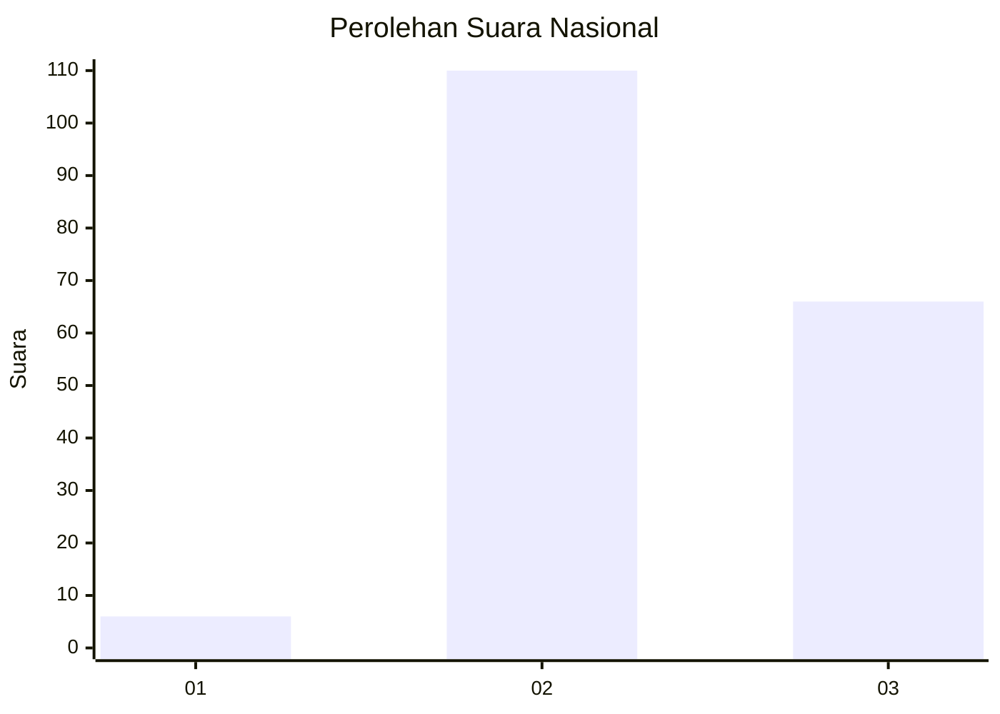
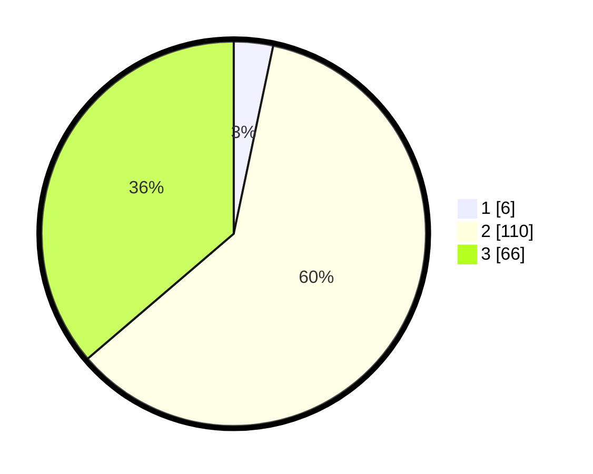

# Hasil

## Grafik

## Tabel

| No. | Nama Paslon    | Suara | Suara (raw) | Persentase |
|:--- |:-------------- | -----:| -----------:| ----------:|
| 1   | ANIES MUHAIMIN | 6     | [6][p-1]    | 3,30       |
| 2   | PRABOWO GIBRAN | 110   | [110][p-2]  | 60,44      |
| 3   | GANJAR MAHFUD  | 66    | [66][p-3]   | 36,26      |

[p-1]: https://github.com/gigit-pemilu/pemilu-2024/blob/main/pilpres/hitung-suara/sub/51-bali/sub/08-buleleng/sub/07-sawan/sub/2012-sangsit/sub/031-tps/sub/paslon-1.txt
[p-2]: https://github.com/gigit-pemilu/pemilu-2024/blob/main/pilpres/hitung-suara/sub/51-bali/sub/08-buleleng/sub/07-sawan/sub/2012-sangsit/sub/031-tps/sub/paslon-2.txt
[p-3]: https://github.com/gigit-pemilu/pemilu-2024/blob/main/pilpres/hitung-suara/sub/51-bali/sub/08-buleleng/sub/07-sawan/sub/2012-sangsit/sub/031-tps/sub/paslon-3.txt

## Foto C Plano

https://sirekap-obj-formc.kpu.go.id/f7f7/pemilu/ppwp/51/08/07/20/12/5108072012031-20240214-141027--13a3acd6-bc57-42c2-bd5e-406d008db0a0.jpg

https://sirekap-obj-formc.kpu.go.id/f7f7/pemilu/ppwp/51/08/07/20/12/5108072012031-20240214-141238--576bfa97-e5d5-4da8-a616-e096ec8ccc92.jpg

## Metadata

| Key        | Value               |
| ---------- | ------------------- |
| Time Stamp | 2024-02-24 22:31:28 |

