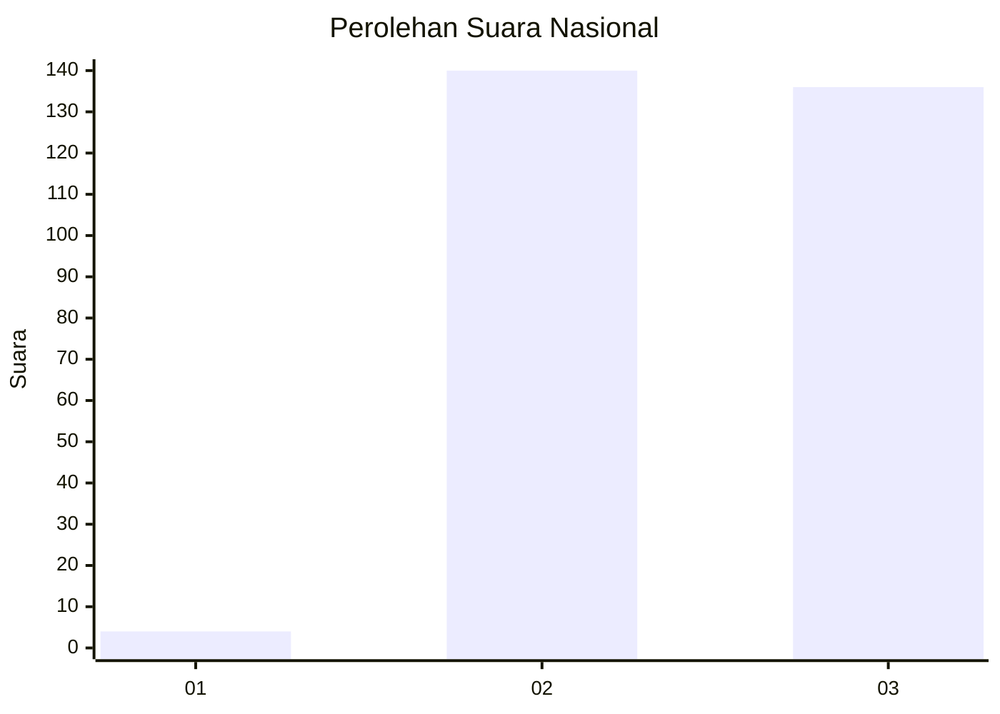
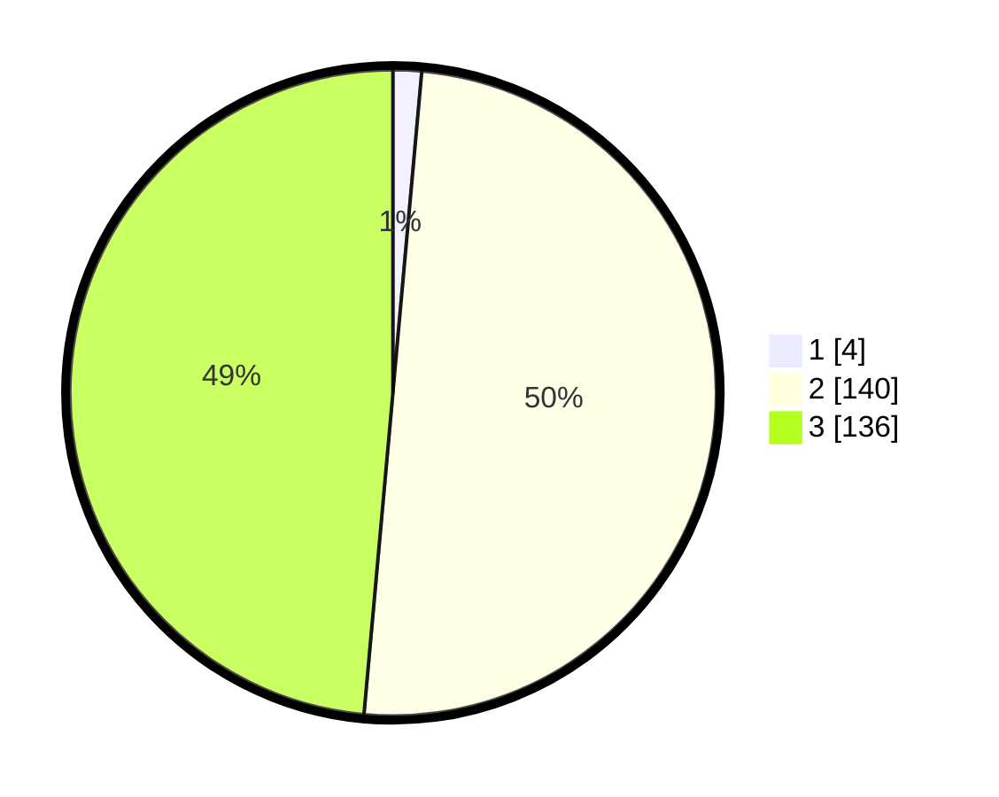

# Hasil

## Grafik

## Tabel

| No. | Nama Paslon    | Suara | Suara (raw) | Persentase |
|:--- |:-------------- | -----:| -----------:| ----------:|
| 1   | ANIES MUHAIMIN | 4     | [4][p-1]    | 1,43       |
| 2   | PRABOWO GIBRAN | 140   | [140][p-2]  | 50,00      |
| 3   | GANJAR MAHFUD  | 136   | [136][p-3]  | 48,57      |

[p-1]: https://github.com/gigit-pemilu/pemilu-2024/blob/main/pilpres/hitung-suara/sub/51-bali/sub/08-buleleng/sub/07-sawan/sub/2013-bungkulan/sub/006-tps/sub/paslon-1.txt
[p-2]: https://github.com/gigit-pemilu/pemilu-2024/blob/main/pilpres/hitung-suara/sub/51-bali/sub/08-buleleng/sub/07-sawan/sub/2013-bungkulan/sub/006-tps/sub/paslon-2.txt
[p-3]: https://github.com/gigit-pemilu/pemilu-2024/blob/main/pilpres/hitung-suara/sub/51-bali/sub/08-buleleng/sub/07-sawan/sub/2013-bungkulan/sub/006-tps/sub/paslon-3.txt

## Foto C Plano

https://sirekap-obj-formc.kpu.go.id/8f4d/pemilu/ppwp/51/08/07/20/13/5108072013006-20240217-104624--9e4b6cc8-7fb3-4172-a34a-5ffc4e80c60f.jpg

https://sirekap-obj-formc.kpu.go.id/8f4d/pemilu/ppwp/51/08/07/20/13/5108072013006-20240217-104644--c70b3f0c-2561-4c3e-ad39-cf6b709e3d4a.jpg

https://sirekap-obj-formc.kpu.go.id/8f4d/pemilu/ppwp/51/08/07/20/13/5108072013006-20240217-104706--b83b3ebc-d9a1-4d19-9104-7a9120638f9a.jpg

## Metadata

| Key        | Value               |
| ---------- | ------------------- |
| Time Stamp | 2024-02-24 22:31:28 |

