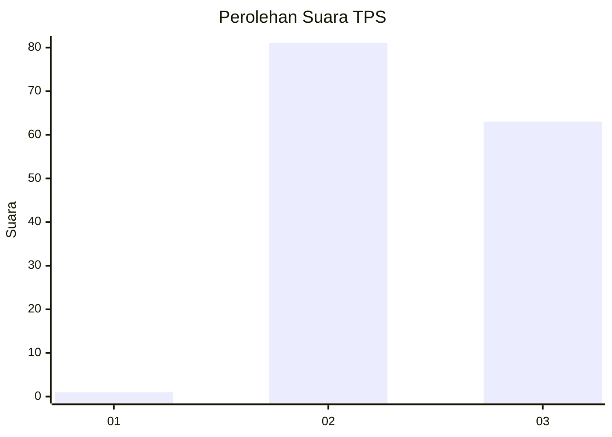
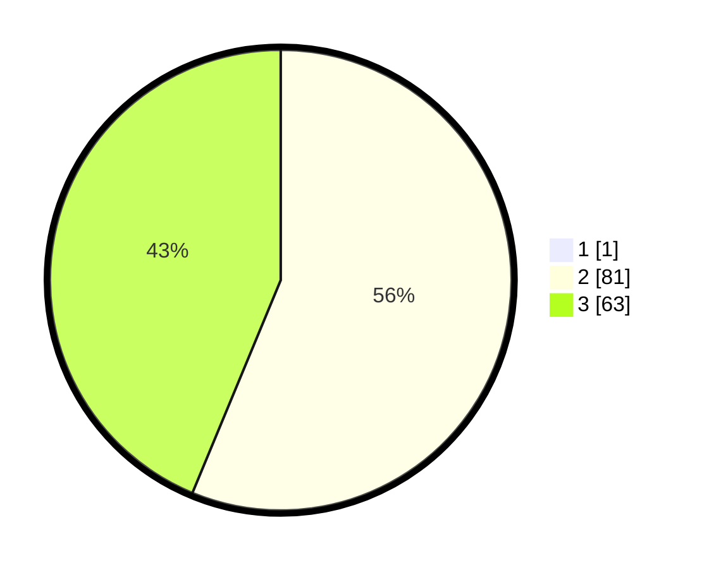

# Hasil

## Grafik

## Tabel

| No. | Nama Paslon    | Suara | Suara (raw) | Persentase |
|:--- |:-------------- | -----:| -----------:| ----------:|
| 1   | ANIES MUHAIMIN | 1     | [1][p-1]    | 0,69       |
| 2   | PRABOWO GIBRAN | 81    | [81][p-2]   | 55,86      |
| 3   | GANJAR MAHFUD  | 63    | [63][p-3]   | 43,45      |

[p-1]: https://github.com/gigit-pemilu/pemilu-2024-51-bali/blob/main/pilpres/hitung-suara/sub/51-bali/sub/08-buleleng/sub/07-sawan/sub/2013-bungkulan/sub/020-tps/sub/paslon-1.txt
[p-2]: https://github.com/gigit-pemilu/pemilu-2024-51-bali/blob/main/pilpres/hitung-suara/sub/51-bali/sub/08-buleleng/sub/07-sawan/sub/2013-bungkulan/sub/020-tps/sub/paslon-2.txt
[p-3]: https://github.com/gigit-pemilu/pemilu-2024-51-bali/blob/main/pilpres/hitung-suara/sub/51-bali/sub/08-buleleng/sub/07-sawan/sub/2013-bungkulan/sub/020-tps/sub/paslon-3.txt

## Foto C Plano

https://sirekap-obj-formc.kpu.go.id/45c1/pemilu/ppwp/51/08/07/20/13/5108072013020-20240214-141231--ab54c323-abce-470f-a62d-1df52cf5c44e.jpg

https://sirekap-obj-formc.kpu.go.id/45c1/pemilu/ppwp/51/08/07/20/13/5108072013020-20240214-141510--1eb50e15-2ba6-4ed4-b04d-c482837e1cbb.jpg

https://sirekap-obj-formc.kpu.go.id/45c1/pemilu/ppwp/51/08/07/20/13/5108072013020-20240214-141611--02689ab3-a145-4e68-915a-c5930e2448cc.jpg

## Metadata

| Key        | Value               |
| ---------- | ------------------- |
| Time Stamp | 2024-02-25 12:00:00 |

