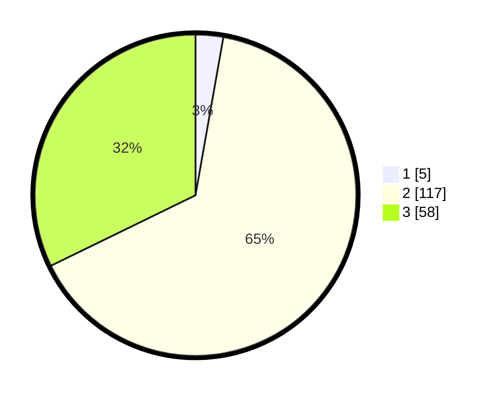

# Hasil

## Grafik

## Tabel

| No. | Nama Paslon    | Suara | Suara (raw) | Persentase |
|:--- |:-------------- | -----:| -----------:| ----------:|
| 1   | ANIES MUHAIMIN | 5     | [5][p-1]    | 2,78       |
| 2   | PRABOWO GIBRAN | 117   | [117][p-2]  | 65,00      |
| 3   | GANJAR MAHFUD  | 58    | [58][p-3]   | 32,22      |

[p-1]: https://github.com/gigit-pemilu/pemilu-2024-51-bali/blob/main/pilpres/hitung-suara/sub/51-bali/sub/08-buleleng/sub/07-sawan/sub/2013-bungkulan/sub/032-tps/sub/paslon-1.txt
[p-2]: https://github.com/gigit-pemilu/pemilu-2024-51-bali/blob/main/pilpres/hitung-suara/sub/51-bali/sub/08-buleleng/sub/07-sawan/sub/2013-bungkulan/sub/032-tps/sub/paslon-2.txt
[p-3]: https://github.com/gigit-pemilu/pemilu-2024-51-bali/blob/main/pilpres/hitung-suara/sub/51-bali/sub/08-buleleng/sub/07-sawan/sub/2013-bungkulan/sub/032-tps/sub/paslon-3.txt

## Foto C Plano

https://sirekap-obj-formc.kpu.go.id/d9aa/pemilu/ppwp/51/08/07/20/13/5108072013032-20240214-133355--2dc6dbf9-2fd3-4b30-afaa-43c67461f1ed.jpg

https://sirekap-obj-formc.kpu.go.id/d9aa/pemilu/ppwp/51/08/07/20/13/5108072013032-20240214-133410--91aa1de4-8601-4eba-8d24-4ec53cbf153f.jpg

https://sirekap-obj-formc.kpu.go.id/d9aa/pemilu/ppwp/51/08/07/20/13/5108072013032-20240214-133126--48704c2b-1ab3-4cdd-a1ec-f8b7ff2b596d.jpg

## Metadata

| Key        | Value               |
| ---------- | ------------------- |
| Time Stamp | 2024-02-24 22:31:28 |

