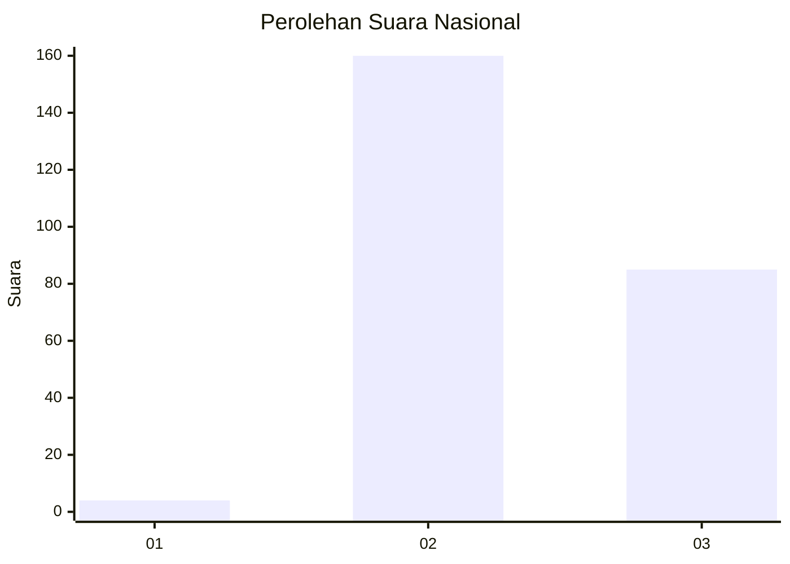
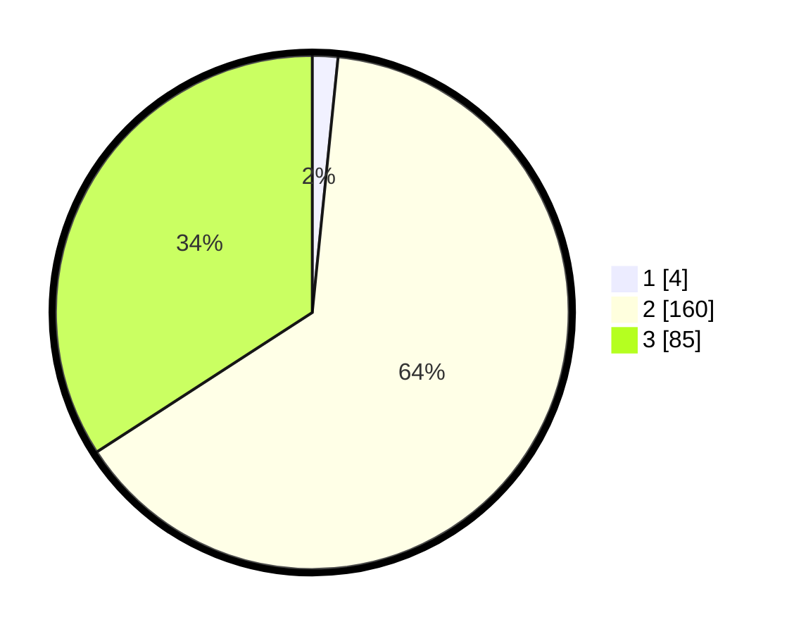

# Hasil

## Grafik

## Tabel

| No. | Nama Paslon    | Suara | Suara (raw) | Persentase |
|:--- |:-------------- | -----:| -----------:| ----------:|
| 1   | ANIES MUHAIMIN | 4     | [4][p-1]    | 1,61       |
| 2   | PRABOWO GIBRAN | 160   | [160][p-2]  | 64,26      |
| 3   | GANJAR MAHFUD  | 85    | [85][p-3]   | 34,14      |

[p-1]: https://github.com/gigit-pemilu/pemilu-2024/blob/main/pilpres/hitung-suara/sub/51-bali/sub/08-buleleng/sub/07-sawan/sub/2013-bungkulan/sub/038-tps/sub/paslon-1.txt
[p-2]: https://github.com/gigit-pemilu/pemilu-2024/blob/main/pilpres/hitung-suara/sub/51-bali/sub/08-buleleng/sub/07-sawan/sub/2013-bungkulan/sub/038-tps/sub/paslon-2.txt
[p-3]: https://github.com/gigit-pemilu/pemilu-2024/blob/main/pilpres/hitung-suara/sub/51-bali/sub/08-buleleng/sub/07-sawan/sub/2013-bungkulan/sub/038-tps/sub/paslon-3.txt

## Foto C Plano

https://sirekap-obj-formc.kpu.go.id/62ad/pemilu/ppwp/51/08/07/20/13/5108072013038-20240214-205007--8617a2a3-b302-4fdb-a972-818cba014d34.jpg

https://sirekap-obj-formc.kpu.go.id/62ad/pemilu/ppwp/51/08/07/20/13/5108072013038-20240214-160101--35f075ba-5d60-43a2-a9b2-22211437c46d.jpg

https://sirekap-obj-formc.kpu.go.id/62ad/pemilu/ppwp/51/08/07/20/13/5108072013038-20240214-155835--582932a8-fbcb-45b6-89e1-1b158493d240.jpg

## Metadata

| Key        | Value               |
| ---------- | ------------------- |
| Time Stamp | 2024-02-24 22:31:28 |

