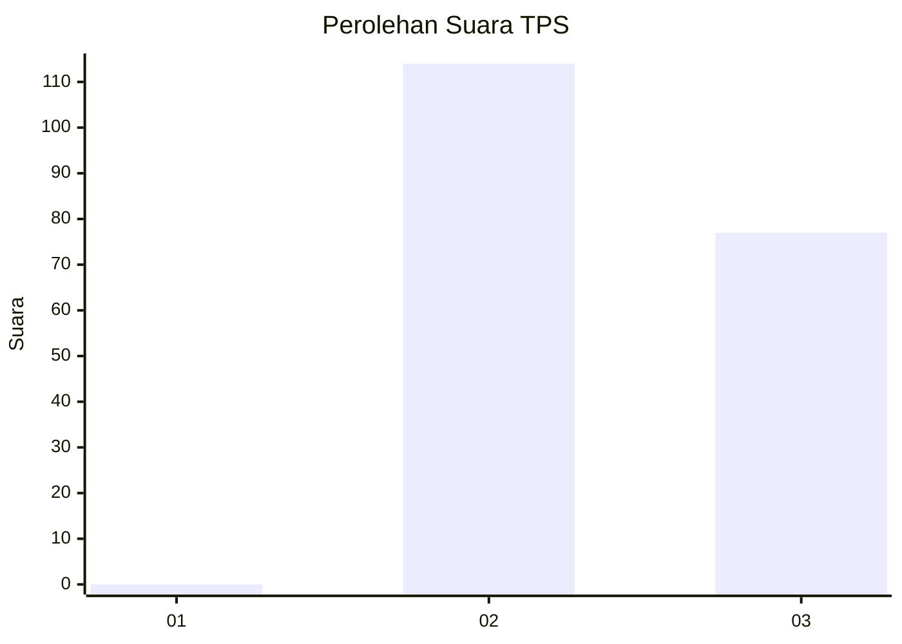
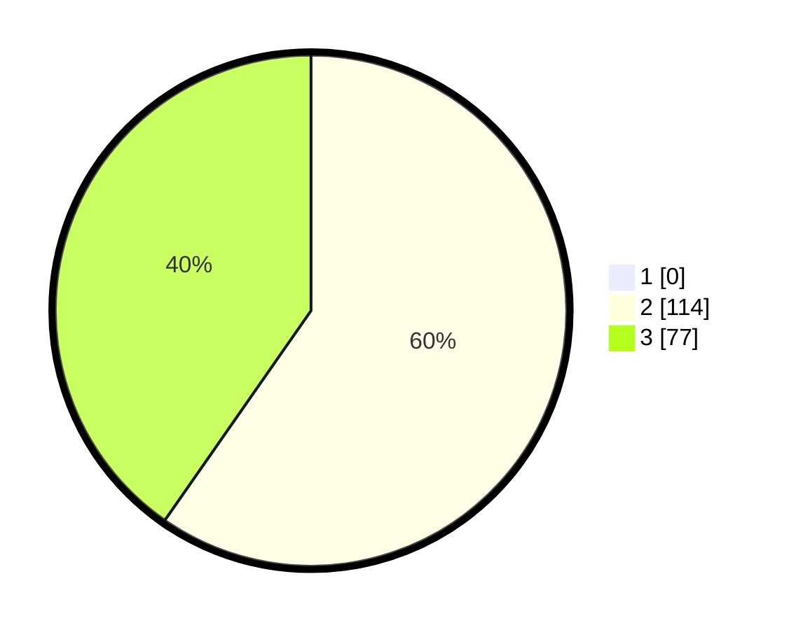

# Hasil

## Grafik

## Tabel

| No. | Nama Paslon    | Suara | Suara (raw) | Persentase |
|:--- |:-------------- | -----:| -----------:| ----------:|
| 1   | ANIES MUHAIMIN | 0     | [0][p-1]    | 0,00       |
| 2   | PRABOWO GIBRAN | 114   | [114][p-2]  | 59,69      |
| 3   | GANJAR MAHFUD  | 77    | [77][p-3]   | 40,31      |

[p-1]: https://github.com/gigit-pemilu/pemilu-2024-51-bali/blob/main/pilpres/hitung-suara/sub/51-bali/sub/08-buleleng/sub/07-sawan/sub/2014-giri-emas/sub/006-tps/sub/paslon-1.txt
[p-2]: https://github.com/gigit-pemilu/pemilu-2024-51-bali/blob/main/pilpres/hitung-suara/sub/51-bali/sub/08-buleleng/sub/07-sawan/sub/2014-giri-emas/sub/006-tps/sub/paslon-2.txt
[p-3]: https://github.com/gigit-pemilu/pemilu-2024-51-bali/blob/main/pilpres/hitung-suara/sub/51-bali/sub/08-buleleng/sub/07-sawan/sub/2014-giri-emas/sub/006-tps/sub/paslon-3.txt

## Foto C Plano

https://sirekap-obj-formc.kpu.go.id/d1d4/pemilu/ppwp/51/08/07/20/14/5108072014006-20240214-214846--e447e4ea-2488-45b9-92fb-a724be572b3d.jpg

https://sirekap-obj-formc.kpu.go.id/d1d4/pemilu/ppwp/51/08/07/20/14/5108072014006-20240214-215000--bd784a29-5933-43e6-a10a-cfff452aee1f.jpg

https://sirekap-obj-formc.kpu.go.id/d1d4/pemilu/ppwp/51/08/07/20/14/5108072014006-20240214-215247--8ced3efa-10c2-4569-92ff-457357a4da3b.jpg

## Metadata

| Key        | Value               |
| ---------- | ------------------- |
| Time Stamp | 2024-02-24 22:31:28 |

