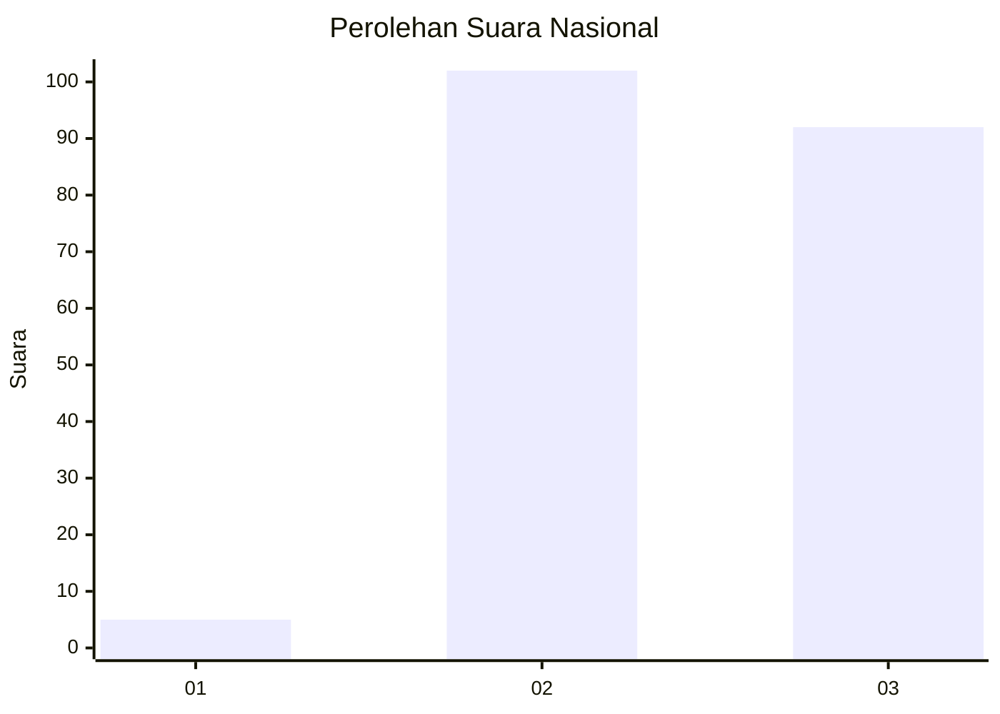
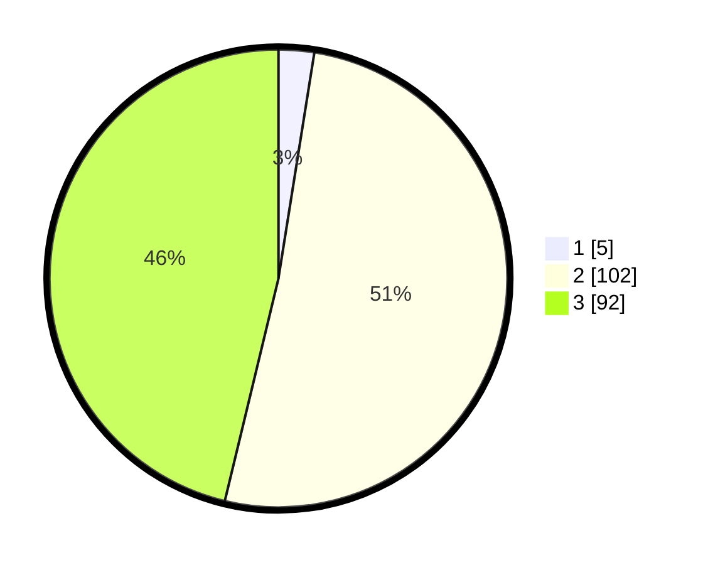

# Hasil

## Grafik

## Tabel

| No. | Nama Paslon    | Suara | Suara (raw) | Persentase |
|:--- |:-------------- | -----:| -----------:| ----------:|
| 1   | ANIES MUHAIMIN | 5     | [5][p-1]    | 2,51       |
| 2   | PRABOWO GIBRAN | 102   | [102][p-2]  | 51,26      |
| 3   | GANJAR MAHFUD  | 92    | [92][p-3]   | 46,23      |

[p-1]: https://github.com/gigit-pemilu/pemilu-2024/blob/main/pilpres/hitung-suara/sub/51-bali/sub/08-buleleng/sub/08-kubutambahan/sub/2001-tambakan/sub/001-tps/sub/paslon-1.txt
[p-2]: https://github.com/gigit-pemilu/pemilu-2024/blob/main/pilpres/hitung-suara/sub/51-bali/sub/08-buleleng/sub/08-kubutambahan/sub/2001-tambakan/sub/001-tps/sub/paslon-2.txt
[p-3]: https://github.com/gigit-pemilu/pemilu-2024/blob/main/pilpres/hitung-suara/sub/51-bali/sub/08-buleleng/sub/08-kubutambahan/sub/2001-tambakan/sub/001-tps/sub/paslon-3.txt

## Foto C Plano

https://sirekap-obj-formc.kpu.go.id/181e/pemilu/ppwp/51/08/08/20/01/5108082001001-20240214-132139--33ef9281-2a89-46f3-bf80-a5c99ffa3137.jpg

https://sirekap-obj-formc.kpu.go.id/181e/pemilu/ppwp/51/08/08/20/01/5108082001001-20240214-212838--cf540e2b-0211-4ed4-bad0-3974527b5594.jpg

https://sirekap-obj-formc.kpu.go.id/181e/pemilu/ppwp/51/08/08/20/01/5108082001001-20240214-213506--ed9e2b5a-22eb-435d-b4a0-ea9d9d97d8b2.jpg

## Metadata

| Key        | Value               |
| ---------- | ------------------- |
| Time Stamp | 2024-02-24 22:31:28 |

## DATA PEMILIH TETAP

Jumlah pemilih dalam DPT: **277**.
 * L: **143**.
 * P: **134**.

## DATA PENGGUNA HAK PILIH

Jumlah pengguna hak pilih dalam DPT: **204**.
 * L: **106**.
 * P: **98**.

Jumlah pengguna hak pilih dalam DPTb: **0**.
 * L: **0**.
 * P: **0**.

Jumlah pengguna hak pilih dalam DPK: **1**.
 * L: **1**.
 * P: **0**.

Jumlah pengguna hak pilih: **205**.
 * L: **107**.
 * P: **98**.

## JUMLAH SUARA SAH DAN TIDAK SAH

JUMLAH SELURUH SUARA SAH: **199**.

JUMLAH SUARA TIDAK SAH: **6**.

JUMLAH SELURUH SUARA SAH DAN SUARA TIDAK SAH: **205**.

