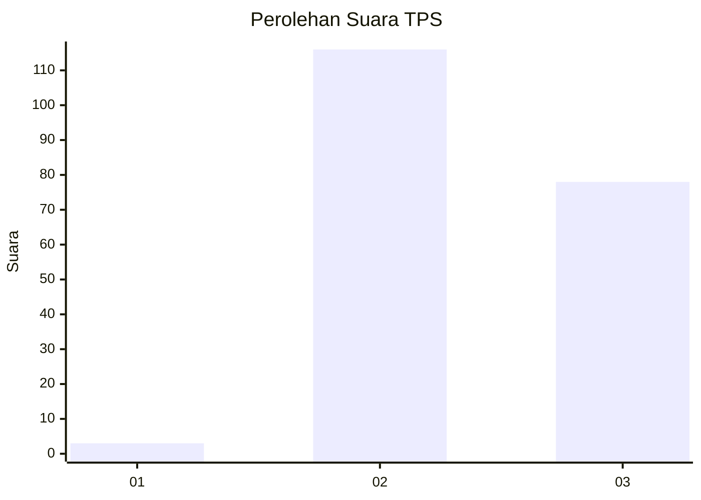
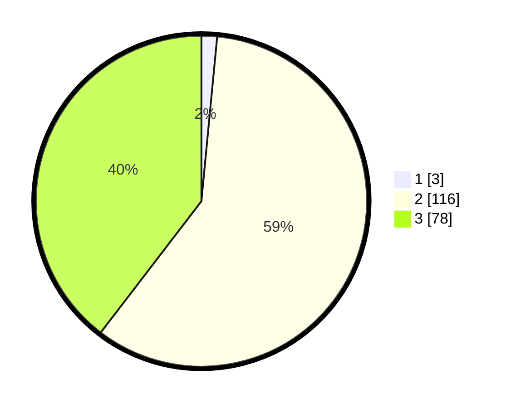

# Hasil

## Grafik

## Tabel

| No. | Nama Paslon    | Suara | Suara (raw) | Persentase |
|:--- |:-------------- | -----:| -----------:| ----------:|
| 1   | ANIES MUHAIMIN | 3     | [3][p-1]    | 1,52       |
| 2   | PRABOWO GIBRAN | 116   | [116][p-2]  | 58,88      |
| 3   | GANJAR MAHFUD  | 78    | [78][p-3]   | 39,59      |

[p-1]: https://github.com/gigit-pemilu/pemilu-2024-51-bali/blob/main/pilpres/hitung-suara/sub/51-bali/sub/08-buleleng/sub/08-kubutambahan/sub/2001-tambakan/sub/002-tps/sub/paslon-1.txt
[p-2]: https://github.com/gigit-pemilu/pemilu-2024-51-bali/blob/main/pilpres/hitung-suara/sub/51-bali/sub/08-buleleng/sub/08-kubutambahan/sub/2001-tambakan/sub/002-tps/sub/paslon-2.txt
[p-3]: https://github.com/gigit-pemilu/pemilu-2024-51-bali/blob/main/pilpres/hitung-suara/sub/51-bali/sub/08-buleleng/sub/08-kubutambahan/sub/2001-tambakan/sub/002-tps/sub/paslon-3.txt

## Foto C Plano

https://sirekap-obj-formc.kpu.go.id/5dbf/pemilu/ppwp/51/08/08/20/01/5108082001002-20240215-000346--98da07cb-b662-47f0-ac2e-ad14fd6ffdcb.jpg

https://sirekap-obj-formc.kpu.go.id/5dbf/pemilu/ppwp/51/08/08/20/01/5108082001002-20240215-000651--ae0e966b-ad42-46fc-be2c-2d7e23d72860.jpg

https://sirekap-obj-formc.kpu.go.id/5dbf/pemilu/ppwp/51/08/08/20/01/5108082001002-20240215-000834--c50f317d-5a30-4a12-8046-5e7da0743df6.jpg

## Metadata

| Key        | Value               |
| ---------- | ------------------- |
| Time Stamp | 2024-02-24 22:31:28 |

