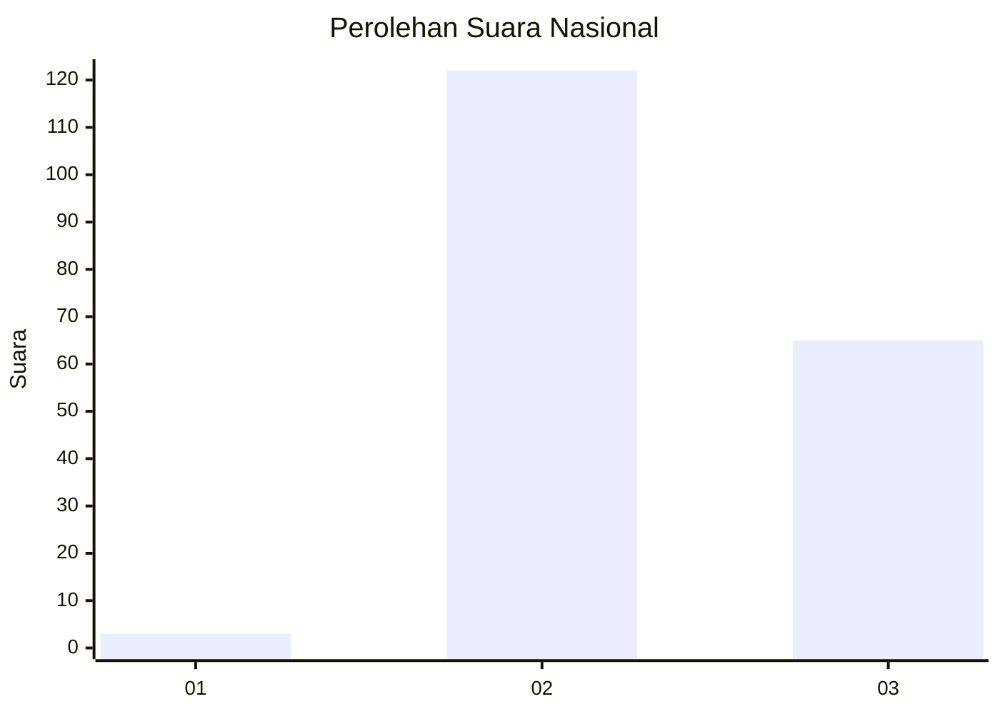
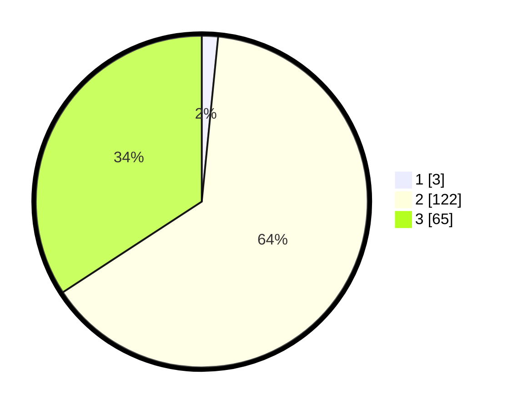

# Hasil

## Grafik

## Tabel

| No. | Nama Paslon    | Suara | Suara (raw) | Persentase |
|:--- |:-------------- | -----:| -----------:| ----------:|
| 1   | ANIES MUHAIMIN | 3     | [3][p-1]    | 1,58       |
| 2   | PRABOWO GIBRAN | 122   | [122][p-2]  | 64,21      |
| 3   | GANJAR MAHFUD  | 65    | [65][p-3]   | 34,21      |

[p-1]: https://github.com/gigit-pemilu/pemilu-2024/blob/main/pilpres/hitung-suara/sub/51-bali/sub/08-buleleng/sub/08-kubutambahan/sub/2001-tambakan/sub/004-tps/sub/paslon-1.txt
[p-2]: https://github.com/gigit-pemilu/pemilu-2024/blob/main/pilpres/hitung-suara/sub/51-bali/sub/08-buleleng/sub/08-kubutambahan/sub/2001-tambakan/sub/004-tps/sub/paslon-2.txt
[p-3]: https://github.com/gigit-pemilu/pemilu-2024/blob/main/pilpres/hitung-suara/sub/51-bali/sub/08-buleleng/sub/08-kubutambahan/sub/2001-tambakan/sub/004-tps/sub/paslon-3.txt

## Foto C Plano

https://sirekap-obj-formc.kpu.go.id/e784/pemilu/ppwp/51/08/08/20/01/5108082001004-20240214-205339--91afe132-b869-4a63-8262-aa287bee1c22.jpg

https://sirekap-obj-formc.kpu.go.id/e784/pemilu/ppwp/51/08/08/20/01/5108082001004-20240214-224056--773b3943-8b59-4002-b86e-aed079b53cad.jpg

https://sirekap-obj-formc.kpu.go.id/e784/pemilu/ppwp/51/08/08/20/01/5108082001004-20240214-224236--39312d05-770a-4af8-b9d0-46180160b681.jpg

## Metadata

| Key        | Value               |
| ---------- | ------------------- |
| Time Stamp | 2024-02-25 11:00:00 |

