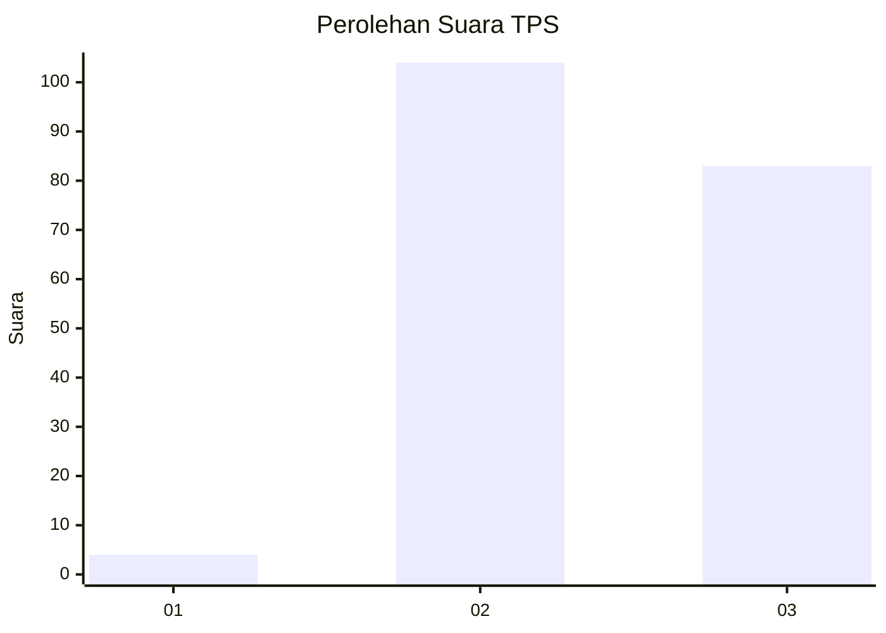
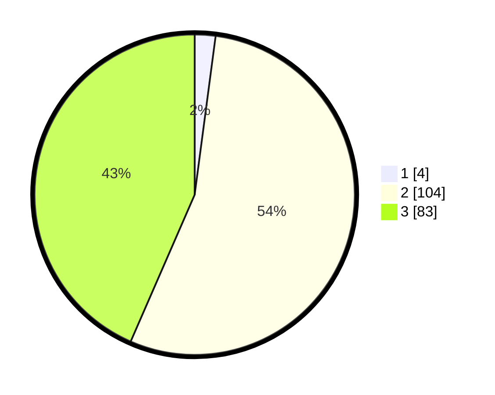

# Hasil

## Grafik

## Tabel

| No. | Nama Paslon    | Suara | Suara (raw) | Persentase |
|:--- |:-------------- | -----:| -----------:| ----------:|
| 1   | ANIES MUHAIMIN | 4     | [4][p-1]    | 2,09       |
| 2   | PRABOWO GIBRAN | 104   | [104][p-2]  | 54,45      |
| 3   | GANJAR MAHFUD  | 83    | [83][p-3]   | 43,46      |

[p-1]: https://github.com/gigit-pemilu/pemilu-2024-51-bali/blob/main/pilpres/hitung-suara/sub/51-bali/sub/08-buleleng/sub/08-kubutambahan/sub/2001-tambakan/sub/005-tps/sub/paslon-1.txt
[p-2]: https://github.com/gigit-pemilu/pemilu-2024-51-bali/blob/main/pilpres/hitung-suara/sub/51-bali/sub/08-buleleng/sub/08-kubutambahan/sub/2001-tambakan/sub/005-tps/sub/paslon-2.txt
[p-3]: https://github.com/gigit-pemilu/pemilu-2024-51-bali/blob/main/pilpres/hitung-suara/sub/51-bali/sub/08-buleleng/sub/08-kubutambahan/sub/2001-tambakan/sub/005-tps/sub/paslon-3.txt

## Foto C Plano

https://sirekap-obj-formc.kpu.go.id/b54d/pemilu/ppwp/51/08/08/20/01/5108082001005-20240214-141319--83d6e44b-2c3c-4b96-80a3-4ab3d7c929ed.jpg

https://sirekap-obj-formc.kpu.go.id/b54d/pemilu/ppwp/51/08/08/20/01/5108082001005-20240214-141105--4d3aa7e1-a7cb-4165-b0ea-9c0187b2e691.jpg

https://sirekap-obj-formc.kpu.go.id/b54d/pemilu/ppwp/51/08/08/20/01/5108082001005-20240214-141209--20275d20-072e-48db-9e7d-8723ab8e5f05.jpg

## Metadata

| Key        | Value               |
| ---------- | ------------------- |
| Time Stamp | 2024-02-14 21:46:01 |

