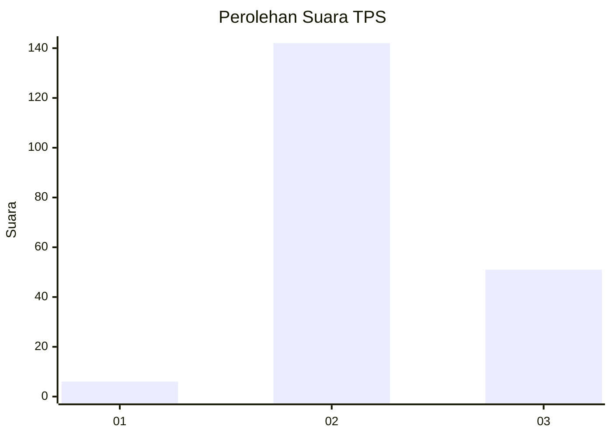
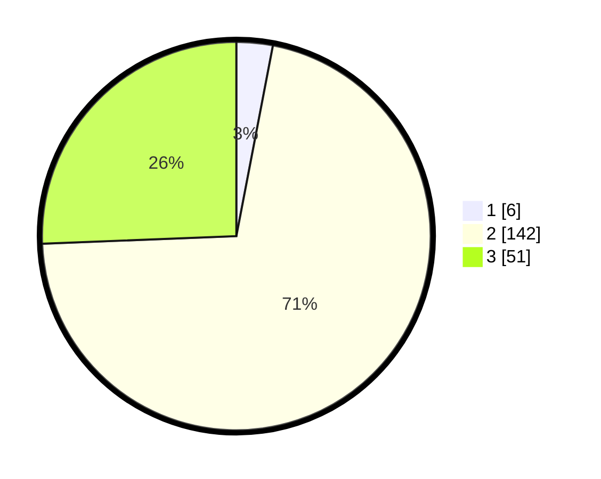

# Hasil

## Grafik

## Tabel

| No. | Nama Paslon    | Suara | Suara (raw) | Persentase |
|:--- |:-------------- | -----:| -----------:| ----------:|
| 1   | ANIES MUHAIMIN | 6     | [6][p-1]    | 3,02       |
| 2   | PRABOWO GIBRAN | 142   | [142][p-2]  | 71,36      |
| 3   | GANJAR MAHFUD  | 51    | [51][p-3]   | 25,63      |

[p-1]: https://github.com/gigit-pemilu/pemilu-2024-51-bali/blob/main/pilpres/hitung-suara/sub/51-bali/sub/08-buleleng/sub/08-kubutambahan/sub/2001-tambakan/sub/007-tps/sub/paslon-1.txt
[p-2]: https://github.com/gigit-pemilu/pemilu-2024-51-bali/blob/main/pilpres/hitung-suara/sub/51-bali/sub/08-buleleng/sub/08-kubutambahan/sub/2001-tambakan/sub/007-tps/sub/paslon-2.txt
[p-3]: https://github.com/gigit-pemilu/pemilu-2024-51-bali/blob/main/pilpres/hitung-suara/sub/51-bali/sub/08-buleleng/sub/08-kubutambahan/sub/2001-tambakan/sub/007-tps/sub/paslon-3.txt

## Foto C Plano

https://sirekap-obj-formc.kpu.go.id/0d68/pemilu/ppwp/51/08/08/20/01/5108082001007-20240214-212446--9a0f74d5-a678-4bf6-9db7-bb2c1d2b393e.jpg

https://sirekap-obj-formc.kpu.go.id/0d68/pemilu/ppwp/51/08/08/20/01/5108082001007-20240214-212514--a8beeb25-4572-41b3-b083-386658696a78.jpg

https://sirekap-obj-formc.kpu.go.id/0d68/pemilu/ppwp/51/08/08/20/01/5108082001007-20240214-212551--54cb5ca5-332e-46cd-a9d6-0be6c7f939bc.jpg

## Metadata

| Key        | Value               |
| ---------- | ------------------- |
| Time Stamp | 2024-02-24 22:31:28 |

