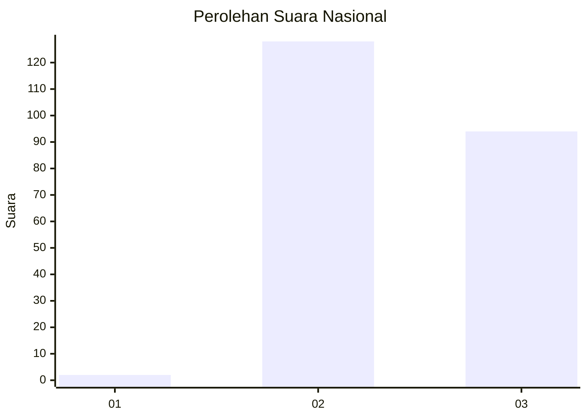
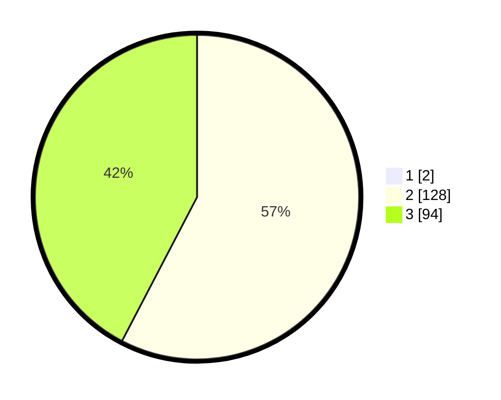

# Hasil

## Grafik

## Tabel

| No. | Nama Paslon    | Suara | Suara (raw) | Persentase |
|:--- |:-------------- | -----:| -----------:| ----------:|
| 1   | ANIES MUHAIMIN | 2     | [2][p-1]    | 0,89       |
| 2   | PRABOWO GIBRAN | 128   | [128][p-2]  | 57,14      |
| 3   | GANJAR MAHFUD  | 94    | [94][p-3]   | 41,96      |

[p-1]: https://github.com/gigit-pemilu/pemilu-2024/blob/main/pilpres/hitung-suara/sub/51-bali/sub/08-buleleng/sub/08-kubutambahan/sub/2002-pakisan/sub/003-tps/sub/paslon-1.txt
[p-2]: https://github.com/gigit-pemilu/pemilu-2024/blob/main/pilpres/hitung-suara/sub/51-bali/sub/08-buleleng/sub/08-kubutambahan/sub/2002-pakisan/sub/003-tps/sub/paslon-2.txt
[p-3]: https://github.com/gigit-pemilu/pemilu-2024/blob/main/pilpres/hitung-suara/sub/51-bali/sub/08-buleleng/sub/08-kubutambahan/sub/2002-pakisan/sub/003-tps/sub/paslon-3.txt

## Foto C Plano

https://sirekap-obj-formc.kpu.go.id/ead1/pemilu/ppwp/51/08/08/20/02/5108082002003-20240214-212402--3d3681a4-1297-4b03-8c9c-46756ff3c5e7.jpg

https://sirekap-obj-formc.kpu.go.id/ead1/pemilu/ppwp/51/08/08/20/02/5108082002003-20240214-212536--7bdd11c7-cec4-4a3e-818c-4d320013796a.jpg

https://sirekap-obj-formc.kpu.go.id/ead1/pemilu/ppwp/51/08/08/20/02/5108082002003-20240214-212618--edfc3153-168e-4755-9886-be0d7106e075.jpg

## Metadata

| Key        | Value               |
| ---------- | ------------------- |
| Time Stamp | 2024-02-24 22:31:28 |

