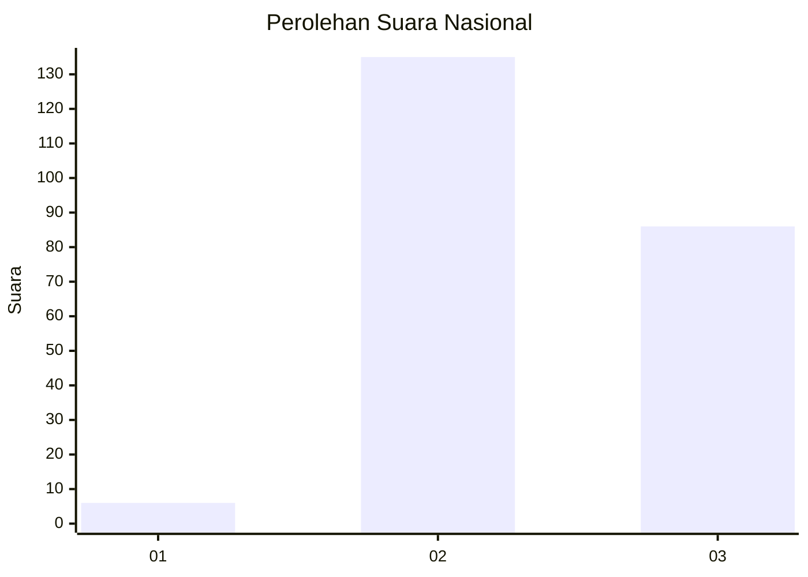
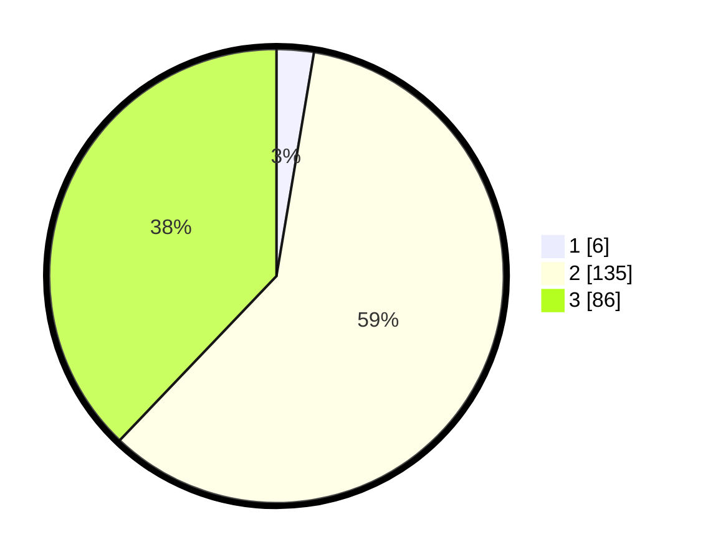

# Hasil

## Grafik

## Tabel

| No. | Nama Paslon    | Suara | Suara (raw) | Persentase |
|:--- |:-------------- | -----:| -----------:| ----------:|
| 1   | ANIES MUHAIMIN | 6     | [6][p-1]    | 2,64       |
| 2   | PRABOWO GIBRAN | 135   | [135][p-2]  | 59,47      |
| 3   | GANJAR MAHFUD  | 86    | [86][p-3]   | 37,89      |

[p-1]: https://github.com/gigit-pemilu/pemilu-2024/blob/main/pilpres/hitung-suara/sub/51-bali/sub/08-buleleng/sub/08-kubutambahan/sub/2002-pakisan/sub/004-tps/sub/paslon-1.txt
[p-2]: https://github.com/gigit-pemilu/pemilu-2024/blob/main/pilpres/hitung-suara/sub/51-bali/sub/08-buleleng/sub/08-kubutambahan/sub/2002-pakisan/sub/004-tps/sub/paslon-2.txt
[p-3]: https://github.com/gigit-pemilu/pemilu-2024/blob/main/pilpres/hitung-suara/sub/51-bali/sub/08-buleleng/sub/08-kubutambahan/sub/2002-pakisan/sub/004-tps/sub/paslon-3.txt

## Foto C Plano

https://sirekap-obj-formc.kpu.go.id/b46d/pemilu/ppwp/51/08/08/20/02/5108082002004-20240215-001334--1b41850e-e037-4a11-8553-bde519b1c59f.jpg

https://sirekap-obj-formc.kpu.go.id/b46d/pemilu/ppwp/51/08/08/20/02/5108082002004-20240215-001451--b46f336f-67aa-46a7-b360-99248a673ecb.jpg

https://sirekap-obj-formc.kpu.go.id/b46d/pemilu/ppwp/51/08/08/20/02/5108082002004-20240215-001711--f8be1214-75f2-4ff0-bb49-12daf8f8ff05.jpg

## Metadata

| Key        | Value               |
| ---------- | ------------------- |
| Time Stamp | 2024-02-24 22:31:28 |

