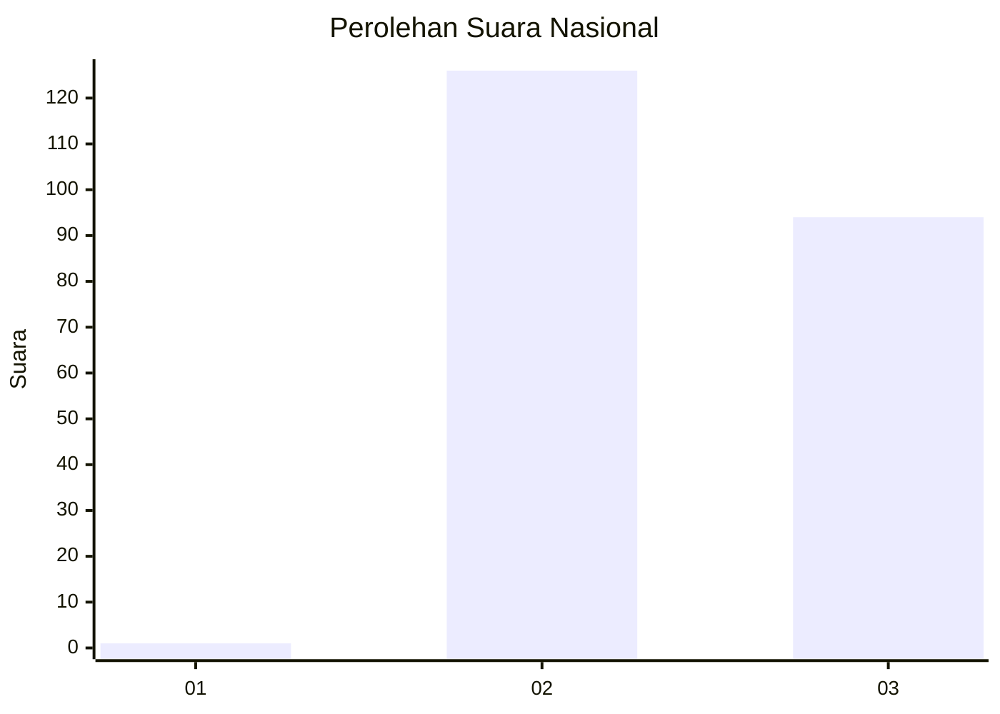
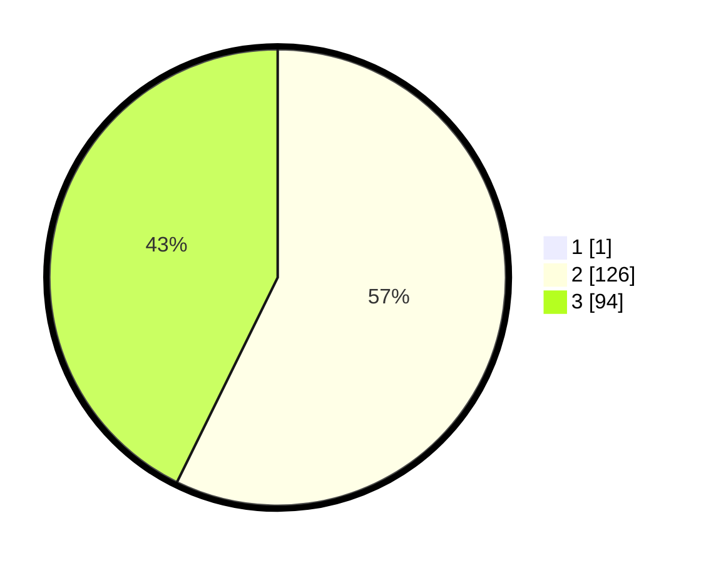

# Hasil

## Grafik

## Tabel

| No. | Nama Paslon    | Suara | Suara (raw) | Persentase |
|:--- |:-------------- | -----:| -----------:| ----------:|
| 1   | ANIES MUHAIMIN | 1     | [1][p-1]    | 0,45       |
| 2   | PRABOWO GIBRAN | 126   | [126][p-2]  | 57,01      |
| 3   | GANJAR MAHFUD  | 94    | [94][p-3]   | 42,53      |

[p-1]: https://github.com/gigit-pemilu/pemilu-2024/blob/main/pilpres/hitung-suara/sub/51-bali/sub/08-buleleng/sub/08-kubutambahan/sub/2002-pakisan/sub/010-tps/sub/paslon-1.txt
[p-2]: https://github.com/gigit-pemilu/pemilu-2024/blob/main/pilpres/hitung-suara/sub/51-bali/sub/08-buleleng/sub/08-kubutambahan/sub/2002-pakisan/sub/010-tps/sub/paslon-2.txt
[p-3]: https://github.com/gigit-pemilu/pemilu-2024/blob/main/pilpres/hitung-suara/sub/51-bali/sub/08-buleleng/sub/08-kubutambahan/sub/2002-pakisan/sub/010-tps/sub/paslon-3.txt

## Foto C Plano

https://sirekap-obj-formc.kpu.go.id/fbd8/pemilu/ppwp/51/08/08/20/02/5108082002010-20240214-223746--0943a6ed-0d31-479f-ae16-c56c74f534f4.jpg

https://sirekap-obj-formc.kpu.go.id/fbd8/pemilu/ppwp/51/08/08/20/02/5108082002010-20240214-223754--bea912c2-a7a1-403c-9832-91a6a34d556a.jpg

https://sirekap-obj-formc.kpu.go.id/fbd8/pemilu/ppwp/51/08/08/20/02/5108082002010-20240214-223911--22228a05-233a-458e-8e80-f90c253ebf93.jpg

## Metadata

| Key        | Value               |
| ---------- | ------------------- |
| Time Stamp | 2024-02-26 22:00:00 |

