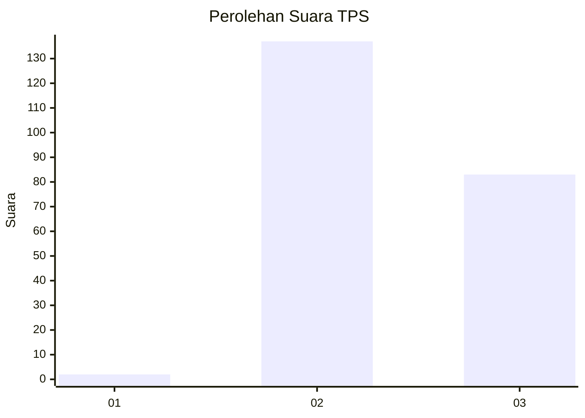
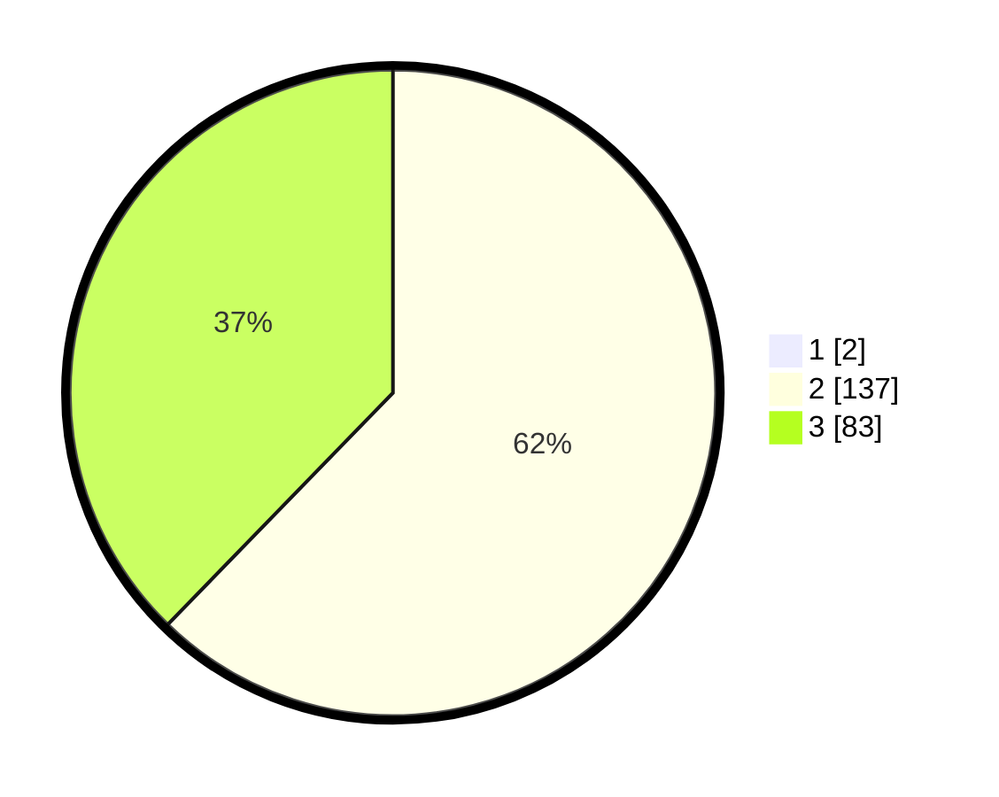

# Hasil

## Grafik

## Tabel

| No. | Nama Paslon    | Suara | Suara (raw) | Persentase |
|:--- |:-------------- | -----:| -----------:| ----------:|
| 1   | ANIES MUHAIMIN | 2     | [2][p-1]    | 0,90       |
| 2   | PRABOWO GIBRAN | 137   | [137][p-2]  | 61,71      |
| 3   | GANJAR MAHFUD  | 83    | [83][p-3]   | 37,39      |

[p-1]: https://github.com/gigit-pemilu/pemilu-2024-51-bali/blob/main/pilpres/hitung-suara/sub/51-bali/sub/08-buleleng/sub/08-kubutambahan/sub/2002-pakisan/sub/012-tps/sub/paslon-1.txt
[p-2]: https://github.com/gigit-pemilu/pemilu-2024-51-bali/blob/main/pilpres/hitung-suara/sub/51-bali/sub/08-buleleng/sub/08-kubutambahan/sub/2002-pakisan/sub/012-tps/sub/paslon-2.txt
[p-3]: https://github.com/gigit-pemilu/pemilu-2024-51-bali/blob/main/pilpres/hitung-suara/sub/51-bali/sub/08-buleleng/sub/08-kubutambahan/sub/2002-pakisan/sub/012-tps/sub/paslon-3.txt

## Foto C Plano

https://sirekap-obj-formc.kpu.go.id/e3cd/pemilu/ppwp/51/08/08/20/02/5108082002012-20240214-141058--0a41aad8-89be-461c-ac2e-56c44010d136.jpg

https://sirekap-obj-formc.kpu.go.id/e3cd/pemilu/ppwp/51/08/08/20/02/5108082002012-20240214-141105--edb8de96-bbc5-4993-9e27-a1ecbe07c9b4.jpg

https://sirekap-obj-formc.kpu.go.id/e3cd/pemilu/ppwp/51/08/08/20/02/5108082002012-20240214-141109--ff50f37e-0168-4abe-8b88-df7c0c376c08.jpg

## Metadata

| Key        | Value               |
| ---------- | ------------------- |
| Time Stamp | 2024-02-15 00:41:44 |

