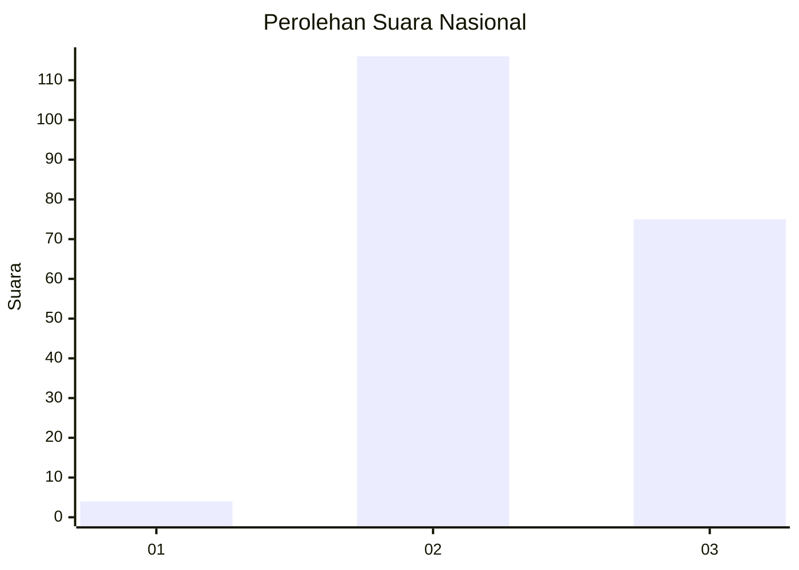
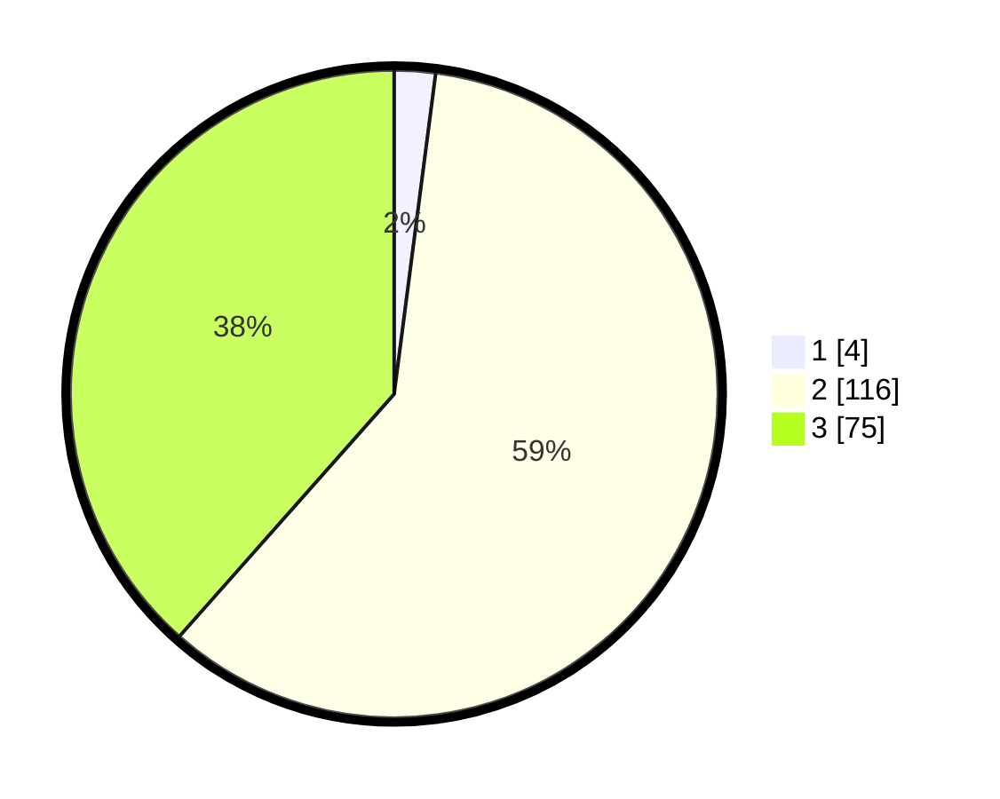

# Hasil

## Grafik

## Tabel

| No. | Nama Paslon    | Suara | Suara (raw) | Persentase |
|:--- |:-------------- | -----:| -----------:| ----------:|
| 1   | ANIES MUHAIMIN | 4     | [4][p-1]    | 2,05       |
| 2   | PRABOWO GIBRAN | 116   | [116][p-2]  | 59,49      |
| 3   | GANJAR MAHFUD  | 75    | [75][p-3]   | 38,46      |

[p-1]: https://github.com/gigit-pemilu/pemilu-2024/blob/main/pilpres/hitung-suara/sub/51-bali/sub/08-buleleng/sub/08-kubutambahan/sub/2003-bontihing/sub/002-tps/sub/paslon-1.txt
[p-2]: https://github.com/gigit-pemilu/pemilu-2024/blob/main/pilpres/hitung-suara/sub/51-bali/sub/08-buleleng/sub/08-kubutambahan/sub/2003-bontihing/sub/002-tps/sub/paslon-2.txt
[p-3]: https://github.com/gigit-pemilu/pemilu-2024/blob/main/pilpres/hitung-suara/sub/51-bali/sub/08-buleleng/sub/08-kubutambahan/sub/2003-bontihing/sub/002-tps/sub/paslon-3.txt

## Foto C Plano

https://sirekap-obj-formc.kpu.go.id/4593/pemilu/ppwp/51/08/08/20/03/5108082003002-20240214-194716--e98bcbc6-300f-4936-a08b-bdc433b7ce37.jpg

https://sirekap-obj-formc.kpu.go.id/4593/pemilu/ppwp/51/08/08/20/03/5108082003002-20240214-194836--0269f932-7cc7-49e7-8470-c160b0406e37.jpg

https://sirekap-obj-formc.kpu.go.id/4593/pemilu/ppwp/51/08/08/20/03/5108082003002-20240214-195645--e4123373-17f3-4937-bf6c-9963b61d6a62.jpg

## Metadata

| Key        | Value               |
| ---------- | ------------------- |
| Time Stamp | 2024-02-25 11:00:00 |

