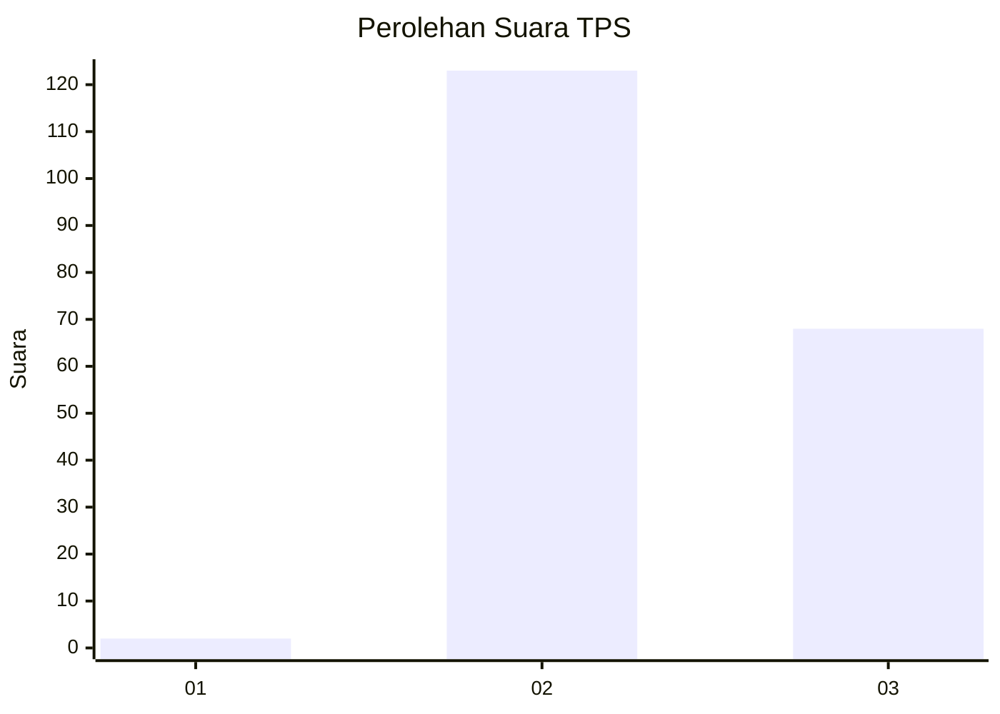
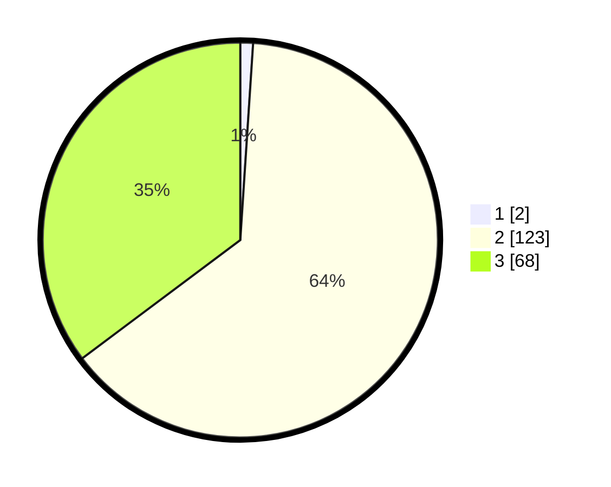

# Hasil

## Grafik

## Tabel

| No. | Nama Paslon    | Suara | Suara (raw) | Persentase |
|:--- |:-------------- | -----:| -----------:| ----------:|
| 1   | ANIES MUHAIMIN | 2     | [2][p-1]    | 1,04       |
| 2   | PRABOWO GIBRAN | 123   | [123][p-2]  | 63,73      |
| 3   | GANJAR MAHFUD  | 68    | [68][p-3]   | 35,23      |

[p-1]: https://github.com/gigit-pemilu/pemilu-2024-51-bali/blob/main/pilpres/hitung-suara/sub/51-bali/sub/08-buleleng/sub/08-kubutambahan/sub/2004-tajun/sub/001-tps/sub/paslon-1.txt
[p-2]: https://github.com/gigit-pemilu/pemilu-2024-51-bali/blob/main/pilpres/hitung-suara/sub/51-bali/sub/08-buleleng/sub/08-kubutambahan/sub/2004-tajun/sub/001-tps/sub/paslon-2.txt
[p-3]: https://github.com/gigit-pemilu/pemilu-2024-51-bali/blob/main/pilpres/hitung-suara/sub/51-bali/sub/08-buleleng/sub/08-kubutambahan/sub/2004-tajun/sub/001-tps/sub/paslon-3.txt

## Foto C Plano

https://sirekap-obj-formc.kpu.go.id/3665/pemilu/ppwp/51/08/08/20/04/5108082004001-20240214-212727--00d45b9a-3e93-464f-a135-9c101b623fb7.jpg

https://sirekap-obj-formc.kpu.go.id/3665/pemilu/ppwp/51/08/08/20/04/5108082004001-20240214-224116--555d40a3-449a-46e3-80e8-978067eef81e.jpg

https://sirekap-obj-formc.kpu.go.id/3665/pemilu/ppwp/51/08/08/20/04/5108082004001-20240214-212942--bb296998-a821-4ab9-a86b-b538fa1eeb90.jpg

## Metadata

| Key        | Value               |
| ---------- | ------------------- |
| Time Stamp | 2024-02-25 11:00:00 |

