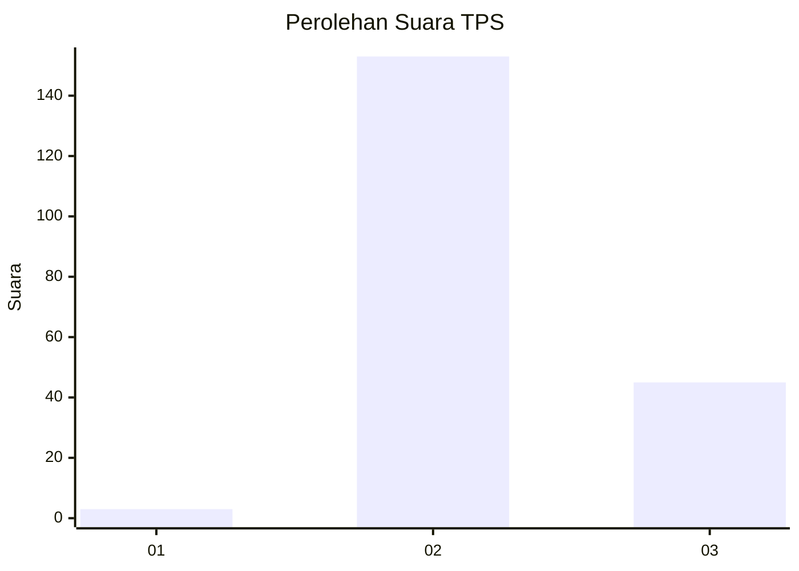
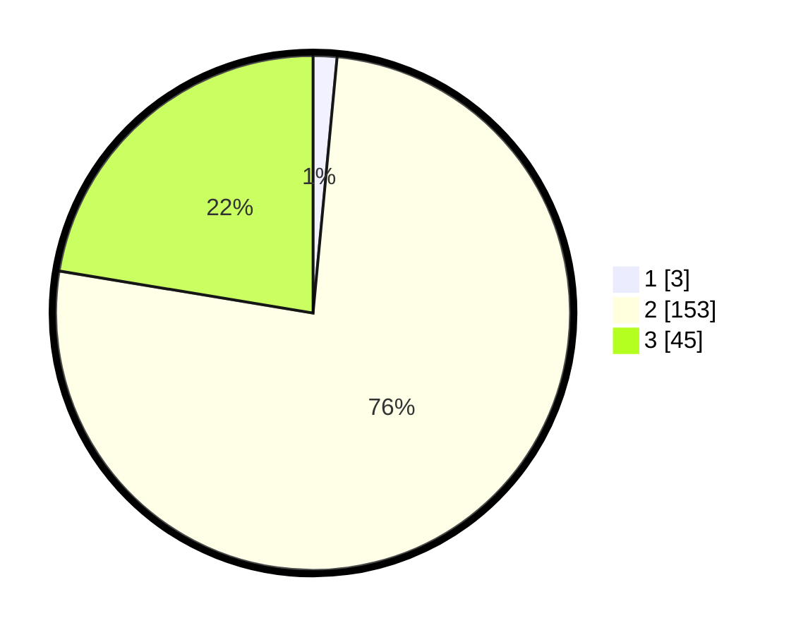

# Hasil

## Grafik

## Tabel

| No. | Nama Paslon    | Suara | Suara (raw) | Persentase |
|:--- |:-------------- | -----:| -----------:| ----------:|
| 1   | ANIES MUHAIMIN | 3     | [3][p-1]    | 1,49       |
| 2   | PRABOWO GIBRAN | 153   | [153][p-2]  | 76,12      |
| 3   | GANJAR MAHFUD  | 45    | [45][p-3]   | 22,39      |

[p-1]: https://github.com/gigit-pemilu/pemilu-2024-51-bali/blob/main/pilpres/hitung-suara/sub/51-bali/sub/08-buleleng/sub/08-kubutambahan/sub/2004-tajun/sub/005-tps/sub/paslon-1.txt
[p-2]: https://github.com/gigit-pemilu/pemilu-2024-51-bali/blob/main/pilpres/hitung-suara/sub/51-bali/sub/08-buleleng/sub/08-kubutambahan/sub/2004-tajun/sub/005-tps/sub/paslon-2.txt
[p-3]: https://github.com/gigit-pemilu/pemilu-2024-51-bali/blob/main/pilpres/hitung-suara/sub/51-bali/sub/08-buleleng/sub/08-kubutambahan/sub/2004-tajun/sub/005-tps/sub/paslon-3.txt

## Foto C Plano

https://sirekap-obj-formc.kpu.go.id/63aa/pemilu/ppwp/51/08/08/20/04/5108082004005-20240214-205350--f78c4cb6-ee31-4b2f-b234-b050dc9c2e47.jpg

https://sirekap-obj-formc.kpu.go.id/63aa/pemilu/ppwp/51/08/08/20/04/5108082004005-20240214-205357--cbaa3d4b-1513-4a11-af1b-f1117c546b32.jpg

https://sirekap-obj-formc.kpu.go.id/63aa/pemilu/ppwp/51/08/08/20/04/5108082004005-20240214-205334--c8250958-ce9f-478f-a679-26700732c1af.jpg

## Metadata

| Key        | Value               |
| ---------- | ------------------- |
| Time Stamp | 2024-02-24 22:31:28 |

