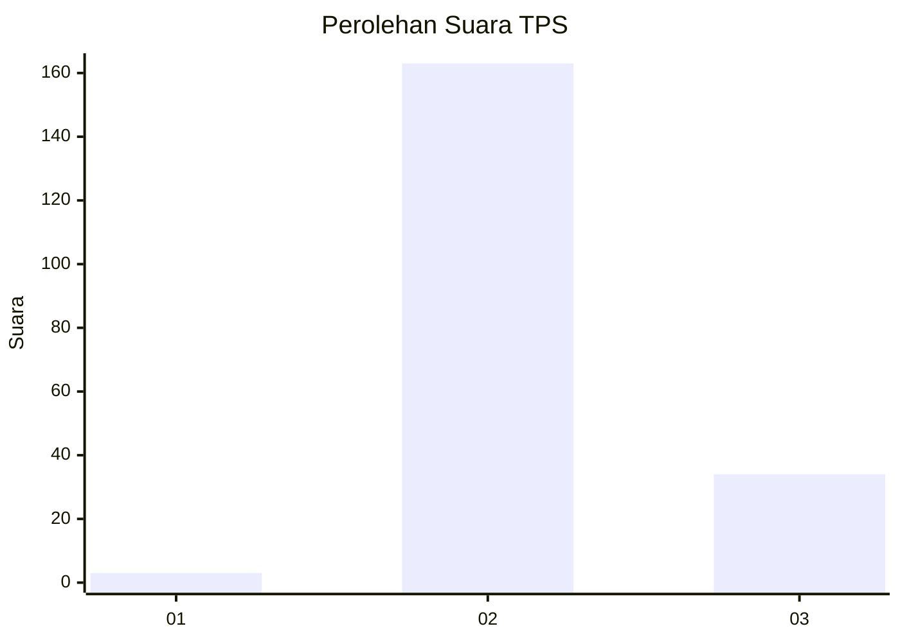
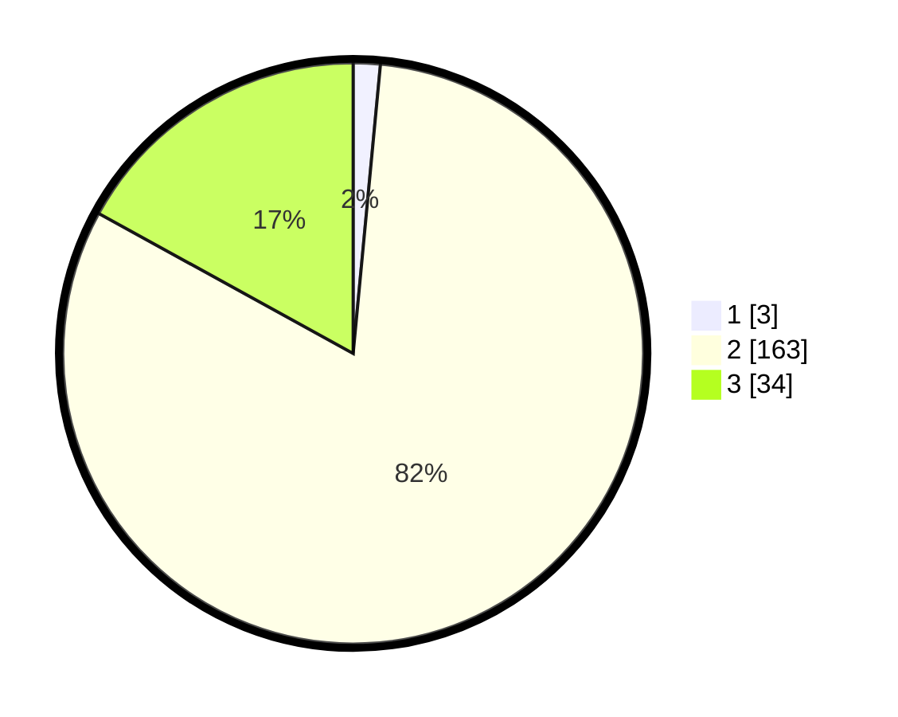

# Hasil

## Grafik

## Tabel

| No. | Nama Paslon    | Suara | Suara (raw) | Persentase |
|:--- |:-------------- | -----:| -----------:| ----------:|
| 1   | ANIES MUHAIMIN | 3     | [3][p-1]    | 1,50       |
| 2   | PRABOWO GIBRAN | 163   | [163][p-2]  | 81,50      |
| 3   | GANJAR MAHFUD  | 34    | [34][p-3]   | 17,00      |

[p-1]: https://github.com/gigit-pemilu/pemilu-2024-51-bali/blob/main/pilpres/hitung-suara/sub/51-bali/sub/08-buleleng/sub/08-kubutambahan/sub/2004-tajun/sub/006-tps/sub/paslon-1.txt
[p-2]: https://github.com/gigit-pemilu/pemilu-2024-51-bali/blob/main/pilpres/hitung-suara/sub/51-bali/sub/08-buleleng/sub/08-kubutambahan/sub/2004-tajun/sub/006-tps/sub/paslon-2.txt
[p-3]: https://github.com/gigit-pemilu/pemilu-2024-51-bali/blob/main/pilpres/hitung-suara/sub/51-bali/sub/08-buleleng/sub/08-kubutambahan/sub/2004-tajun/sub/006-tps/sub/paslon-3.txt

## Foto C Plano

https://sirekap-obj-formc.kpu.go.id/1245/pemilu/ppwp/51/08/08/20/04/5108082004006-20240214-221859--935de58c-d934-44ce-8e24-bfca57ed7b9a.jpg

https://sirekap-obj-formc.kpu.go.id/1245/pemilu/ppwp/51/08/08/20/04/5108082004006-20240214-222352--a87037c6-fb73-4b44-b677-9b93180f3edf.jpg

https://sirekap-obj-formc.kpu.go.id/1245/pemilu/ppwp/51/08/08/20/04/5108082004006-20240214-222957--5b6ccd6b-5d9a-4b7d-9540-b681a2c9c0ea.jpg

## Metadata

| Key        | Value               |
| ---------- | ------------------- |
| Time Stamp | 2024-02-25 16:00:00 |

