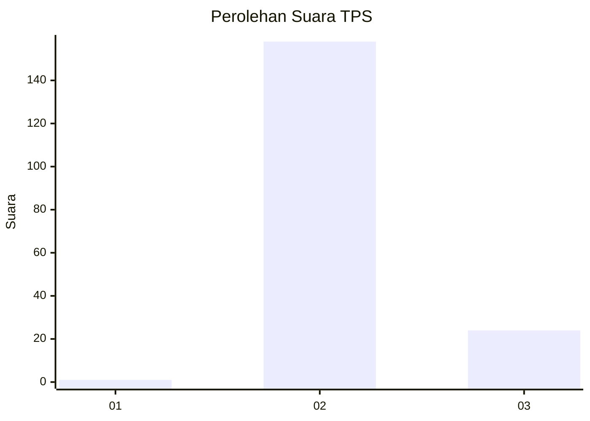
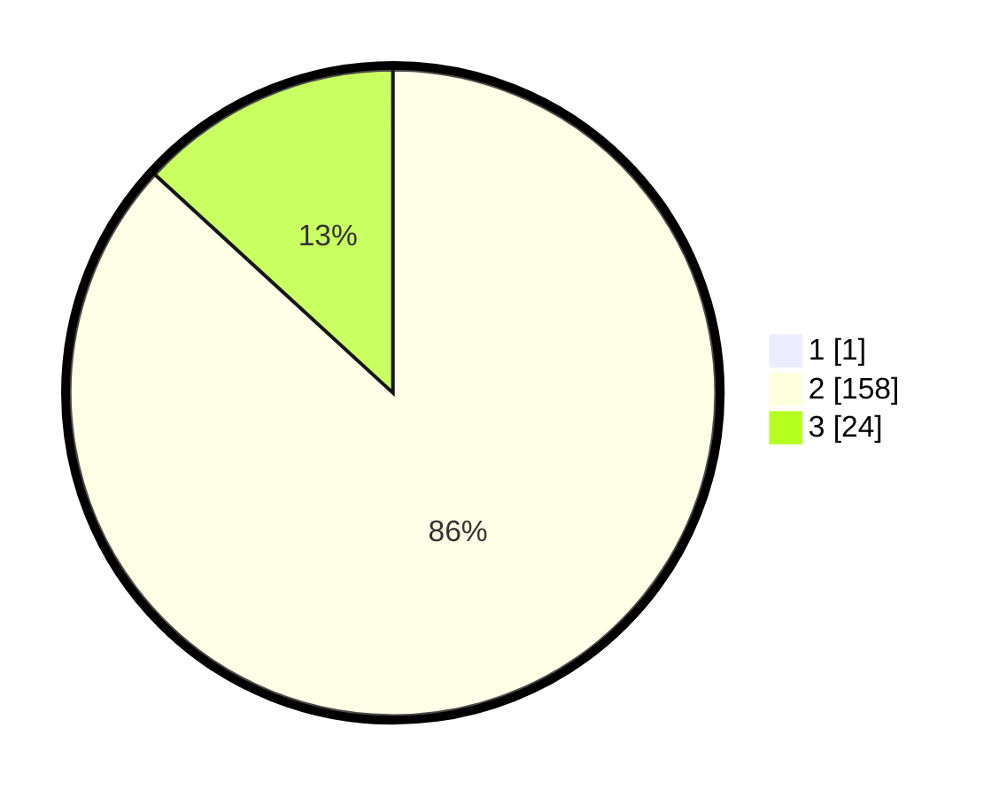

# Hasil

## Grafik

## Tabel

| No. | Nama Paslon    | Suara | Suara (raw) | Persentase |
|:--- |:-------------- | -----:| -----------:| ----------:|
| 1   | ANIES MUHAIMIN | 1     | [1][p-1]    | 0,55       |
| 2   | PRABOWO GIBRAN | 158   | [158][p-2]  | 86,34      |
| 3   | GANJAR MAHFUD  | 24    | [24][p-3]   | 13,11      |

[p-1]: https://github.com/gigit-pemilu/pemilu-2024-51-bali/blob/main/pilpres/hitung-suara/sub/51-bali/sub/08-buleleng/sub/08-kubutambahan/sub/2004-tajun/sub/008-tps/sub/paslon-1.txt
[p-2]: https://github.com/gigit-pemilu/pemilu-2024-51-bali/blob/main/pilpres/hitung-suara/sub/51-bali/sub/08-buleleng/sub/08-kubutambahan/sub/2004-tajun/sub/008-tps/sub/paslon-2.txt
[p-3]: https://github.com/gigit-pemilu/pemilu-2024-51-bali/blob/main/pilpres/hitung-suara/sub/51-bali/sub/08-buleleng/sub/08-kubutambahan/sub/2004-tajun/sub/008-tps/sub/paslon-3.txt

## Foto C Plano

https://sirekap-obj-formc.kpu.go.id/7964/pemilu/ppwp/51/08/08/20/04/5108082004008-20240214-213142--6d20f797-cd38-4dec-becd-a4728c2618a3.jpg

https://sirekap-obj-formc.kpu.go.id/7964/pemilu/ppwp/51/08/08/20/04/5108082004008-20240214-213356--7d2cac28-c371-42dc-9c5e-c0b2ce640287.jpg

https://sirekap-obj-formc.kpu.go.id/7964/pemilu/ppwp/51/08/08/20/04/5108082004008-20240214-213653--625ce09f-d476-4ea1-b098-2913152767df.jpg

## Metadata

| Key        | Value               |
| ---------- | ------------------- |
| Time Stamp | 2024-02-24 22:31:28 |

