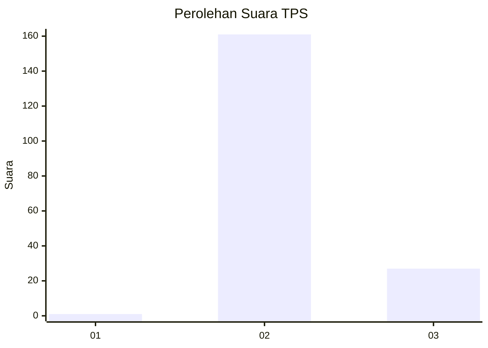
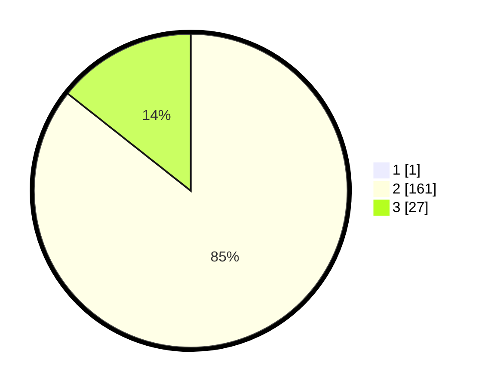

# Hasil

## Grafik

## Tabel

| No. | Nama Paslon    | Suara | Suara (raw) | Persentase |
|:--- |:-------------- | -----:| -----------:| ----------:|
| 1   | ANIES MUHAIMIN | 1     | [1][p-1]    | 0,53       |
| 2   | PRABOWO GIBRAN | 161   | [161][p-2]  | 85,19      |
| 3   | GANJAR MAHFUD  | 27    | [27][p-3]   | 14,29      |

[p-1]: https://github.com/gigit-pemilu/pemilu-2024-51-bali/blob/main/pilpres/hitung-suara/sub/51-bali/sub/08-buleleng/sub/08-kubutambahan/sub/2004-tajun/sub/009-tps/sub/paslon-1.txt
[p-2]: https://github.com/gigit-pemilu/pemilu-2024-51-bali/blob/main/pilpres/hitung-suara/sub/51-bali/sub/08-buleleng/sub/08-kubutambahan/sub/2004-tajun/sub/009-tps/sub/paslon-2.txt
[p-3]: https://github.com/gigit-pemilu/pemilu-2024-51-bali/blob/main/pilpres/hitung-suara/sub/51-bali/sub/08-buleleng/sub/08-kubutambahan/sub/2004-tajun/sub/009-tps/sub/paslon-3.txt

## Foto C Plano

https://sirekap-obj-formc.kpu.go.id/5042/pemilu/ppwp/51/08/08/20/04/5108082004009-20240214-215350--9440e94c-23c6-4071-a92c-9e2cfeee5b14.jpg

https://sirekap-obj-formc.kpu.go.id/5042/pemilu/ppwp/51/08/08/20/04/5108082004009-20240214-213939--7115324f-a498-474b-84e5-836cf4c32324.jpg

https://sirekap-obj-formc.kpu.go.id/5042/pemilu/ppwp/51/08/08/20/04/5108082004009-20240214-214217--d49872bb-947c-4b6f-8a04-2f6eea489e42.jpg

## Metadata

| Key        | Value               |
| ---------- | ------------------- |
| Time Stamp | 2024-02-24 22:31:28 |

