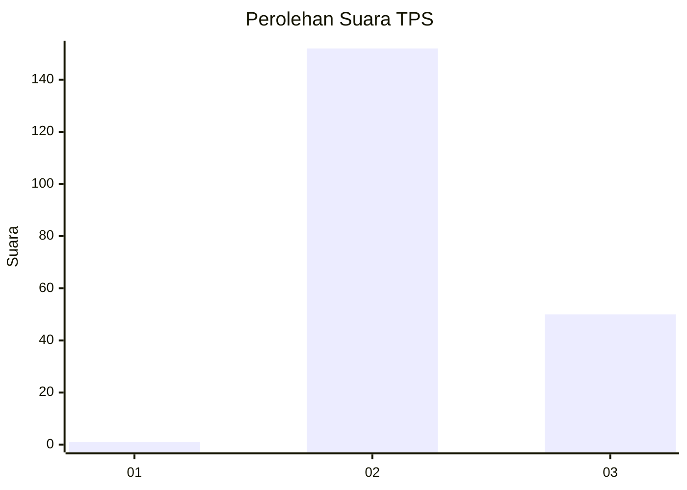
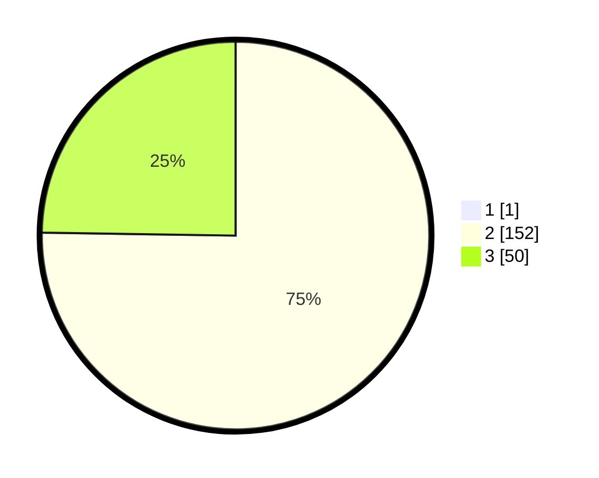

# Hasil

## Grafik

## Tabel

| No. | Nama Paslon    | Suara | Suara (raw) | Persentase |
|:--- |:-------------- | -----:| -----------:| ----------:|
| 1   | ANIES MUHAIMIN | 1     | [1][p-1]    | 0,49       |
| 2   | PRABOWO GIBRAN | 152   | [152][p-2]  | 74,88      |
| 3   | GANJAR MAHFUD  | 50    | [50][p-3]   | 24,63      |

[p-1]: https://github.com/gigit-pemilu/pemilu-2024-51-bali/blob/main/pilpres/hitung-suara/sub/51-bali/sub/08-buleleng/sub/08-kubutambahan/sub/2004-tajun/sub/012-tps/sub/paslon-1.txt
[p-2]: https://github.com/gigit-pemilu/pemilu-2024-51-bali/blob/main/pilpres/hitung-suara/sub/51-bali/sub/08-buleleng/sub/08-kubutambahan/sub/2004-tajun/sub/012-tps/sub/paslon-2.txt
[p-3]: https://github.com/gigit-pemilu/pemilu-2024-51-bali/blob/main/pilpres/hitung-suara/sub/51-bali/sub/08-buleleng/sub/08-kubutambahan/sub/2004-tajun/sub/012-tps/sub/paslon-3.txt

## Foto C Plano

https://sirekap-obj-formc.kpu.go.id/4d9c/pemilu/ppwp/51/08/08/20/04/5108082004012-20240214-211706--2cec98ff-4f19-4a0d-98c3-c60749fa7f45.jpg

https://sirekap-obj-formc.kpu.go.id/4d9c/pemilu/ppwp/51/08/08/20/04/5108082004012-20240214-211929--bbd3bb54-ddc8-408e-be2e-c92b68b9b917.jpg

https://sirekap-obj-formc.kpu.go.id/4d9c/pemilu/ppwp/51/08/08/20/04/5108082004012-20240214-212046--12174b2c-1a6b-40ff-8b3c-9e3db16aa471.jpg

## Metadata

| Key        | Value               |
| ---------- | ------------------- |
| Time Stamp | 2024-02-24 22:31:28 |

