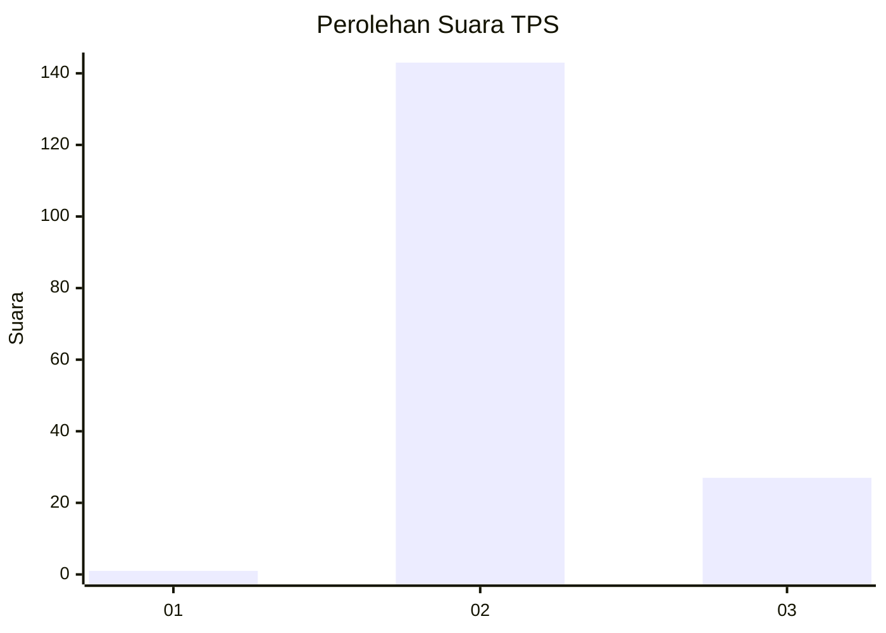
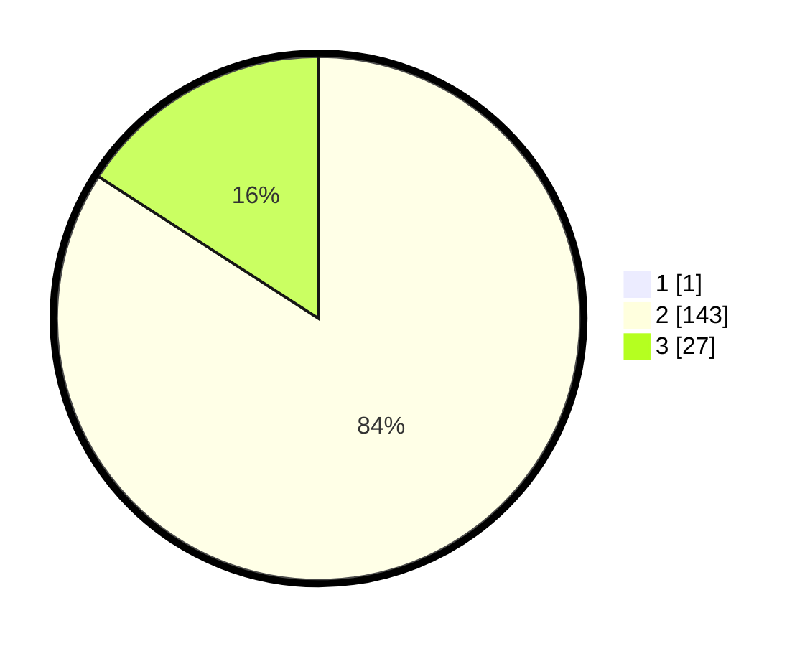

# Hasil

## Grafik

## Tabel

| No. | Nama Paslon    | Suara | Suara (raw) | Persentase |
|:--- |:-------------- | -----:| -----------:| ----------:|
| 1   | ANIES MUHAIMIN | 1     | [1][p-1]    | 0,58       |
| 2   | PRABOWO GIBRAN | 143   | [143][p-2]  | 83,63      |
| 3   | GANJAR MAHFUD  | 27    | [27][p-3]   | 15,79      |

[p-1]: https://github.com/gigit-pemilu/pemilu-2024-51-bali/blob/main/pilpres/hitung-suara/sub/51-bali/sub/08-buleleng/sub/08-kubutambahan/sub/2004-tajun/sub/014-tps/sub/paslon-1.txt
[p-2]: https://github.com/gigit-pemilu/pemilu-2024-51-bali/blob/main/pilpres/hitung-suara/sub/51-bali/sub/08-buleleng/sub/08-kubutambahan/sub/2004-tajun/sub/014-tps/sub/paslon-2.txt
[p-3]: https://github.com/gigit-pemilu/pemilu-2024-51-bali/blob/main/pilpres/hitung-suara/sub/51-bali/sub/08-buleleng/sub/08-kubutambahan/sub/2004-tajun/sub/014-tps/sub/paslon-3.txt

## Foto C Plano

https://sirekap-obj-formc.kpu.go.id/2238/pemilu/ppwp/51/08/08/20/04/5108082004014-20240214-235032--7ccaf4f5-72ba-4ae1-b148-e6ee2a3663dc.jpg

https://sirekap-obj-formc.kpu.go.id/2238/pemilu/ppwp/51/08/08/20/04/5108082004014-20240214-235537--a9b34718-dcf5-43eb-9793-82b041651fad.jpg

https://sirekap-obj-formc.kpu.go.id/2238/pemilu/ppwp/51/08/08/20/04/5108082004014-20240214-235733--45248d06-d46f-465b-b4a8-6dcd03ca771f.jpg

## Metadata

| Key        | Value               |
| ---------- | ------------------- |
| Time Stamp | 2024-02-24 22:31:28 |

