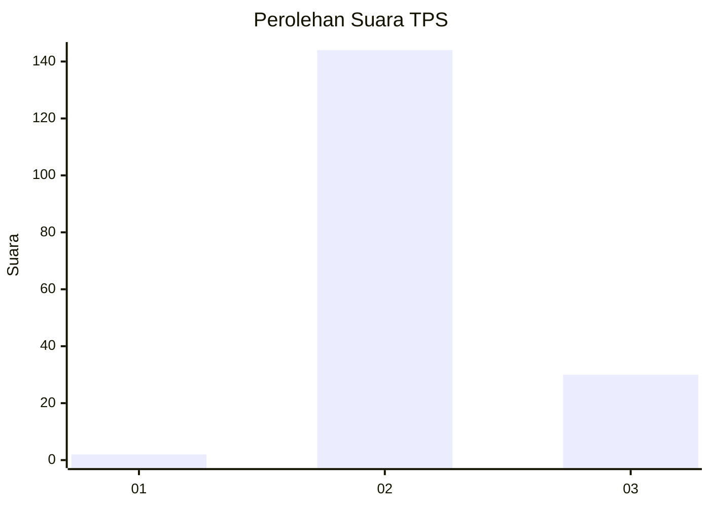
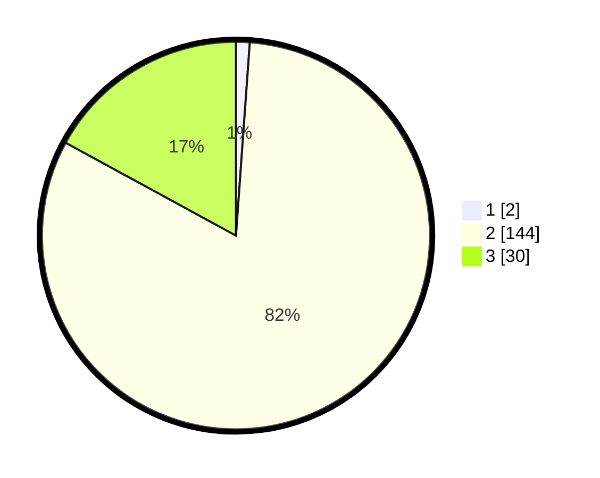

# Hasil

## Grafik

## Tabel

| No. | Nama Paslon    | Suara | Suara (raw) | Persentase |
|:--- |:-------------- | -----:| -----------:| ----------:|
| 1   | ANIES MUHAIMIN | 2     | [2][p-1]    | 1,14       |
| 2   | PRABOWO GIBRAN | 144   | [144][p-2]  | 81,82      |
| 3   | GANJAR MAHFUD  | 30    | [30][p-3]   | 17,05      |

[p-1]: https://github.com/gigit-pemilu/pemilu-2024-51-bali/blob/main/pilpres/hitung-suara/sub/51-bali/sub/08-buleleng/sub/08-kubutambahan/sub/2004-tajun/sub/015-tps/sub/paslon-1.txt
[p-2]: https://github.com/gigit-pemilu/pemilu-2024-51-bali/blob/main/pilpres/hitung-suara/sub/51-bali/sub/08-buleleng/sub/08-kubutambahan/sub/2004-tajun/sub/015-tps/sub/paslon-2.txt
[p-3]: https://github.com/gigit-pemilu/pemilu-2024-51-bali/blob/main/pilpres/hitung-suara/sub/51-bali/sub/08-buleleng/sub/08-kubutambahan/sub/2004-tajun/sub/015-tps/sub/paslon-3.txt

## Foto C Plano

https://sirekap-obj-formc.kpu.go.id/741a/pemilu/ppwp/51/08/08/20/04/5108082004015-20240214-212840--c3b70480-acd6-479f-83ae-37ba22765b25.jpg

https://sirekap-obj-formc.kpu.go.id/741a/pemilu/ppwp/51/08/08/20/04/5108082004015-20240214-212814--d9133bc1-897e-431c-bbff-911474692db1.jpg

https://sirekap-obj-formc.kpu.go.id/741a/pemilu/ppwp/51/08/08/20/04/5108082004015-20240214-212736--17cf435a-dd2f-46d9-b07e-374bef8a77c2.jpg

## Metadata

| Key        | Value               |
| ---------- | ------------------- |
| Time Stamp | 2024-02-24 22:31:28 |

