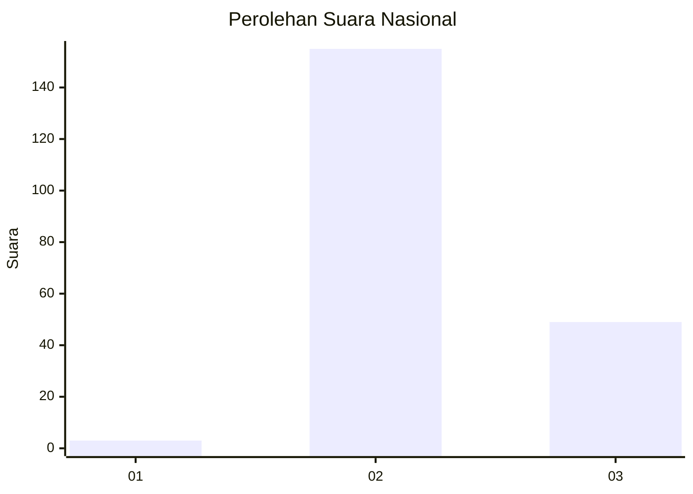
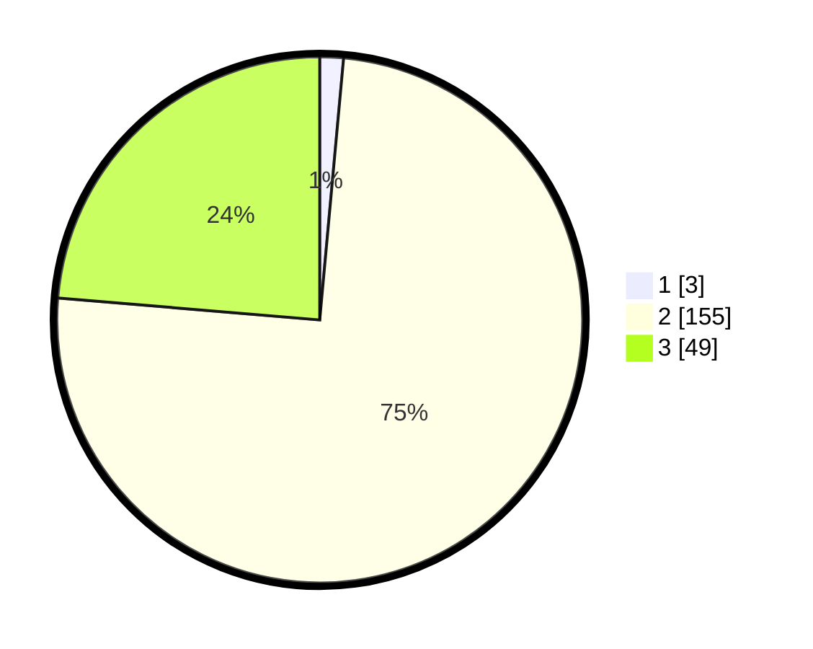

# Hasil

## Grafik

## Tabel

| No. | Nama Paslon    | Suara | Suara (raw) | Persentase |
|:--- |:-------------- | -----:| -----------:| ----------:|
| 1   | ANIES MUHAIMIN | 3     | [3][p-1]    | 1,45       |
| 2   | PRABOWO GIBRAN | 155   | [155][p-2]  | 74,88      |
| 3   | GANJAR MAHFUD  | 49    | [49][p-3]   | 23,67      |

[p-1]: https://github.com/gigit-pemilu/pemilu-2024/blob/main/pilpres/hitung-suara/sub/51-bali/sub/08-buleleng/sub/08-kubutambahan/sub/2004-tajun/sub/016-tps/sub/paslon-1.txt
[p-2]: https://github.com/gigit-pemilu/pemilu-2024/blob/main/pilpres/hitung-suara/sub/51-bali/sub/08-buleleng/sub/08-kubutambahan/sub/2004-tajun/sub/016-tps/sub/paslon-2.txt
[p-3]: https://github.com/gigit-pemilu/pemilu-2024/blob/main/pilpres/hitung-suara/sub/51-bali/sub/08-buleleng/sub/08-kubutambahan/sub/2004-tajun/sub/016-tps/sub/paslon-3.txt

## Foto C Plano

https://sirekap-obj-formc.kpu.go.id/ff7e/pemilu/ppwp/51/08/08/20/04/5108082004016-20240214-214455--139e4698-7ca8-46c6-8efd-300a89f880c3.jpg

https://sirekap-obj-formc.kpu.go.id/ff7e/pemilu/ppwp/51/08/08/20/04/5108082004016-20240214-214541--803d241d-c94f-4a02-8172-70092c188d47.jpg

https://sirekap-obj-formc.kpu.go.id/ff7e/pemilu/ppwp/51/08/08/20/04/5108082004016-20240214-214634--b66e31ae-dbda-430f-bac5-b9dd4face0ec.jpg

## Metadata

| Key        | Value               |
| ---------- | ------------------- |
| Time Stamp | 2024-02-25 12:00:00 |

