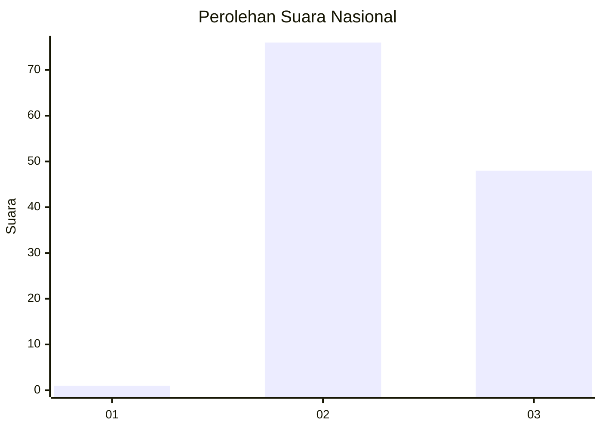
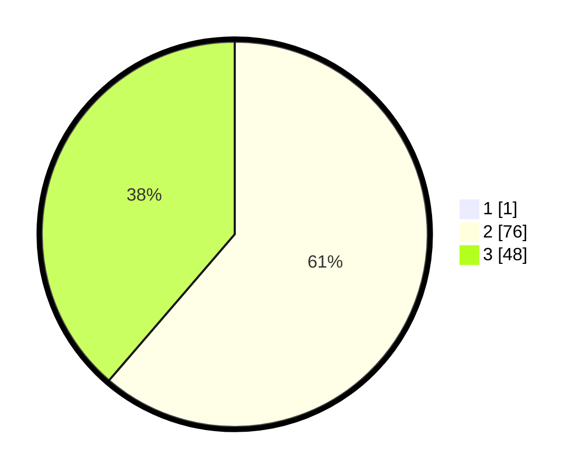

# Hasil

## Grafik

## Tabel

| No. | Nama Paslon    | Suara | Suara (raw) | Persentase |
|:--- |:-------------- | -----:| -----------:| ----------:|
| 1   | ANIES MUHAIMIN | 1     | [1][p-1]    | 0,80       |
| 2   | PRABOWO GIBRAN | 76    | [76][p-2]   | 60,80      |
| 3   | GANJAR MAHFUD  | 48    | [48][p-3]   | 38,40      |

[p-1]: https://github.com/gigit-pemilu/pemilu-2024/blob/main/pilpres/hitung-suara/sub/51-bali/sub/08-buleleng/sub/08-kubutambahan/sub/2004-tajun/sub/018-tps/sub/paslon-1.txt
[p-2]: https://github.com/gigit-pemilu/pemilu-2024/blob/main/pilpres/hitung-suara/sub/51-bali/sub/08-buleleng/sub/08-kubutambahan/sub/2004-tajun/sub/018-tps/sub/paslon-2.txt
[p-3]: https://github.com/gigit-pemilu/pemilu-2024/blob/main/pilpres/hitung-suara/sub/51-bali/sub/08-buleleng/sub/08-kubutambahan/sub/2004-tajun/sub/018-tps/sub/paslon-3.txt

## Foto C Plano

https://sirekap-obj-formc.kpu.go.id/7ab3/pemilu/ppwp/51/08/08/20/04/5108082004018-20240214-211838--87dfd307-913d-46a0-b7bc-25d18f6108cb.jpg

https://sirekap-obj-formc.kpu.go.id/7ab3/pemilu/ppwp/51/08/08/20/04/5108082004018-20240214-211933--91b822fc-deeb-411e-a9e5-44339349782a.jpg

https://sirekap-obj-formc.kpu.go.id/7ab3/pemilu/ppwp/51/08/08/20/04/5108082004018-20240214-212025--a316314a-6267-436a-81a1-824dfae75fff.jpg

## Metadata

| Key        | Value               |
| ---------- | ------------------- |
| Time Stamp | 2024-02-19 06:16:00 |

