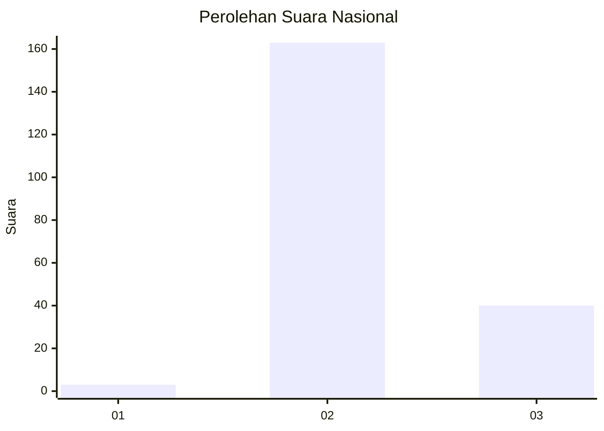

# Hasil

## Grafik

## Tabel

| No. | Nama Paslon    | Suara | Suara (raw) | Persentase |
|:--- |:-------------- | -----:| -----------:| ----------:|
| 1   | ANIES MUHAIMIN | 3     | [3][p-1]    | 1,46       |
| 2   | PRABOWO GIBRAN | 163   | [163][p-2]  | 79,13      |
| 3   | GANJAR MAHFUD  | 40    | [40][p-3]   | 19,42      |

[p-1]: https://github.com/gigit-pemilu/pemilu-2024/blob/main/pilpres/hitung-suara/sub/51-bali/sub/08-buleleng/sub/08-kubutambahan/sub/2005-tunjung/sub/001-tps/sub/paslon-1.txt
[p-2]: https://github.com/gigit-pemilu/pemilu-2024/blob/main/pilpres/hitung-suara/sub/51-bali/sub/08-buleleng/sub/08-kubutambahan/sub/2005-tunjung/sub/001-tps/sub/paslon-2.txt
[p-3]: https://github.com/gigit-pemilu/pemilu-2024/blob/main/pilpres/hitung-suara/sub/51-bali/sub/08-buleleng/sub/08-kubutambahan/sub/2005-tunjung/sub/001-tps/sub/paslon-3.txt

## Foto C Plano

https://sirekap-obj-formc.kpu.go.id/928c/pemilu/ppwp/51/08/08/20/05/5108082005001-20240214-232819--a57ba526-5017-4178-835d-303274e2c85a.jpg

https://sirekap-obj-formc.kpu.go.id/928c/pemilu/ppwp/51/08/08/20/05/5108082005001-20240214-232905--2b2c1536-08c7-43bf-bd48-4228f0d6cf68.jpg

https://sirekap-obj-formc.kpu.go.id/928c/pemilu/ppwp/51/08/08/20/05/5108082005001-20240214-232946--112df75a-35cd-4955-942b-4a0c2d5f969a.jpg

## Metadata

| Key        | Value               |
| ---------- | ------------------- |
| Time Stamp | 2024-02-24 22:31:28 |

