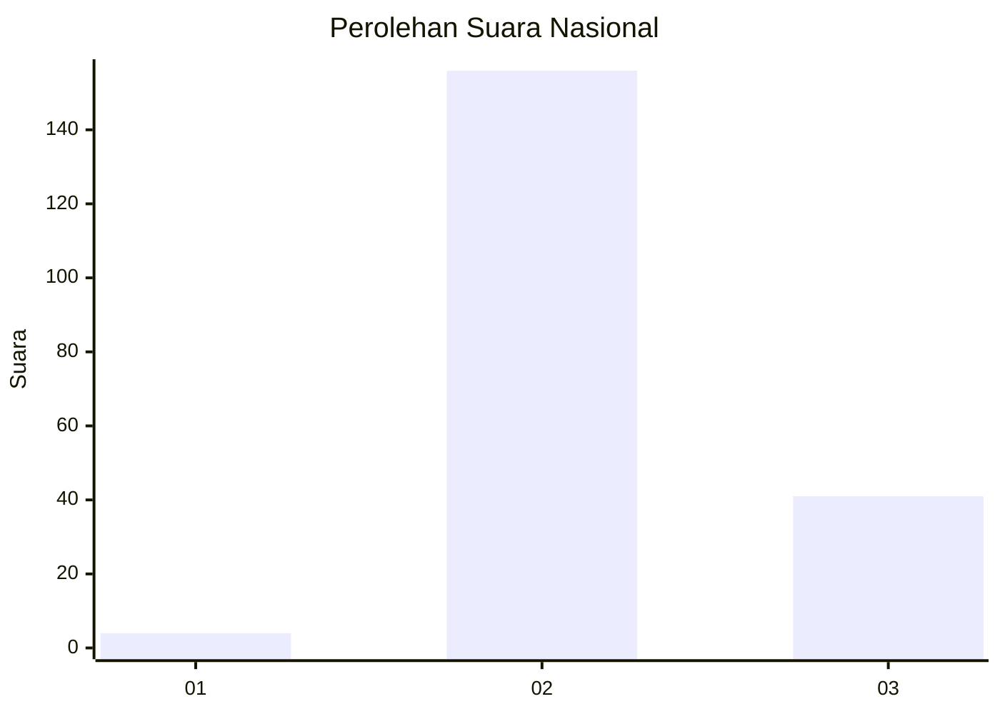

# Hasil

## Grafik

## Tabel

| No. | Nama Paslon    | Suara | Suara (raw) | Persentase |
|:--- |:-------------- | -----:| -----------:| ----------:|
| 1   | ANIES MUHAIMIN | 4     | [4][p-1]    | 1,99       |
| 2   | PRABOWO GIBRAN | 156   | [156][p-2]  | 77,61      |
| 3   | GANJAR MAHFUD  | 41    | [41][p-3]   | 20,40      |

[p-1]: https://github.com/gigit-pemilu/pemilu-2024/blob/main/pilpres/hitung-suara/sub/51-bali/sub/08-buleleng/sub/08-kubutambahan/sub/2005-tunjung/sub/002-tps/sub/paslon-1.txt
[p-2]: https://github.com/gigit-pemilu/pemilu-2024/blob/main/pilpres/hitung-suara/sub/51-bali/sub/08-buleleng/sub/08-kubutambahan/sub/2005-tunjung/sub/002-tps/sub/paslon-2.txt
[p-3]: https://github.com/gigit-pemilu/pemilu-2024/blob/main/pilpres/hitung-suara/sub/51-bali/sub/08-buleleng/sub/08-kubutambahan/sub/2005-tunjung/sub/002-tps/sub/paslon-3.txt

## Foto C Plano

https://sirekap-obj-formc.kpu.go.id/35bd/pemilu/ppwp/51/08/08/20/05/5108082005002-20240214-231708--05dcc7bc-73dd-4253-b61f-c6b470911088.jpg

https://sirekap-obj-formc.kpu.go.id/35bd/pemilu/ppwp/51/08/08/20/05/5108082005002-20240214-231810--2c750ba2-bd54-4334-8d39-00c694c7ae42.jpg

https://sirekap-obj-formc.kpu.go.id/35bd/pemilu/ppwp/51/08/08/20/05/5108082005002-20240214-231852--06d9b237-fcae-41ec-a3c9-0b0f48b1d42c.jpg

## Metadata

| Key        | Value               |
| ---------- | ------------------- |
| Time Stamp | 2024-02-24 22:31:28 |

