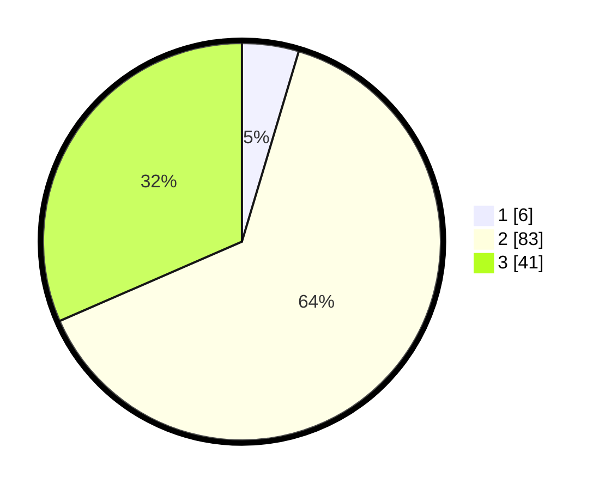

# Hasil

## Grafik

## Tabel

| No. | Nama Paslon    | Suara | Suara (raw) | Persentase |
|:--- |:-------------- | -----:| -----------:| ----------:|
| 1   | ANIES MUHAIMIN | 6     | [6][p-1]    | 4,62       |
| 2   | PRABOWO GIBRAN | 83    | [83][p-2]   | 63,85      |
| 3   | GANJAR MAHFUD  | 41    | [41][p-3]   | 31,54      |

[p-1]: https://github.com/gigit-pemilu/pemilu-2024-51-bali/blob/main/pilpres/hitung-suara/sub/51-bali/sub/08-buleleng/sub/08-kubutambahan/sub/2006-depeha/sub/001-tps/sub/paslon-1.txt
[p-2]: https://github.com/gigit-pemilu/pemilu-2024-51-bali/blob/main/pilpres/hitung-suara/sub/51-bali/sub/08-buleleng/sub/08-kubutambahan/sub/2006-depeha/sub/001-tps/sub/paslon-2.txt
[p-3]: https://github.com/gigit-pemilu/pemilu-2024-51-bali/blob/main/pilpres/hitung-suara/sub/51-bali/sub/08-buleleng/sub/08-kubutambahan/sub/2006-depeha/sub/001-tps/sub/paslon-3.txt

## Foto C Plano

https://sirekap-obj-formc.kpu.go.id/fdea/pemilu/ppwp/51/08/08/20/06/5108082006001-20240215-001038--0c0bab05-ccd0-4a90-9518-534f68dc48a1.jpg

https://sirekap-obj-formc.kpu.go.id/fdea/pemilu/ppwp/51/08/08/20/06/5108082006001-20240215-001130--6cf7e5db-014c-4d01-bc3d-898aece672be.jpg

## Metadata

| Key        | Value               |
| ---------- | ------------------- |
| Time Stamp | 2024-02-24 22:31:28 |

