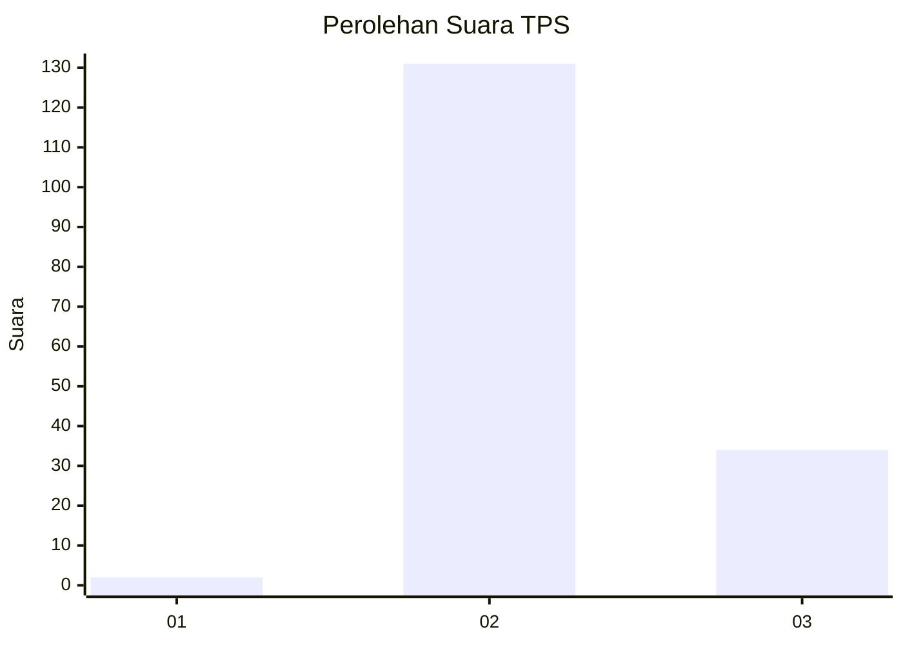

# Hasil

## Grafik

## Tabel

| No. | Nama Paslon    | Suara | Suara (raw) | Persentase |
|:--- |:-------------- | -----:| -----------:| ----------:|
| 1   | ANIES MUHAIMIN | 2     | [2][p-1]    | 1,20       |
| 2   | PRABOWO GIBRAN | 131   | [131][p-2]  | 78,44      |
| 3   | GANJAR MAHFUD  | 34    | [34][p-3]   | 20,36      |

[p-1]: https://github.com/gigit-pemilu/pemilu-2024-51-bali/blob/main/pilpres/hitung-suara/sub/51-bali/sub/08-buleleng/sub/08-kubutambahan/sub/2006-depeha/sub/004-tps/sub/paslon-1.txt
[p-2]: https://github.com/gigit-pemilu/pemilu-2024-51-bali/blob/main/pilpres/hitung-suara/sub/51-bali/sub/08-buleleng/sub/08-kubutambahan/sub/2006-depeha/sub/004-tps/sub/paslon-2.txt
[p-3]: https://github.com/gigit-pemilu/pemilu-2024-51-bali/blob/main/pilpres/hitung-suara/sub/51-bali/sub/08-buleleng/sub/08-kubutambahan/sub/2006-depeha/sub/004-tps/sub/paslon-3.txt

## Foto C Plano

https://sirekap-obj-formc.kpu.go.id/f5d8/pemilu/ppwp/51/08/08/20/06/5108082006004-20240214-141920--87be20c7-40c0-4838-a449-d860060a396e.jpg

https://sirekap-obj-formc.kpu.go.id/f5d8/pemilu/ppwp/51/08/08/20/06/5108082006004-20240214-133006--223a2dc2-5e44-4fc3-b7ee-e268504712d1.jpg

https://sirekap-obj-formc.kpu.go.id/f5d8/pemilu/ppwp/51/08/08/20/06/5108082006004-20240214-133425--afe57033-d81a-47bf-aa4c-7c20902a46d5.jpg

## Metadata

| Key        | Value               |
| ---------- | ------------------- |
| Time Stamp | 2024-02-14 21:46:01 |

