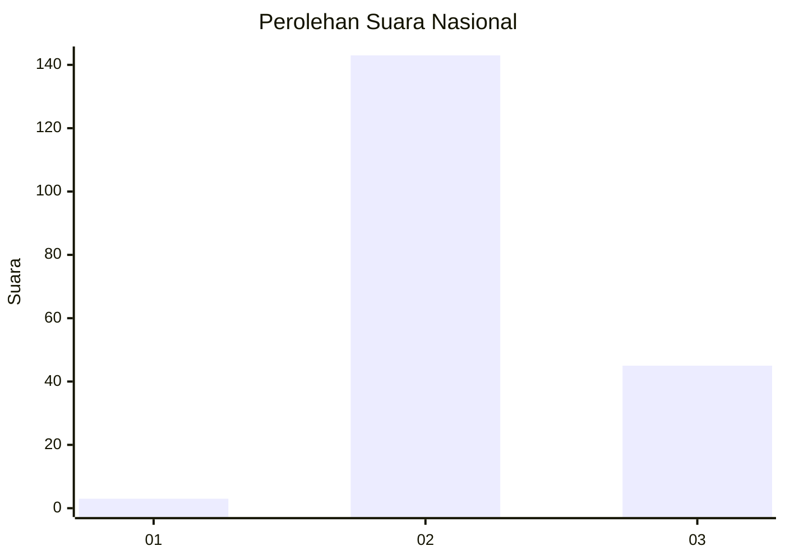
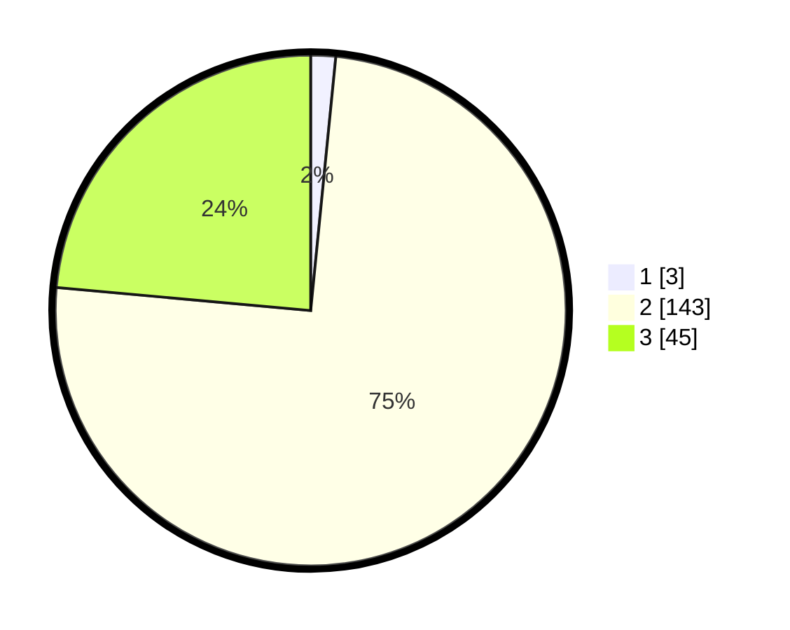

# Hasil

## Grafik

## Tabel

| No. | Nama Paslon    | Suara | Suara (raw) | Persentase |
|:--- |:-------------- | -----:| -----------:| ----------:|
| 1   | ANIES MUHAIMIN | 3     | [3][p-1]    | 1,57       |
| 2   | PRABOWO GIBRAN | 143   | [143][p-2]  | 74,87      |
| 3   | GANJAR MAHFUD  | 45    | [45][p-3]   | 23,56      |

[p-1]: https://github.com/gigit-pemilu/pemilu-2024/blob/main/pilpres/hitung-suara/sub/51-bali/sub/08-buleleng/sub/08-kubutambahan/sub/2006-depeha/sub/006-tps/sub/paslon-1.txt
[p-2]: https://github.com/gigit-pemilu/pemilu-2024/blob/main/pilpres/hitung-suara/sub/51-bali/sub/08-buleleng/sub/08-kubutambahan/sub/2006-depeha/sub/006-tps/sub/paslon-2.txt
[p-3]: https://github.com/gigit-pemilu/pemilu-2024/blob/main/pilpres/hitung-suara/sub/51-bali/sub/08-buleleng/sub/08-kubutambahan/sub/2006-depeha/sub/006-tps/sub/paslon-3.txt

## Foto C Plano

https://sirekap-obj-formc.kpu.go.id/f78f/pemilu/ppwp/51/08/08/20/06/5108082006006-20240214-215109--fb0dcffb-b422-4856-9ffb-e86e919951c5.jpg

https://sirekap-obj-formc.kpu.go.id/f78f/pemilu/ppwp/51/08/08/20/06/5108082006006-20240214-215116--40830b2f-4df5-41fc-8af8-ecee770213ba.jpg

https://sirekap-obj-formc.kpu.go.id/f78f/pemilu/ppwp/51/08/08/20/06/5108082006006-20240214-215121--71015423-b795-4d30-b685-c0486c967fd1.jpg

## Metadata

| Key        | Value               |
| ---------- | ------------------- |
| Time Stamp | 2024-02-24 22:31:28 |

