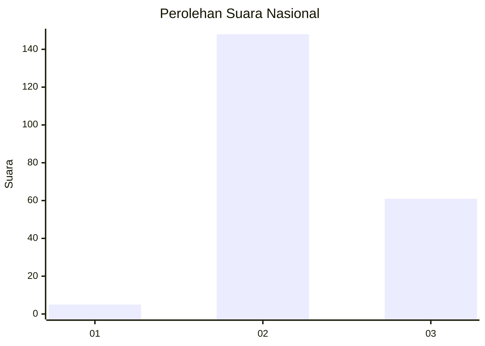
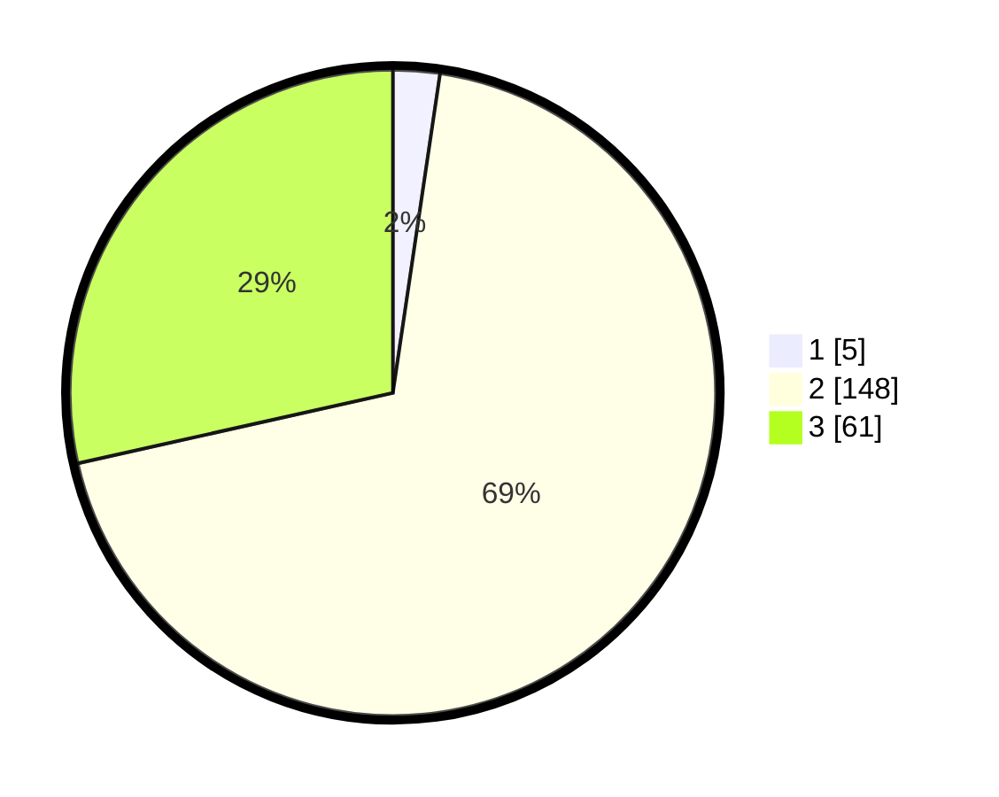

# Hasil

## Grafik

## Tabel

| No. | Nama Paslon    | Suara | Suara (raw) | Persentase |
|:--- |:-------------- | -----:| -----------:| ----------:|
| 1   | ANIES MUHAIMIN | 5     | [5][p-1]    | 2,34       |
| 2   | PRABOWO GIBRAN | 148   | [148][p-2]  | 69,16      |
| 3   | GANJAR MAHFUD  | 61    | [61][p-3]   | 28,50      |

[p-1]: https://github.com/gigit-pemilu/pemilu-2024/blob/main/pilpres/hitung-suara/sub/51-bali/sub/08-buleleng/sub/08-kubutambahan/sub/2006-depeha/sub/008-tps/sub/paslon-1.txt
[p-2]: https://github.com/gigit-pemilu/pemilu-2024/blob/main/pilpres/hitung-suara/sub/51-bali/sub/08-buleleng/sub/08-kubutambahan/sub/2006-depeha/sub/008-tps/sub/paslon-2.txt
[p-3]: https://github.com/gigit-pemilu/pemilu-2024/blob/main/pilpres/hitung-suara/sub/51-bali/sub/08-buleleng/sub/08-kubutambahan/sub/2006-depeha/sub/008-tps/sub/paslon-3.txt

## Foto C Plano

https://sirekap-obj-formc.kpu.go.id/2cd2/pemilu/ppwp/51/08/08/20/06/5108082006008-20240214-215342--8ca9d1da-d6cb-4d0a-ada9-1fd62e498a26.jpg

https://sirekap-obj-formc.kpu.go.id/2cd2/pemilu/ppwp/51/08/08/20/06/5108082006008-20240214-215315--963e896e-193a-42ea-80cd-9c693ee2cbca.jpg

https://sirekap-obj-formc.kpu.go.id/2cd2/pemilu/ppwp/51/08/08/20/06/5108082006008-20240214-215537--a3f01f8e-0596-4c6a-9dfe-f868d9a37b2c.jpg

## Metadata

| Key        | Value               |
| ---------- | ------------------- |
| Time Stamp | 2024-02-24 22:31:28 |

