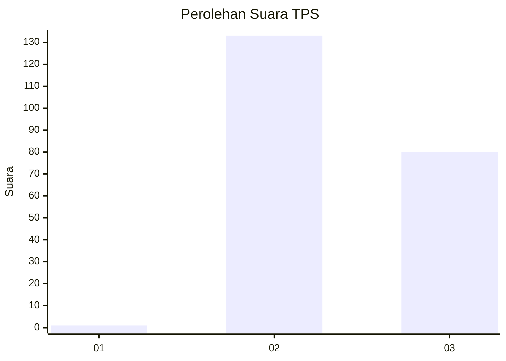
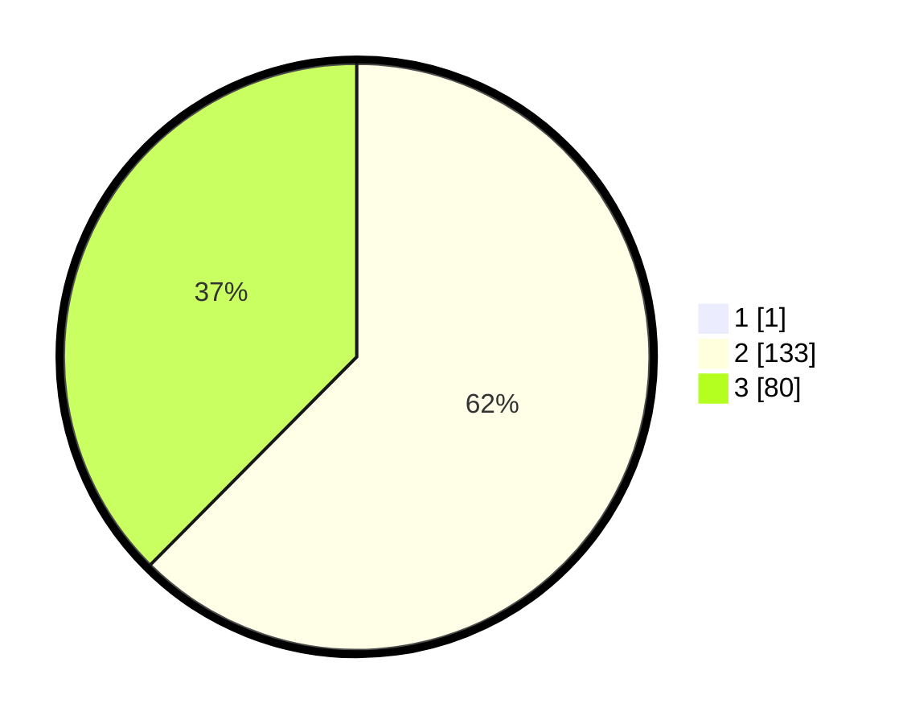

# Hasil

## Grafik

## Tabel

| No. | Nama Paslon    | Suara | Suara (raw) | Persentase |
|:--- |:-------------- | -----:| -----------:| ----------:|
| 1   | ANIES MUHAIMIN | 1     | [1][p-1]    | 0,47       |
| 2   | PRABOWO GIBRAN | 133   | [133][p-2]  | 62,15      |
| 3   | GANJAR MAHFUD  | 80    | [80][p-3]   | 37,38      |

[p-1]: https://github.com/gigit-pemilu/pemilu-2024-51-bali/blob/main/pilpres/hitung-suara/sub/51-bali/sub/08-buleleng/sub/08-kubutambahan/sub/2006-depeha/sub/009-tps/sub/paslon-1.txt
[p-2]: https://github.com/gigit-pemilu/pemilu-2024-51-bali/blob/main/pilpres/hitung-suara/sub/51-bali/sub/08-buleleng/sub/08-kubutambahan/sub/2006-depeha/sub/009-tps/sub/paslon-2.txt
[p-3]: https://github.com/gigit-pemilu/pemilu-2024-51-bali/blob/main/pilpres/hitung-suara/sub/51-bali/sub/08-buleleng/sub/08-kubutambahan/sub/2006-depeha/sub/009-tps/sub/paslon-3.txt

## Foto C Plano

https://sirekap-obj-formc.kpu.go.id/a863/pemilu/ppwp/51/08/08/20/06/5108082006009-20240215-000022--7346cf58-93b3-457e-a49c-e7a98cf30055.jpg

https://sirekap-obj-formc.kpu.go.id/a863/pemilu/ppwp/51/08/08/20/06/5108082006009-20240215-000039--df3eb5d2-4892-4cd7-b500-b782dfc8718f.jpg

https://sirekap-obj-formc.kpu.go.id/a863/pemilu/ppwp/51/08/08/20/06/5108082006009-20240215-000034--7e4242e5-93b4-4f2b-86b2-1742a516799c.jpg

## Metadata

| Key        | Value               |
| ---------- | ------------------- |
| Time Stamp | 2024-02-24 22:31:28 |

