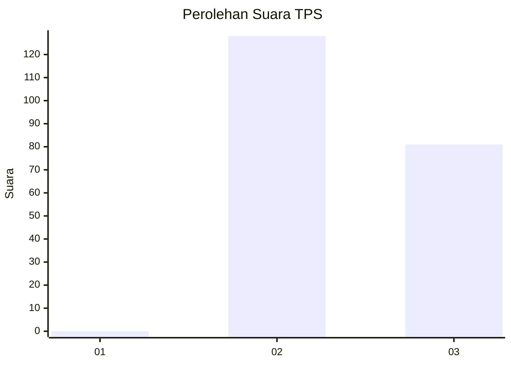
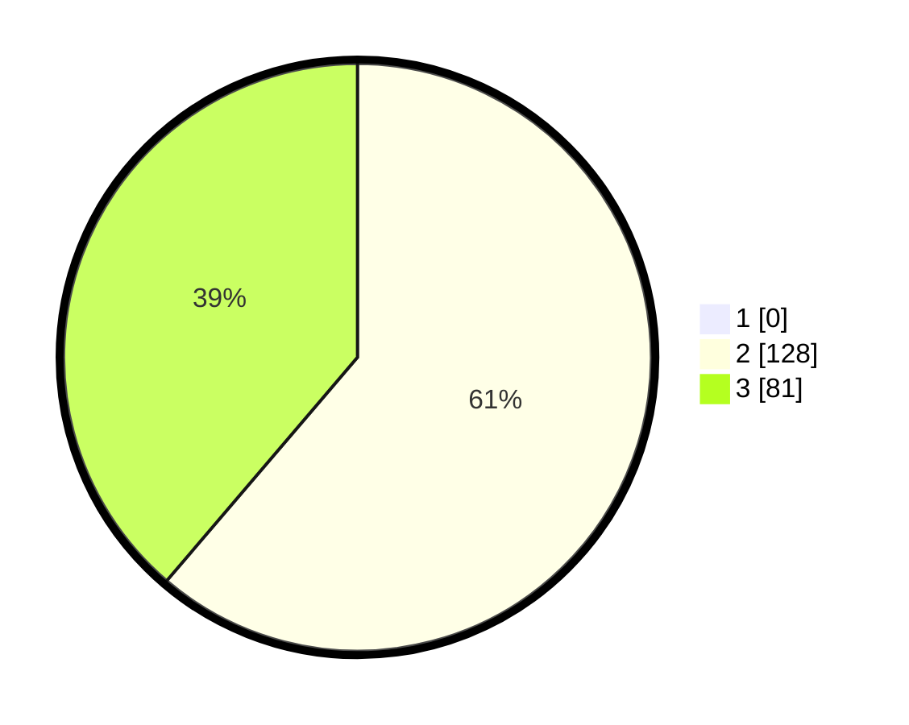

# Hasil

## Grafik

## Tabel

| No. | Nama Paslon    | Suara | Suara (raw) | Persentase |
|:--- |:-------------- | -----:| -----------:| ----------:|
| 1   | ANIES MUHAIMIN | 0     | [0][p-1]    | 0,00       |
| 2   | PRABOWO GIBRAN | 128   | [128][p-2]  | 61,24      |
| 3   | GANJAR MAHFUD  | 81    | [81][p-3]   | 38,76      |

[p-1]: https://github.com/gigit-pemilu/pemilu-2024-51-bali/blob/main/pilpres/hitung-suara/sub/51-bali/sub/08-buleleng/sub/08-kubutambahan/sub/2006-depeha/sub/011-tps/sub/paslon-1.txt
[p-2]: https://github.com/gigit-pemilu/pemilu-2024-51-bali/blob/main/pilpres/hitung-suara/sub/51-bali/sub/08-buleleng/sub/08-kubutambahan/sub/2006-depeha/sub/011-tps/sub/paslon-2.txt
[p-3]: https://github.com/gigit-pemilu/pemilu-2024-51-bali/blob/main/pilpres/hitung-suara/sub/51-bali/sub/08-buleleng/sub/08-kubutambahan/sub/2006-depeha/sub/011-tps/sub/paslon-3.txt

## Foto C Plano

https://sirekap-obj-formc.kpu.go.id/080f/pemilu/ppwp/51/08/08/20/06/5108082006011-20240214-233243--f1ebf22e-8638-4f3b-b55f-3c19bd3ce95b.jpg

https://sirekap-obj-formc.kpu.go.id/080f/pemilu/ppwp/51/08/08/20/06/5108082006011-20240214-233509--2478f5d9-97ce-41f2-b64f-54d4fffa407a.jpg

https://sirekap-obj-formc.kpu.go.id/080f/pemilu/ppwp/51/08/08/20/06/5108082006011-20240214-233653--5689f474-f7fb-4d1a-a483-a4f8592b8edf.jpg

## Metadata

| Key        | Value               |
| ---------- | ------------------- |
| Time Stamp | 2024-02-24 22:31:28 |

