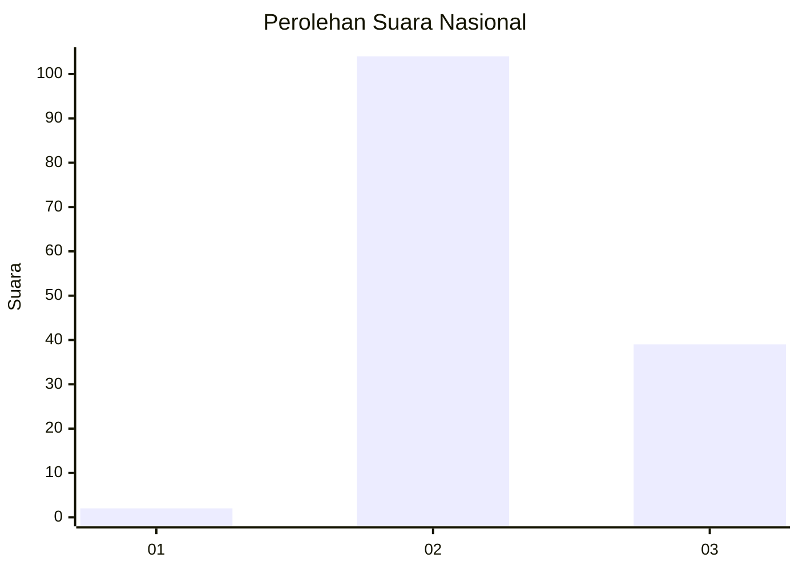
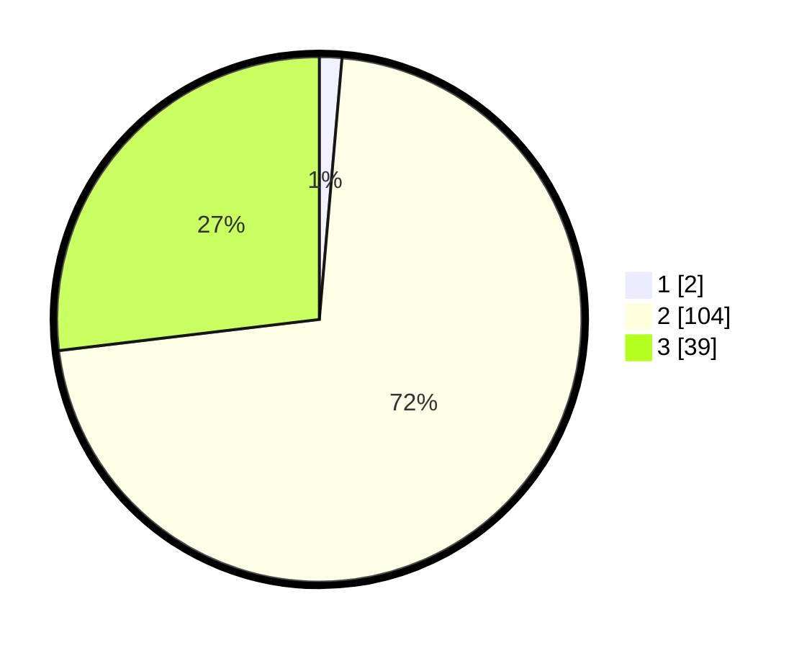

# Hasil

## Grafik

## Tabel

| No. | Nama Paslon    | Suara | Suara (raw) | Persentase |
|:--- |:-------------- | -----:| -----------:| ----------:|
| 1   | ANIES MUHAIMIN | 2     | [2][p-1]    | 1,38       |
| 2   | PRABOWO GIBRAN | 104   | [104][p-2]  | 71,72      |
| 3   | GANJAR MAHFUD  | 39    | [39][p-3]   | 26,90      |

[p-1]: https://github.com/gigit-pemilu/pemilu-2024/blob/main/pilpres/hitung-suara/sub/51-bali/sub/08-buleleng/sub/08-kubutambahan/sub/2006-depeha/sub/015-tps/sub/paslon-1.txt
[p-2]: https://github.com/gigit-pemilu/pemilu-2024/blob/main/pilpres/hitung-suara/sub/51-bali/sub/08-buleleng/sub/08-kubutambahan/sub/2006-depeha/sub/015-tps/sub/paslon-2.txt
[p-3]: https://github.com/gigit-pemilu/pemilu-2024/blob/main/pilpres/hitung-suara/sub/51-bali/sub/08-buleleng/sub/08-kubutambahan/sub/2006-depeha/sub/015-tps/sub/paslon-3.txt

## Foto C Plano

https://sirekap-obj-formc.kpu.go.id/421b/pemilu/ppwp/51/08/08/20/06/5108082006015-20240215-033441--e1d20a35-3548-4fc2-ae24-fc6ecdb8c4fe.jpg

https://sirekap-obj-formc.kpu.go.id/421b/pemilu/ppwp/51/08/08/20/06/5108082006015-20240215-033431--99891761-f6cd-4e05-b9b8-3329599edf71.jpg

## Metadata

| Key        | Value               |
| ---------- | ------------------- |
| Time Stamp | 2024-02-24 22:31:28 |

