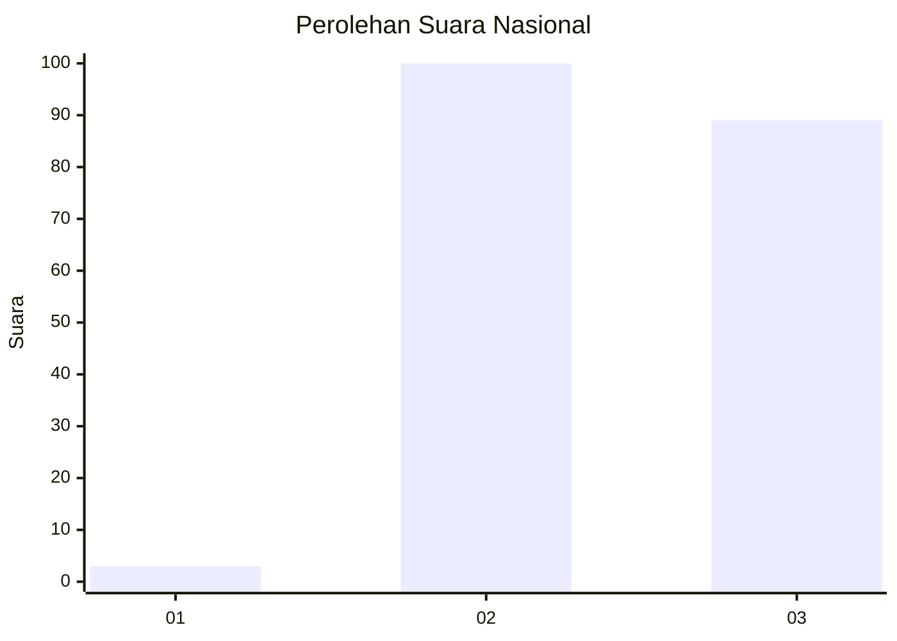
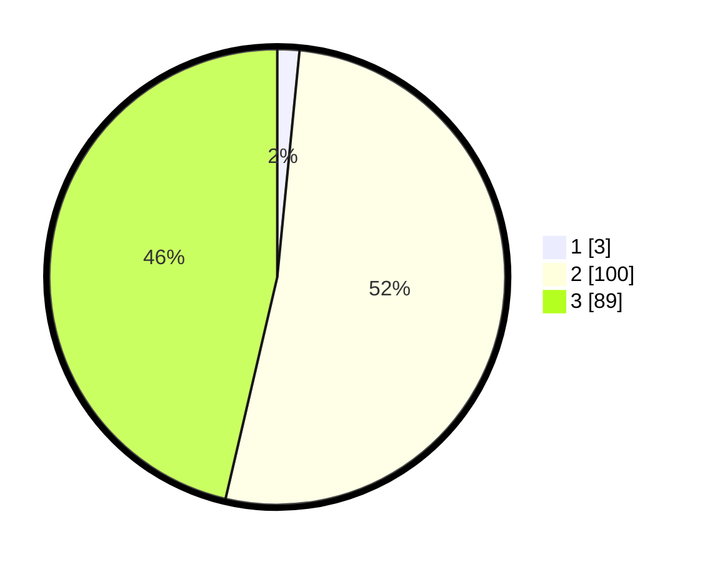

# Hasil

## Grafik

## Tabel

| No. | Nama Paslon    | Suara | Suara (raw) | Persentase |
|:--- |:-------------- | -----:| -----------:| ----------:|
| 1   | ANIES MUHAIMIN | 3     | [3][p-1]    | 1,56       |
| 2   | PRABOWO GIBRAN | 100   | [100][p-2]  | 52,08      |
| 3   | GANJAR MAHFUD  | 89    | [89][p-3]   | 46,35      |

[p-1]: https://github.com/gigit-pemilu/pemilu-2024/blob/main/pilpres/hitung-suara/sub/51-bali/sub/08-buleleng/sub/08-kubutambahan/sub/2007-tamblang/sub/008-tps/sub/paslon-1.txt
[p-2]: https://github.com/gigit-pemilu/pemilu-2024/blob/main/pilpres/hitung-suara/sub/51-bali/sub/08-buleleng/sub/08-kubutambahan/sub/2007-tamblang/sub/008-tps/sub/paslon-2.txt
[p-3]: https://github.com/gigit-pemilu/pemilu-2024/blob/main/pilpres/hitung-suara/sub/51-bali/sub/08-buleleng/sub/08-kubutambahan/sub/2007-tamblang/sub/008-tps/sub/paslon-3.txt

## Foto C Plano

https://sirekap-obj-formc.kpu.go.id/4aa6/pemilu/ppwp/51/08/08/20/07/5108082007008-20240214-225745--d5c51a8f-dd85-4c73-8b27-e4a934261666.jpg

https://sirekap-obj-formc.kpu.go.id/4aa6/pemilu/ppwp/51/08/08/20/07/5108082007008-20240214-230349--7be2c8a1-d2ed-4838-9025-6108afae8fee.jpg

https://sirekap-obj-formc.kpu.go.id/4aa6/pemilu/ppwp/51/08/08/20/07/5108082007008-20240214-230513--6fb7acf7-a71e-4613-94a9-4fe26a346bf4.jpg

## Metadata

| Key        | Value               |
| ---------- | ------------------- |
| Time Stamp | 2024-02-24 22:31:28 |

