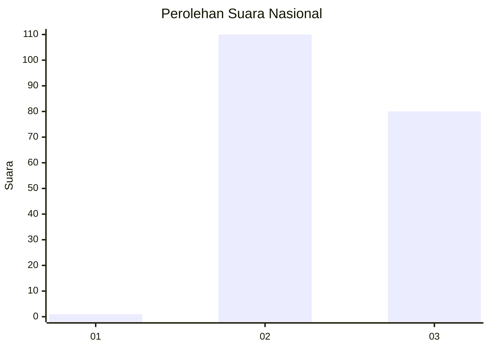
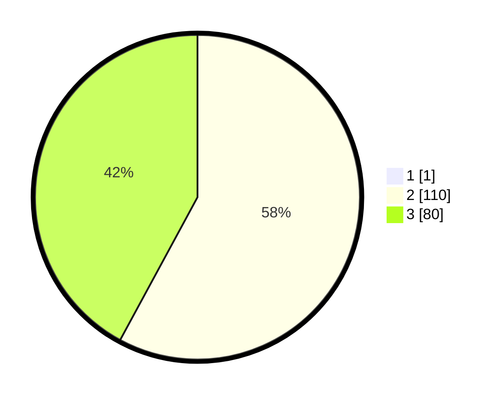

# Hasil

## Grafik

## Tabel

| No. | Nama Paslon    | Suara | Suara (raw) | Persentase |
|:--- |:-------------- | -----:| -----------:| ----------:|
| 1   | ANIES MUHAIMIN | 1     | [1][p-1]    | 0,52       |
| 2   | PRABOWO GIBRAN | 110   | [110][p-2]  | 57,59      |
| 3   | GANJAR MAHFUD  | 80    | [80][p-3]   | 41,88      |

[p-1]: https://github.com/gigit-pemilu/pemilu-2024/blob/main/pilpres/hitung-suara/sub/51-bali/sub/08-buleleng/sub/08-kubutambahan/sub/2007-tamblang/sub/011-tps/sub/paslon-1.txt
[p-2]: https://github.com/gigit-pemilu/pemilu-2024/blob/main/pilpres/hitung-suara/sub/51-bali/sub/08-buleleng/sub/08-kubutambahan/sub/2007-tamblang/sub/011-tps/sub/paslon-2.txt
[p-3]: https://github.com/gigit-pemilu/pemilu-2024/blob/main/pilpres/hitung-suara/sub/51-bali/sub/08-buleleng/sub/08-kubutambahan/sub/2007-tamblang/sub/011-tps/sub/paslon-3.txt

## Foto C Plano

https://sirekap-obj-formc.kpu.go.id/4aac/pemilu/ppwp/51/08/08/20/07/5108082007011-20240214-203710--6202c383-8b9f-420b-af11-661f1cedd58d.jpg

https://sirekap-obj-formc.kpu.go.id/4aac/pemilu/ppwp/51/08/08/20/07/5108082007011-20240214-203943--9f6c0f2e-8ef5-4452-8e1c-2ec915353538.jpg

https://sirekap-obj-formc.kpu.go.id/4aac/pemilu/ppwp/51/08/08/20/07/5108082007011-20240214-204117--05965b88-d83a-451a-96db-9c1d67eb6442.jpg

## Metadata

| Key        | Value               |
| ---------- | ------------------- |
| Time Stamp | 2024-02-24 22:31:28 |

