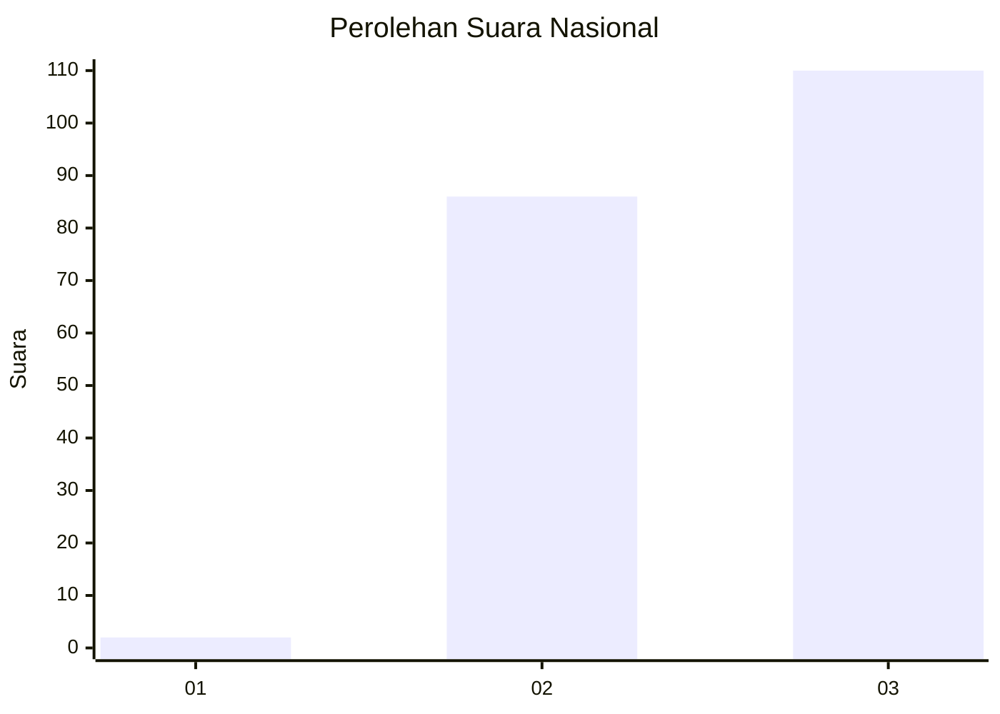
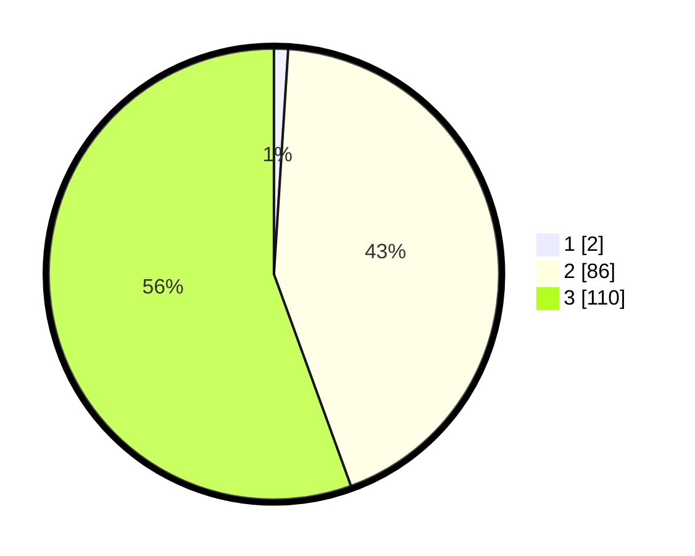

# Hasil

## Grafik

## Tabel

| No. | Nama Paslon    | Suara | Suara (raw) | Persentase |
|:--- |:-------------- | -----:| -----------:| ----------:|
| 1   | ANIES MUHAIMIN | 2     | [2][p-1]    | 1,01       |
| 2   | PRABOWO GIBRAN | 86    | [86][p-2]   | 43,43      |
| 3   | GANJAR MAHFUD  | 110   | [110][p-3]  | 55,56      |

[p-1]: https://github.com/gigit-pemilu/pemilu-2024/blob/main/pilpres/hitung-suara/sub/51-bali/sub/08-buleleng/sub/08-kubutambahan/sub/2007-tamblang/sub/013-tps/sub/paslon-1.txt
[p-2]: https://github.com/gigit-pemilu/pemilu-2024/blob/main/pilpres/hitung-suara/sub/51-bali/sub/08-buleleng/sub/08-kubutambahan/sub/2007-tamblang/sub/013-tps/sub/paslon-2.txt
[p-3]: https://github.com/gigit-pemilu/pemilu-2024/blob/main/pilpres/hitung-suara/sub/51-bali/sub/08-buleleng/sub/08-kubutambahan/sub/2007-tamblang/sub/013-tps/sub/paslon-3.txt

## Foto C Plano

https://sirekap-obj-formc.kpu.go.id/5069/pemilu/ppwp/51/08/08/20/07/5108082007013-20240214-205702--a3e1f021-abd3-4355-9c78-96ebcb0e4257.jpg

https://sirekap-obj-formc.kpu.go.id/5069/pemilu/ppwp/51/08/08/20/07/5108082007013-20240214-205937--f9f74758-fed9-4c70-91cb-0234bae2c2ae.jpg

https://sirekap-obj-formc.kpu.go.id/5069/pemilu/ppwp/51/08/08/20/07/5108082007013-20240214-210209--15090cae-51de-4063-a0ff-5e650ad23513.jpg

## Metadata

| Key        | Value               |
| ---------- | ------------------- |
| Time Stamp | 2024-02-15 06:00:23 |

