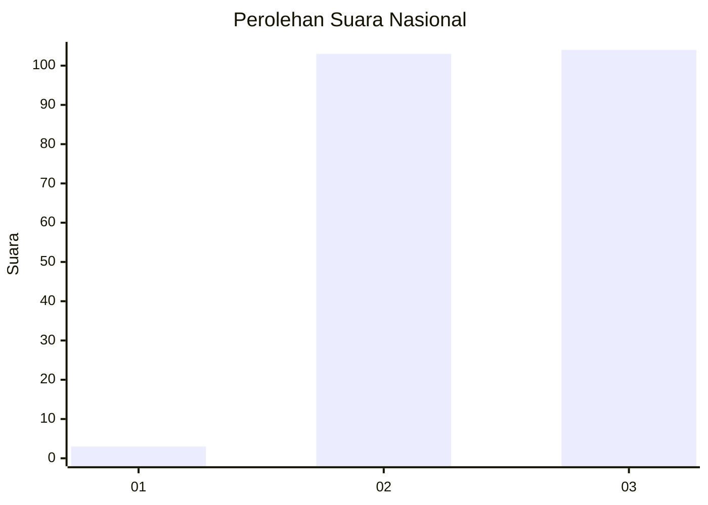
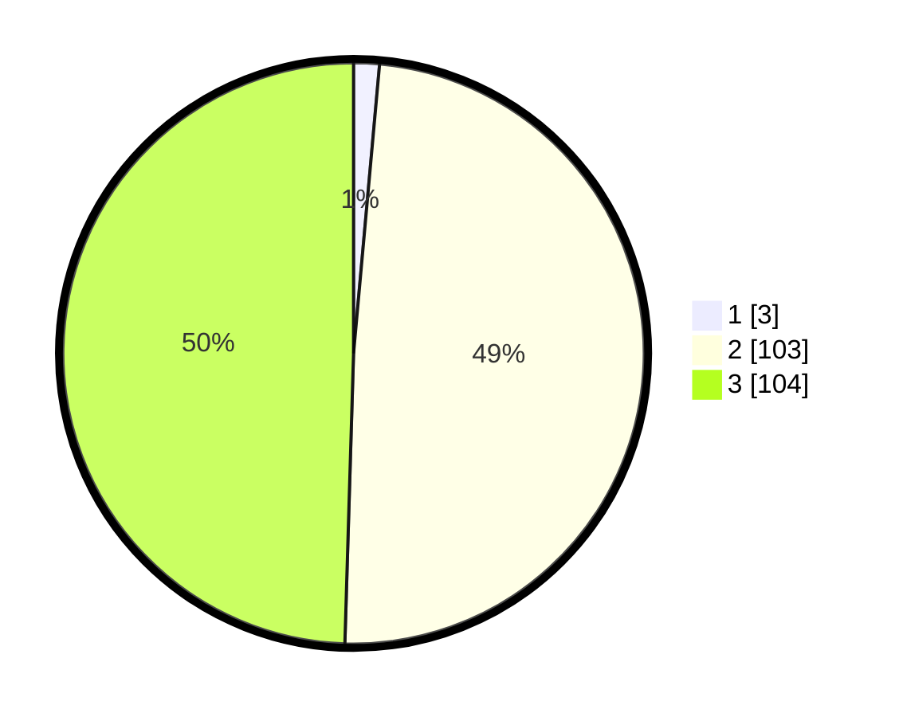

# Hasil

## Grafik

## Tabel

| No. | Nama Paslon    | Suara | Suara (raw) | Persentase |
|:--- |:-------------- | -----:| -----------:| ----------:|
| 1   | ANIES MUHAIMIN | 3     | [3][p-1]    | 1,43       |
| 2   | PRABOWO GIBRAN | 103   | [103][p-2]  | 49,05      |
| 3   | GANJAR MAHFUD  | 104   | [104][p-3]  | 49,52      |

[p-1]: https://github.com/gigit-pemilu/pemilu-2024/blob/main/pilpres/hitung-suara/sub/51-bali/sub/08-buleleng/sub/08-kubutambahan/sub/2007-tamblang/sub/014-tps/sub/paslon-1.txt
[p-2]: https://github.com/gigit-pemilu/pemilu-2024/blob/main/pilpres/hitung-suara/sub/51-bali/sub/08-buleleng/sub/08-kubutambahan/sub/2007-tamblang/sub/014-tps/sub/paslon-2.txt
[p-3]: https://github.com/gigit-pemilu/pemilu-2024/blob/main/pilpres/hitung-suara/sub/51-bali/sub/08-buleleng/sub/08-kubutambahan/sub/2007-tamblang/sub/014-tps/sub/paslon-3.txt

## Foto C Plano

https://sirekap-obj-formc.kpu.go.id/e33c/pemilu/ppwp/51/08/08/20/07/5108082007014-20240214-215128--8b98fbed-d4c9-4a80-bdaf-b79fd196f05e.jpg

https://sirekap-obj-formc.kpu.go.id/e33c/pemilu/ppwp/51/08/08/20/07/5108082007014-20240214-213403--4d62e95a-8bf0-4574-b05c-ee4999b22c1f.jpg

https://sirekap-obj-formc.kpu.go.id/e33c/pemilu/ppwp/51/08/08/20/07/5108082007014-20240214-213553--7fdf5c8b-f024-44a3-bd76-3a7ebc7ffa4d.jpg

## Metadata

| Key        | Value               |
| ---------- | ------------------- |
| Time Stamp | 2024-02-24 22:31:28 |

