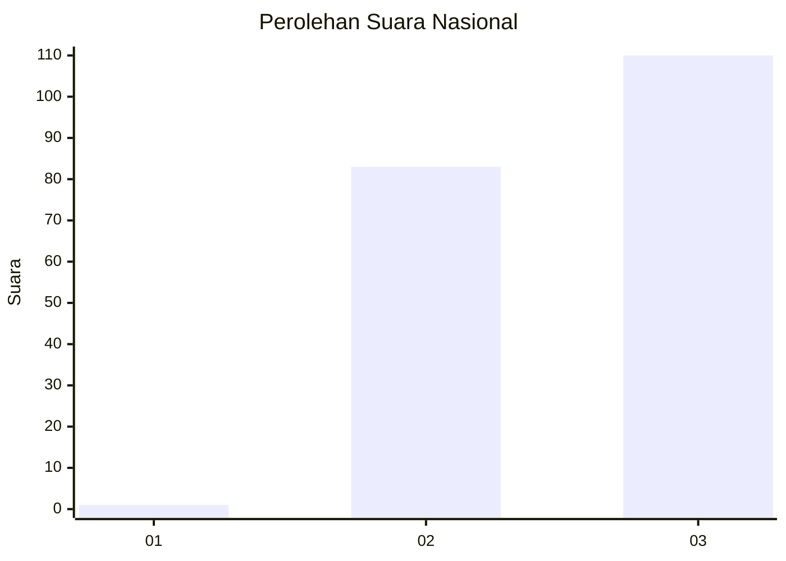
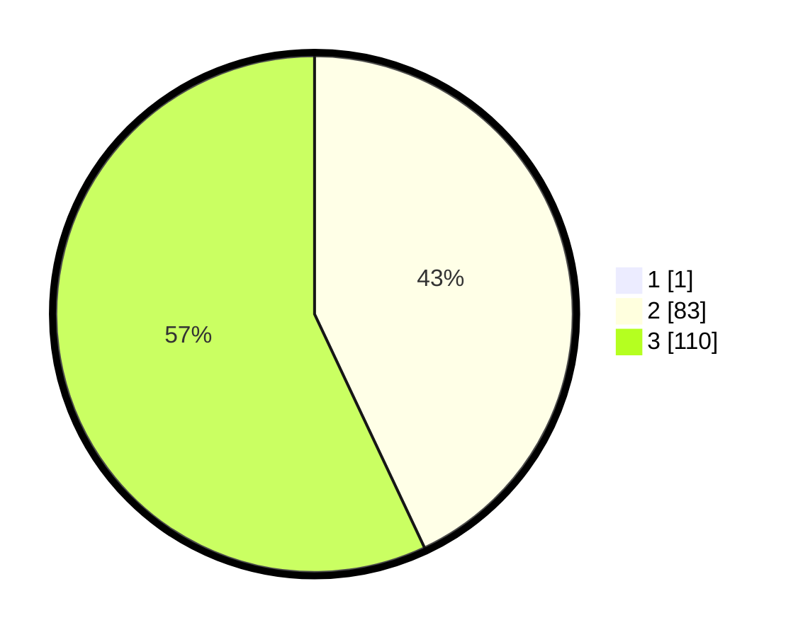

# Hasil

## Grafik

## Tabel

| No. | Nama Paslon    | Suara | Suara (raw) | Persentase |
|:--- |:-------------- | -----:| -----------:| ----------:|
| 1   | ANIES MUHAIMIN | 1     | [1][p-1]    | 0,52       |
| 2   | PRABOWO GIBRAN | 83    | [83][p-2]   | 42,78      |
| 3   | GANJAR MAHFUD  | 110   | [110][p-3]  | 56,70      |

[p-1]: https://github.com/gigit-pemilu/pemilu-2024/blob/main/pilpres/hitung-suara/sub/51-bali/sub/08-buleleng/sub/08-kubutambahan/sub/2007-tamblang/sub/015-tps/sub/paslon-1.txt
[p-2]: https://github.com/gigit-pemilu/pemilu-2024/blob/main/pilpres/hitung-suara/sub/51-bali/sub/08-buleleng/sub/08-kubutambahan/sub/2007-tamblang/sub/015-tps/sub/paslon-2.txt
[p-3]: https://github.com/gigit-pemilu/pemilu-2024/blob/main/pilpres/hitung-suara/sub/51-bali/sub/08-buleleng/sub/08-kubutambahan/sub/2007-tamblang/sub/015-tps/sub/paslon-3.txt

## Foto C Plano

https://sirekap-obj-formc.kpu.go.id/4ca5/pemilu/ppwp/51/08/08/20/07/5108082007015-20240214-224313--4f3ff76d-becc-4091-9b4b-3d43e7a166e4.jpg

https://sirekap-obj-formc.kpu.go.id/4ca5/pemilu/ppwp/51/08/08/20/07/5108082007015-20240214-224454--b92953d1-ee48-41ac-bdf9-ba14a57efa78.jpg

https://sirekap-obj-formc.kpu.go.id/4ca5/pemilu/ppwp/51/08/08/20/07/5108082007015-20240214-225408--926c48b4-6eeb-44cf-b04c-fcf3a6763f9e.jpg

## Metadata

| Key        | Value               |
| ---------- | ------------------- |
| Time Stamp | 2024-02-24 22:31:28 |

