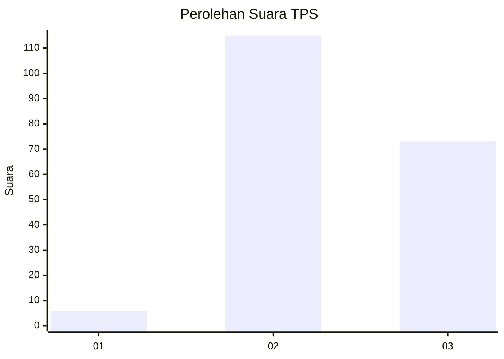
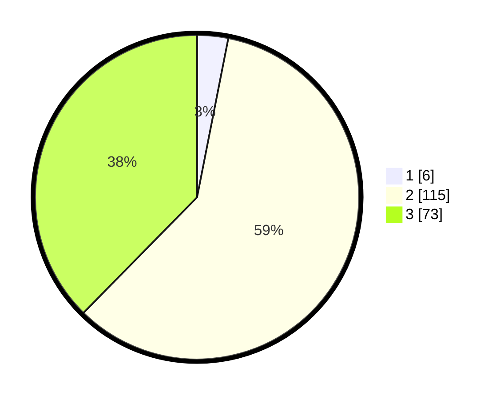

# Hasil

## Grafik

## Tabel

| No. | Nama Paslon    | Suara | Suara (raw) | Persentase |
|:--- |:-------------- | -----:| -----------:| ----------:|
| 1   | ANIES MUHAIMIN | 6     | [6][p-1]    | 3,09       |
| 2   | PRABOWO GIBRAN | 115   | [115][p-2]  | 59,28      |
| 3   | GANJAR MAHFUD  | 73    | [73][p-3]   | 37,63      |

[p-1]: https://github.com/gigit-pemilu/pemilu-2024-51-bali/blob/main/pilpres/hitung-suara/sub/51-bali/sub/08-buleleng/sub/08-kubutambahan/sub/2007-tamblang/sub/021-tps/sub/paslon-1.txt
[p-2]: https://github.com/gigit-pemilu/pemilu-2024-51-bali/blob/main/pilpres/hitung-suara/sub/51-bali/sub/08-buleleng/sub/08-kubutambahan/sub/2007-tamblang/sub/021-tps/sub/paslon-2.txt
[p-3]: https://github.com/gigit-pemilu/pemilu-2024-51-bali/blob/main/pilpres/hitung-suara/sub/51-bali/sub/08-buleleng/sub/08-kubutambahan/sub/2007-tamblang/sub/021-tps/sub/paslon-3.txt

## Foto C Plano

https://sirekap-obj-formc.kpu.go.id/92a4/pemilu/ppwp/51/08/08/20/07/5108082007021-20240214-214117--4a8d7e22-d02f-44e0-ab9d-f5cb2904295b.jpg

https://sirekap-obj-formc.kpu.go.id/92a4/pemilu/ppwp/51/08/08/20/07/5108082007021-20240214-214349--34a63cc8-3db8-465a-9c5c-08ec090320d3.jpg

https://sirekap-obj-formc.kpu.go.id/92a4/pemilu/ppwp/51/08/08/20/07/5108082007021-20240214-214528--9a91e0f2-f6ab-4fca-b933-2d39007c1117.jpg

## Metadata

| Key        | Value               |
| ---------- | ------------------- |
| Time Stamp | 2024-02-25 22:00:00 |

