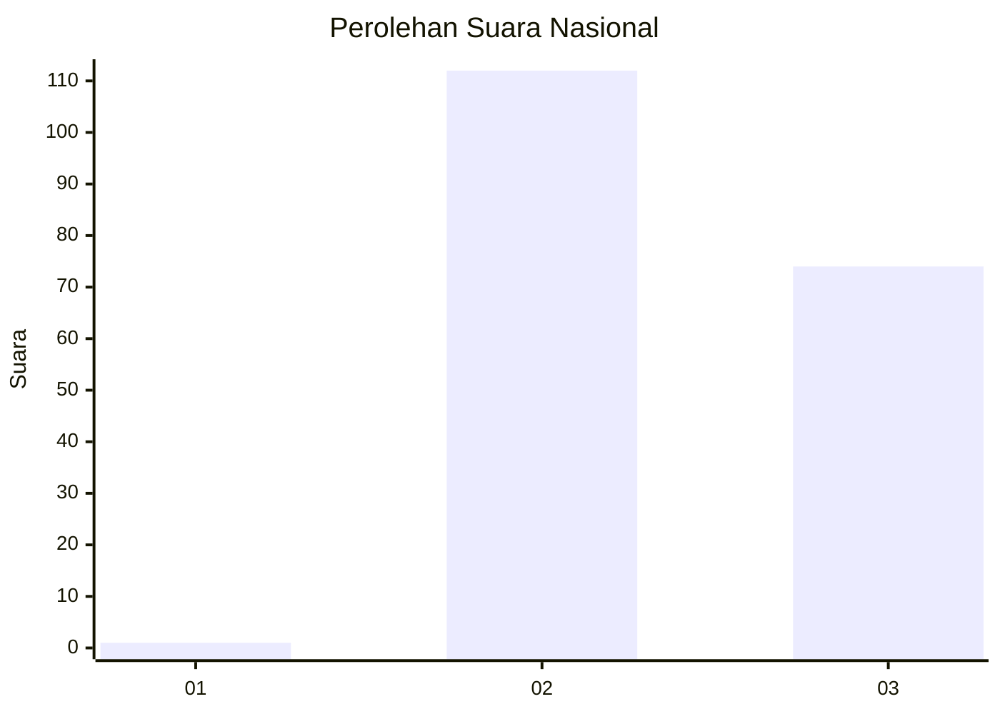
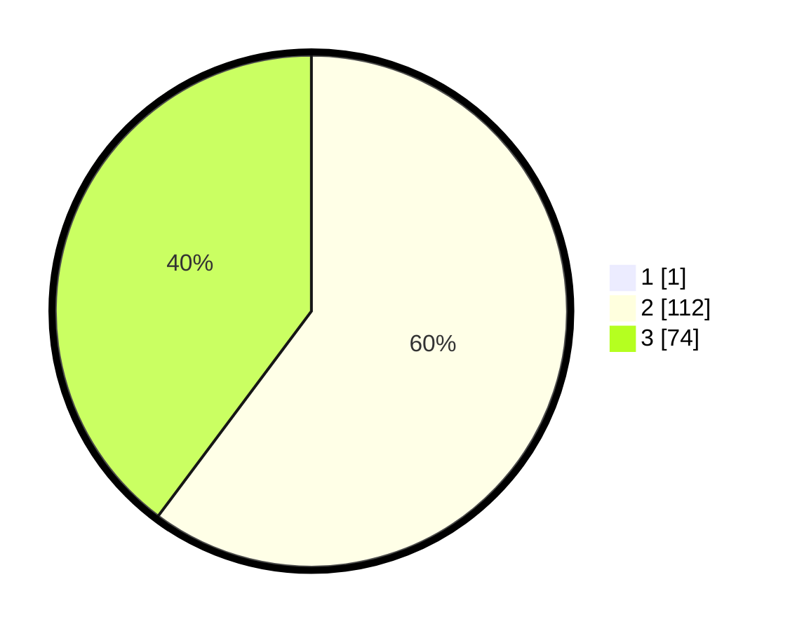

# Hasil

## Grafik

## Tabel

| No. | Nama Paslon    | Suara | Suara (raw) | Persentase |
|:--- |:-------------- | -----:| -----------:| ----------:|
| 1   | ANIES MUHAIMIN | 1     | [1][p-1]    | 0,53       |
| 2   | PRABOWO GIBRAN | 112   | [112][p-2]  | 59,89      |
| 3   | GANJAR MAHFUD  | 74    | [74][p-3]   | 39,57      |

[p-1]: https://github.com/gigit-pemilu/pemilu-2024/blob/main/pilpres/hitung-suara/sub/51-bali/sub/08-buleleng/sub/08-kubutambahan/sub/2008-bulian/sub/007-tps/sub/paslon-1.txt
[p-2]: https://github.com/gigit-pemilu/pemilu-2024/blob/main/pilpres/hitung-suara/sub/51-bali/sub/08-buleleng/sub/08-kubutambahan/sub/2008-bulian/sub/007-tps/sub/paslon-2.txt
[p-3]: https://github.com/gigit-pemilu/pemilu-2024/blob/main/pilpres/hitung-suara/sub/51-bali/sub/08-buleleng/sub/08-kubutambahan/sub/2008-bulian/sub/007-tps/sub/paslon-3.txt

## Foto C Plano

https://sirekap-obj-formc.kpu.go.id/ad9a/pemilu/ppwp/51/08/08/20/08/5108082008007-20240214-224007--3305d4b0-eaf9-46ec-abbb-06d7cb37b750.jpg

https://sirekap-obj-formc.kpu.go.id/ad9a/pemilu/ppwp/51/08/08/20/08/5108082008007-20240214-223259--c2fcb4b4-9ad4-47bc-98d3-ec3987ecfead.jpg

https://sirekap-obj-formc.kpu.go.id/ad9a/pemilu/ppwp/51/08/08/20/08/5108082008007-20240214-224628--6eb0d782-a5f8-4a04-85ba-d256409d8bbf.jpg

## Metadata

| Key        | Value               |
| ---------- | ------------------- |
| Time Stamp | 2024-02-24 22:31:28 |

