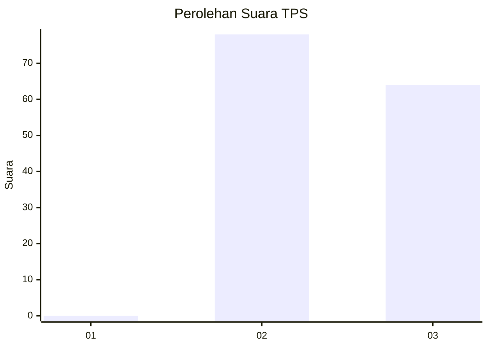
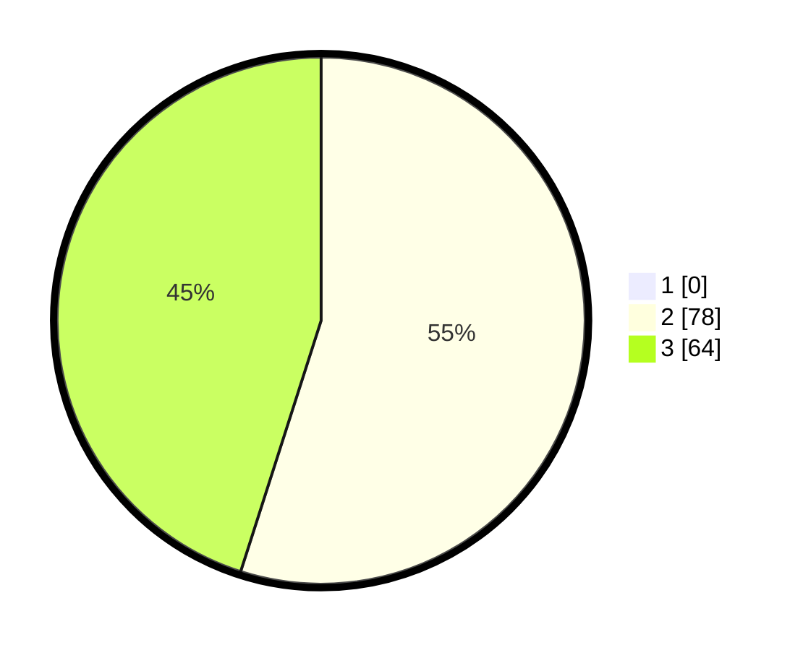

# Hasil

## Grafik

## Tabel

| No. | Nama Paslon    | Suara | Suara (raw) | Persentase |
|:--- |:-------------- | -----:| -----------:| ----------:|
| 1   | ANIES MUHAIMIN | 0     | [0][p-1]    | 0,00       |
| 2   | PRABOWO GIBRAN | 78    | [78][p-2]   | 54,93      |
| 3   | GANJAR MAHFUD  | 64    | [64][p-3]   | 45,07      |

[p-1]: https://github.com/gigit-pemilu/pemilu-2024-51-bali/blob/main/pilpres/hitung-suara/sub/51-bali/sub/08-buleleng/sub/08-kubutambahan/sub/2009-bila/sub/001-tps/sub/paslon-1.txt
[p-2]: https://github.com/gigit-pemilu/pemilu-2024-51-bali/blob/main/pilpres/hitung-suara/sub/51-bali/sub/08-buleleng/sub/08-kubutambahan/sub/2009-bila/sub/001-tps/sub/paslon-2.txt
[p-3]: https://github.com/gigit-pemilu/pemilu-2024-51-bali/blob/main/pilpres/hitung-suara/sub/51-bali/sub/08-buleleng/sub/08-kubutambahan/sub/2009-bila/sub/001-tps/sub/paslon-3.txt

## Foto C Plano

https://sirekap-obj-formc.kpu.go.id/ec26/pemilu/ppwp/51/08/08/20/09/5108082009001-20240214-214427--5d0dce65-fb48-44fc-b86f-84d1feb20265.jpg

https://sirekap-obj-formc.kpu.go.id/ec26/pemilu/ppwp/51/08/08/20/09/5108082009001-20240214-214510--e307592b-9757-4ff9-9c86-5b28d8d83cf1.jpg

https://sirekap-obj-formc.kpu.go.id/ec26/pemilu/ppwp/51/08/08/20/09/5108082009001-20240214-214605--3a9616ae-83d2-4d7d-b70b-99b36cbf90d6.jpg

## Metadata

| Key        | Value               |
| ---------- | ------------------- |
| Time Stamp | 2024-02-24 22:31:28 |

