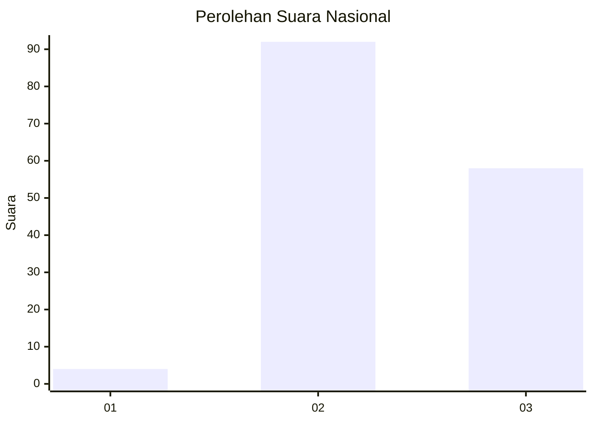
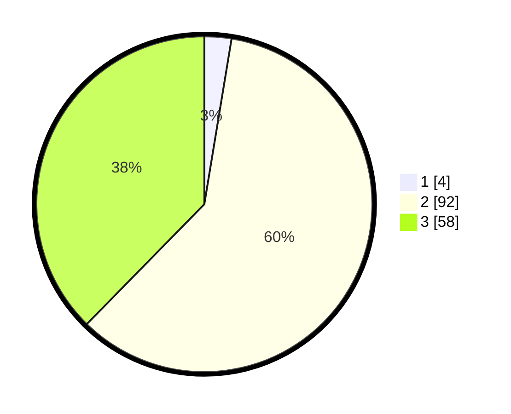

# Hasil

## Grafik

## Tabel

| No. | Nama Paslon    | Suara | Suara (raw) | Persentase |
|:--- |:-------------- | -----:| -----------:| ----------:|
| 1   | ANIES MUHAIMIN | 4     | [4][p-1]    | 2,60       |
| 2   | PRABOWO GIBRAN | 92    | [92][p-2]   | 59,74      |
| 3   | GANJAR MAHFUD  | 58    | [58][p-3]   | 37,66      |

[p-1]: https://github.com/gigit-pemilu/pemilu-2024/blob/main/pilpres/hitung-suara/sub/51-bali/sub/08-buleleng/sub/08-kubutambahan/sub/2009-bila/sub/004-tps/sub/paslon-1.txt
[p-2]: https://github.com/gigit-pemilu/pemilu-2024/blob/main/pilpres/hitung-suara/sub/51-bali/sub/08-buleleng/sub/08-kubutambahan/sub/2009-bila/sub/004-tps/sub/paslon-2.txt
[p-3]: https://github.com/gigit-pemilu/pemilu-2024/blob/main/pilpres/hitung-suara/sub/51-bali/sub/08-buleleng/sub/08-kubutambahan/sub/2009-bila/sub/004-tps/sub/paslon-3.txt

## Foto C Plano

https://sirekap-obj-formc.kpu.go.id/87e2/pemilu/ppwp/51/08/08/20/09/5108082009004-20240214-201407--71f51dae-c6a9-41fb-9351-ef1419a6b60a.jpg

https://sirekap-obj-formc.kpu.go.id/87e2/pemilu/ppwp/51/08/08/20/09/5108082009004-20240214-194352--db36c425-d414-4e60-8801-219dd04be7d9.jpg

## Metadata

| Key        | Value               |
| ---------- | ------------------- |
| Time Stamp | 2024-02-15 07:00:44 |

