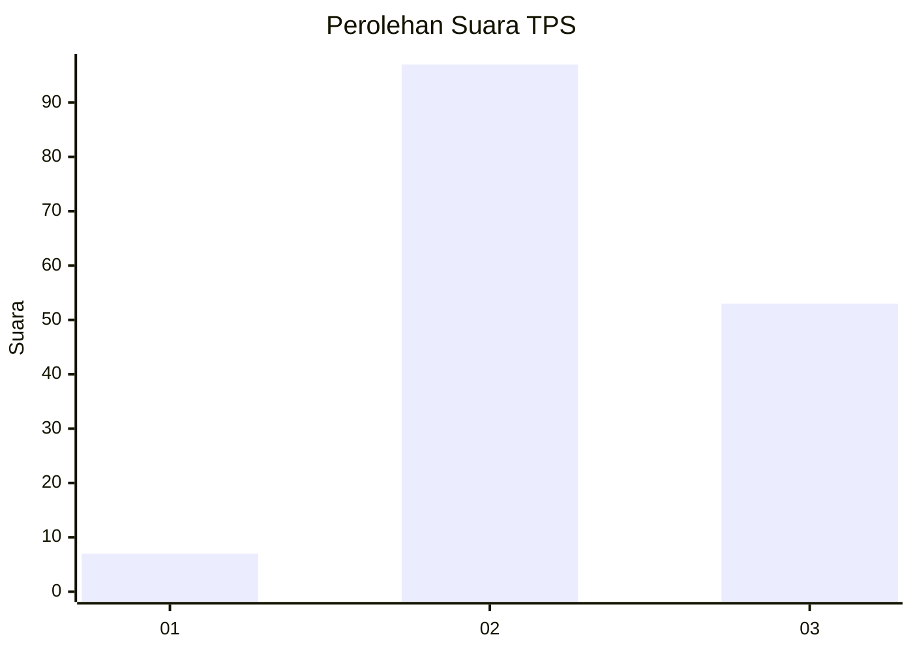
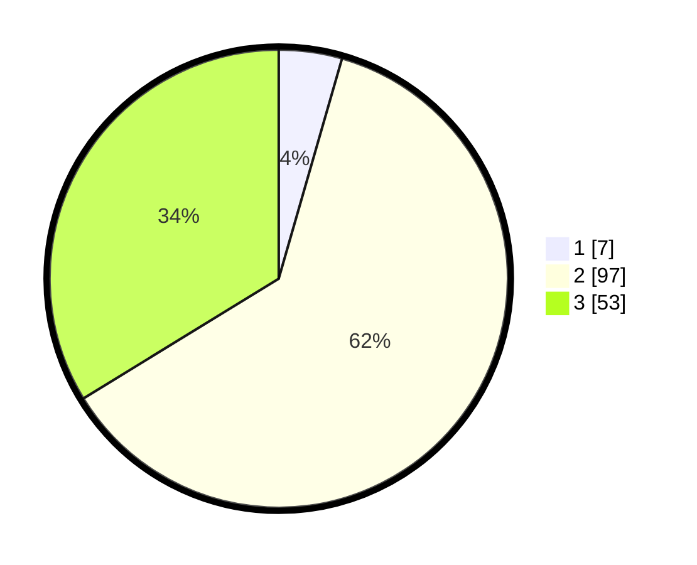

# Hasil

## Grafik

## Tabel

| No. | Nama Paslon    | Suara | Suara (raw) | Persentase |
|:--- |:-------------- | -----:| -----------:| ----------:|
| 1   | ANIES MUHAIMIN | 7     | [7][p-1]    | 4,46       |
| 2   | PRABOWO GIBRAN | 97    | [97][p-2]   | 61,78      |
| 3   | GANJAR MAHFUD  | 53    | [53][p-3]   | 33,76      |

[p-1]: https://github.com/gigit-pemilu/pemilu-2024-51-bali/blob/main/pilpres/hitung-suara/sub/51-bali/sub/08-buleleng/sub/08-kubutambahan/sub/2009-bila/sub/005-tps/sub/paslon-1.txt
[p-2]: https://github.com/gigit-pemilu/pemilu-2024-51-bali/blob/main/pilpres/hitung-suara/sub/51-bali/sub/08-buleleng/sub/08-kubutambahan/sub/2009-bila/sub/005-tps/sub/paslon-2.txt
[p-3]: https://github.com/gigit-pemilu/pemilu-2024-51-bali/blob/main/pilpres/hitung-suara/sub/51-bali/sub/08-buleleng/sub/08-kubutambahan/sub/2009-bila/sub/005-tps/sub/paslon-3.txt

## Foto C Plano

https://sirekap-obj-formc.kpu.go.id/7060/pemilu/ppwp/51/08/08/20/09/5108082009005-20240215-083848--af17f00c-5c8b-4531-8633-8813129169a9.jpg

https://sirekap-obj-formc.kpu.go.id/7060/pemilu/ppwp/51/08/08/20/09/5108082009005-20240215-084252--902a70ec-51f9-4128-9377-edc1fcab8a01.jpg

## Metadata

| Key        | Value               |
| ---------- | ------------------- |
| Time Stamp | 2024-02-24 22:31:28 |

