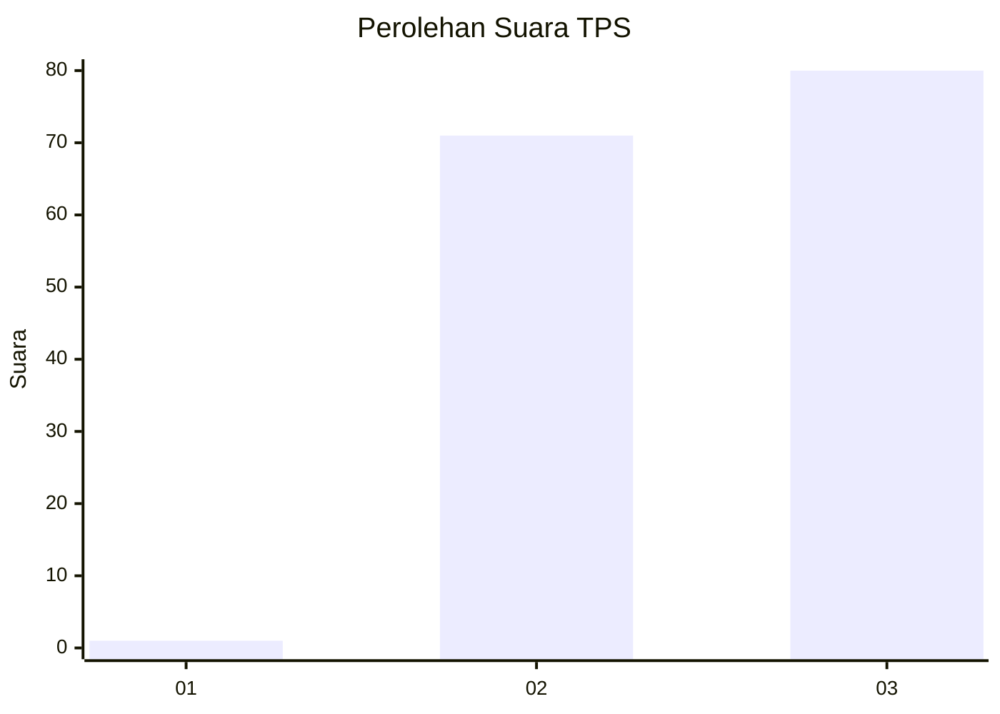
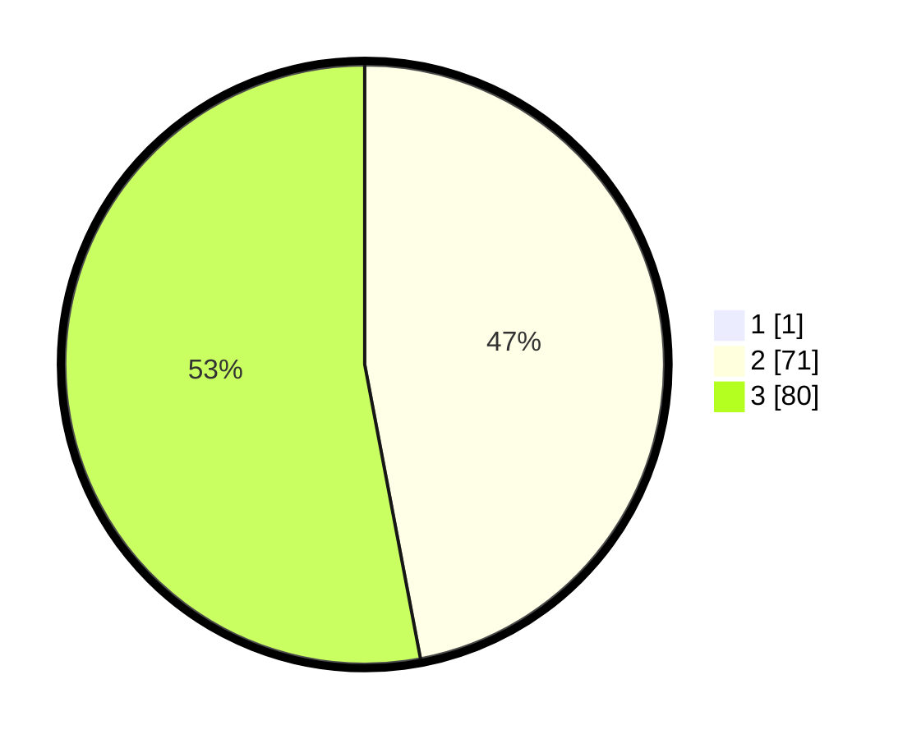

# Hasil

## Grafik

## Tabel

| No. | Nama Paslon    | Suara | Suara (raw) | Persentase |
|:--- |:-------------- | -----:| -----------:| ----------:|
| 1   | ANIES MUHAIMIN | 1     | [1][p-1]    | 0,66       |
| 2   | PRABOWO GIBRAN | 71    | [71][p-2]   | 46,71      |
| 3   | GANJAR MAHFUD  | 80    | [80][p-3]   | 52,63      |

[p-1]: https://github.com/gigit-pemilu/pemilu-2024-51-bali/blob/main/pilpres/hitung-suara/sub/51-bali/sub/08-buleleng/sub/08-kubutambahan/sub/2009-bila/sub/006-tps/sub/paslon-1.txt
[p-2]: https://github.com/gigit-pemilu/pemilu-2024-51-bali/blob/main/pilpres/hitung-suara/sub/51-bali/sub/08-buleleng/sub/08-kubutambahan/sub/2009-bila/sub/006-tps/sub/paslon-2.txt
[p-3]: https://github.com/gigit-pemilu/pemilu-2024-51-bali/blob/main/pilpres/hitung-suara/sub/51-bali/sub/08-buleleng/sub/08-kubutambahan/sub/2009-bila/sub/006-tps/sub/paslon-3.txt

## Foto C Plano

https://sirekap-obj-formc.kpu.go.id/bcc7/pemilu/ppwp/51/08/08/20/09/5108082009006-20240214-220728--d9244dd1-d36d-4aec-ad57-8e6d4524bf1f.jpg

https://sirekap-obj-formc.kpu.go.id/bcc7/pemilu/ppwp/51/08/08/20/09/5108082009006-20240214-214559--50b2599c-3f72-4751-a0fd-db8b2f804f41.jpg

https://sirekap-obj-formc.kpu.go.id/bcc7/pemilu/ppwp/51/08/08/20/09/5108082009006-20240214-214609--f97ac6ad-3461-4b00-a685-08737704a59e.jpg

## Metadata

| Key        | Value               |
| ---------- | ------------------- |
| Time Stamp | 2024-02-24 22:31:28 |

