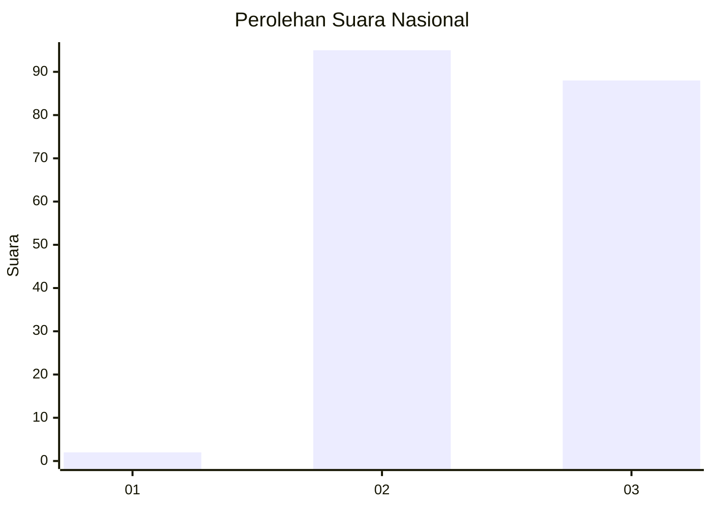
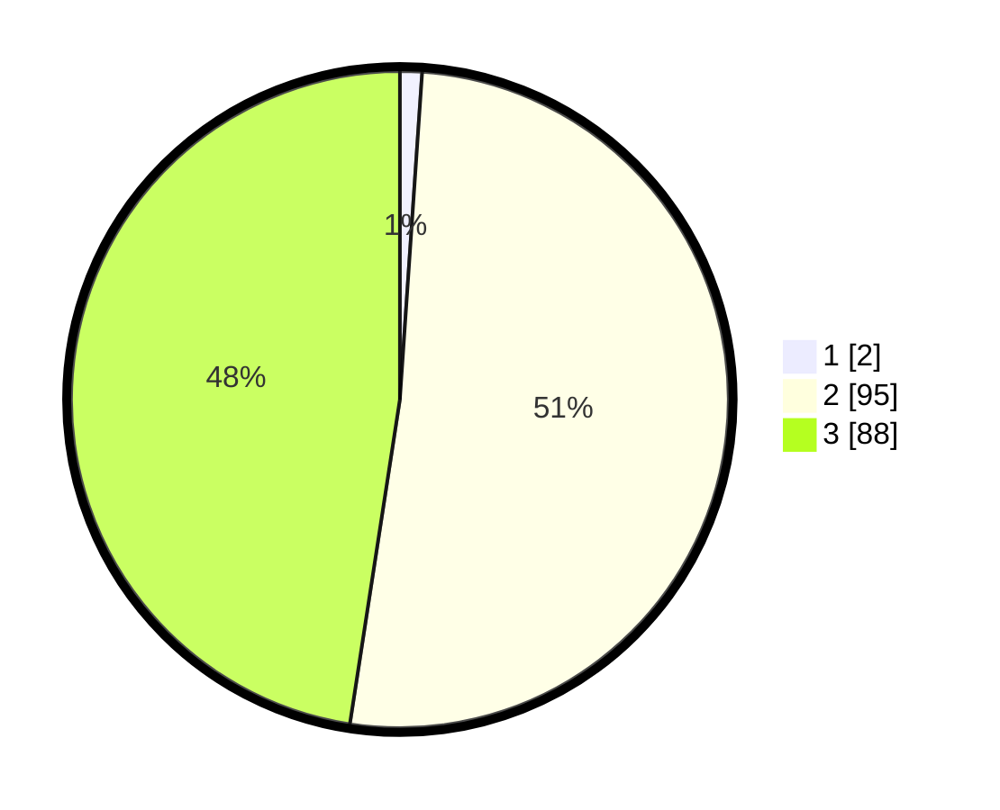

# Hasil

## Grafik

## Tabel

| No. | Nama Paslon    | Suara | Suara (raw) | Persentase |
|:--- |:-------------- | -----:| -----------:| ----------:|
| 1   | ANIES MUHAIMIN | 2     | [2][p-1]    | 1,08       |
| 2   | PRABOWO GIBRAN | 95    | [95][p-2]   | 51,35      |
| 3   | GANJAR MAHFUD  | 88    | [88][p-3]   | 47,57      |

[p-1]: https://github.com/gigit-pemilu/pemilu-2024/blob/main/pilpres/hitung-suara/sub/51-bali/sub/08-buleleng/sub/08-kubutambahan/sub/2009-bila/sub/007-tps/sub/paslon-1.txt
[p-2]: https://github.com/gigit-pemilu/pemilu-2024/blob/main/pilpres/hitung-suara/sub/51-bali/sub/08-buleleng/sub/08-kubutambahan/sub/2009-bila/sub/007-tps/sub/paslon-2.txt
[p-3]: https://github.com/gigit-pemilu/pemilu-2024/blob/main/pilpres/hitung-suara/sub/51-bali/sub/08-buleleng/sub/08-kubutambahan/sub/2009-bila/sub/007-tps/sub/paslon-3.txt

## Foto C Plano

https://sirekap-obj-formc.kpu.go.id/aa98/pemilu/ppwp/51/08/08/20/09/5108082009007-20240215-015356--3e59957f-d627-4cdc-af09-533a74e1dde0.jpg

https://sirekap-obj-formc.kpu.go.id/aa98/pemilu/ppwp/51/08/08/20/09/5108082009007-20240215-001222--46bfac2d-b01e-4fac-8f2a-ca687e525846.jpg

https://sirekap-obj-formc.kpu.go.id/aa98/pemilu/ppwp/51/08/08/20/09/5108082009007-20240215-001244--57285f3c-58cf-4ea1-be15-229358414395.jpg

## Metadata

| Key        | Value               |
| ---------- | ------------------- |
| Time Stamp | 2024-02-25 11:00:00 |

