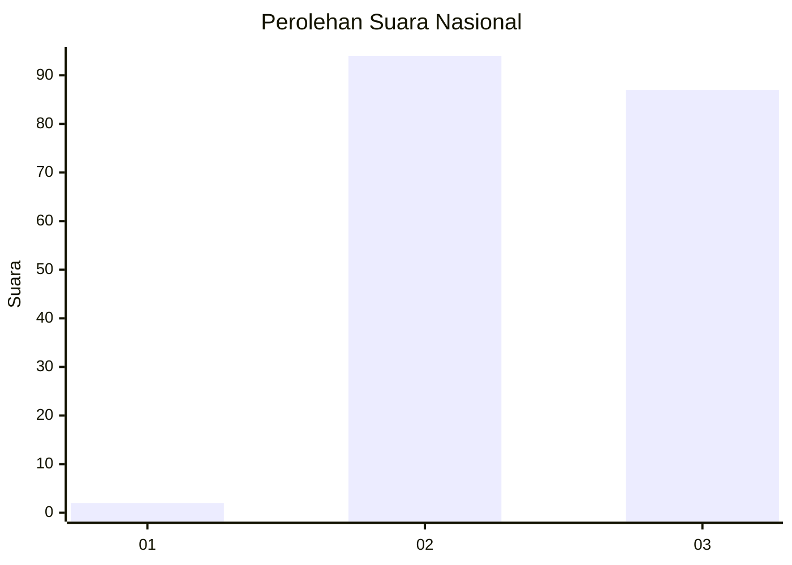
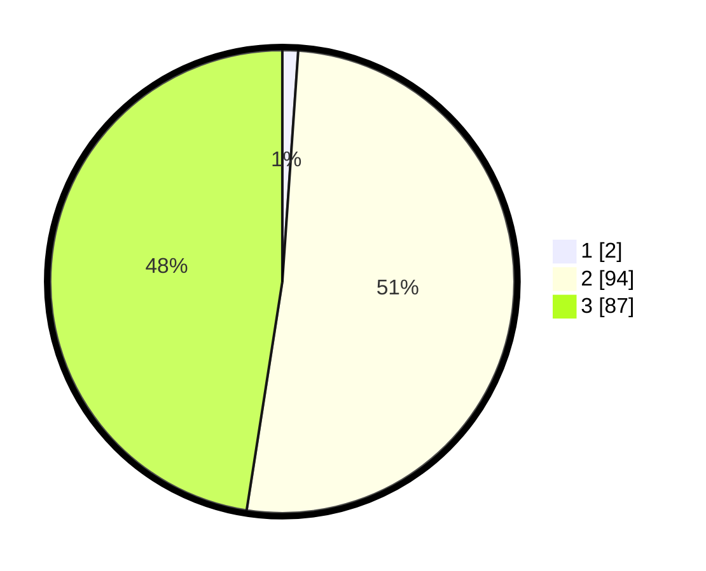

# Hasil

## Grafik

## Tabel

| No. | Nama Paslon    | Suara | Suara (raw) | Persentase |
|:--- |:-------------- | -----:| -----------:| ----------:|
| 1   | ANIES MUHAIMIN | 2     | [2][p-1]    | 1,09       |
| 2   | PRABOWO GIBRAN | 94    | [94][p-2]   | 51,37      |
| 3   | GANJAR MAHFUD  | 87    | [87][p-3]   | 47,54      |

[p-1]: https://github.com/gigit-pemilu/pemilu-2024/blob/main/pilpres/hitung-suara/sub/51-bali/sub/08-buleleng/sub/08-kubutambahan/sub/2009-bila/sub/009-tps/sub/paslon-1.txt
[p-2]: https://github.com/gigit-pemilu/pemilu-2024/blob/main/pilpres/hitung-suara/sub/51-bali/sub/08-buleleng/sub/08-kubutambahan/sub/2009-bila/sub/009-tps/sub/paslon-2.txt
[p-3]: https://github.com/gigit-pemilu/pemilu-2024/blob/main/pilpres/hitung-suara/sub/51-bali/sub/08-buleleng/sub/08-kubutambahan/sub/2009-bila/sub/009-tps/sub/paslon-3.txt

## Foto C Plano

https://sirekap-obj-formc.kpu.go.id/04d7/pemilu/ppwp/51/08/08/20/09/5108082009009-20240214-205641--5d277fa7-eca8-4f38-8051-a289cd72b9f0.jpg

https://sirekap-obj-formc.kpu.go.id/04d7/pemilu/ppwp/51/08/08/20/09/5108082009009-20240214-205813--ed98e3d4-8824-4532-96ff-604d50aeca86.jpg

https://sirekap-obj-formc.kpu.go.id/04d7/pemilu/ppwp/51/08/08/20/09/5108082009009-20240214-205953--8c9eaa85-d192-4488-b691-1fdaf54eaafe.jpg

## Metadata

| Key        | Value               |
| ---------- | ------------------- |
| Time Stamp | 2024-02-24 22:31:28 |

