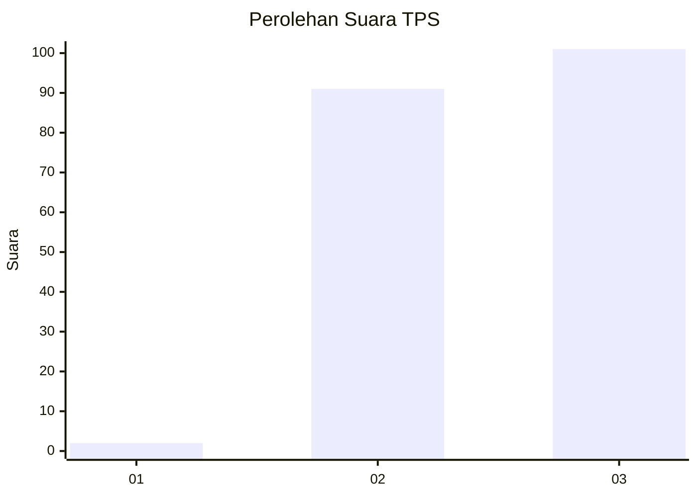
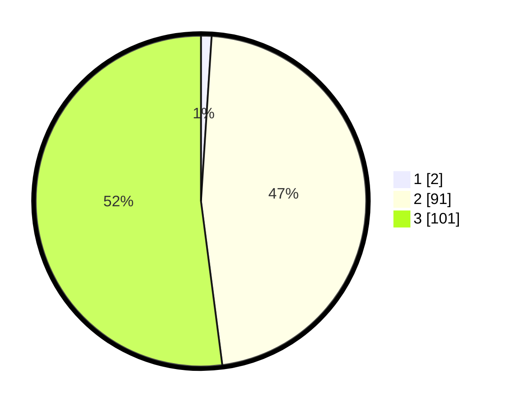

# Hasil

## Grafik

## Tabel

| No. | Nama Paslon    | Suara | Suara (raw) | Persentase |
|:--- |:-------------- | -----:| -----------:| ----------:|
| 1   | ANIES MUHAIMIN | 2     | [2][p-1]    | 1,03       |
| 2   | PRABOWO GIBRAN | 91    | [91][p-2]   | 46,91      |
| 3   | GANJAR MAHFUD  | 101   | [101][p-3]  | 52,06      |

[p-1]: https://github.com/gigit-pemilu/pemilu-2024-51-bali/blob/main/pilpres/hitung-suara/sub/51-bali/sub/08-buleleng/sub/08-kubutambahan/sub/2011-kubutambahan/sub/003-tps/sub/paslon-1.txt
[p-2]: https://github.com/gigit-pemilu/pemilu-2024-51-bali/blob/main/pilpres/hitung-suara/sub/51-bali/sub/08-buleleng/sub/08-kubutambahan/sub/2011-kubutambahan/sub/003-tps/sub/paslon-2.txt
[p-3]: https://github.com/gigit-pemilu/pemilu-2024-51-bali/blob/main/pilpres/hitung-suara/sub/51-bali/sub/08-buleleng/sub/08-kubutambahan/sub/2011-kubutambahan/sub/003-tps/sub/paslon-3.txt

## Foto C Plano

https://sirekap-obj-formc.kpu.go.id/cbc4/pemilu/ppwp/51/08/08/20/11/5108082011003-20240214-223731--f071418b-0566-4d03-bffe-a492b645c999.jpg

https://sirekap-obj-formc.kpu.go.id/cbc4/pemilu/ppwp/51/08/08/20/11/5108082011003-20240214-224911--b0126a31-b4c9-43f4-94c1-9828937371af.jpg

https://sirekap-obj-formc.kpu.go.id/cbc4/pemilu/ppwp/51/08/08/20/11/5108082011003-20240214-225211--b904b4cd-5f77-4147-be04-698594d63c86.jpg

## Metadata

| Key        | Value               |
| ---------- | ------------------- |
| Time Stamp | 2024-02-24 22:31:28 |

