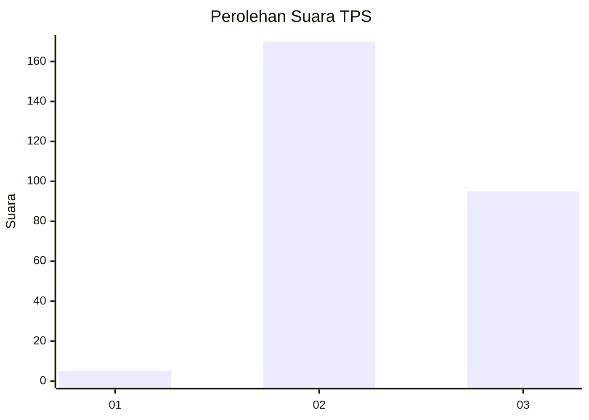
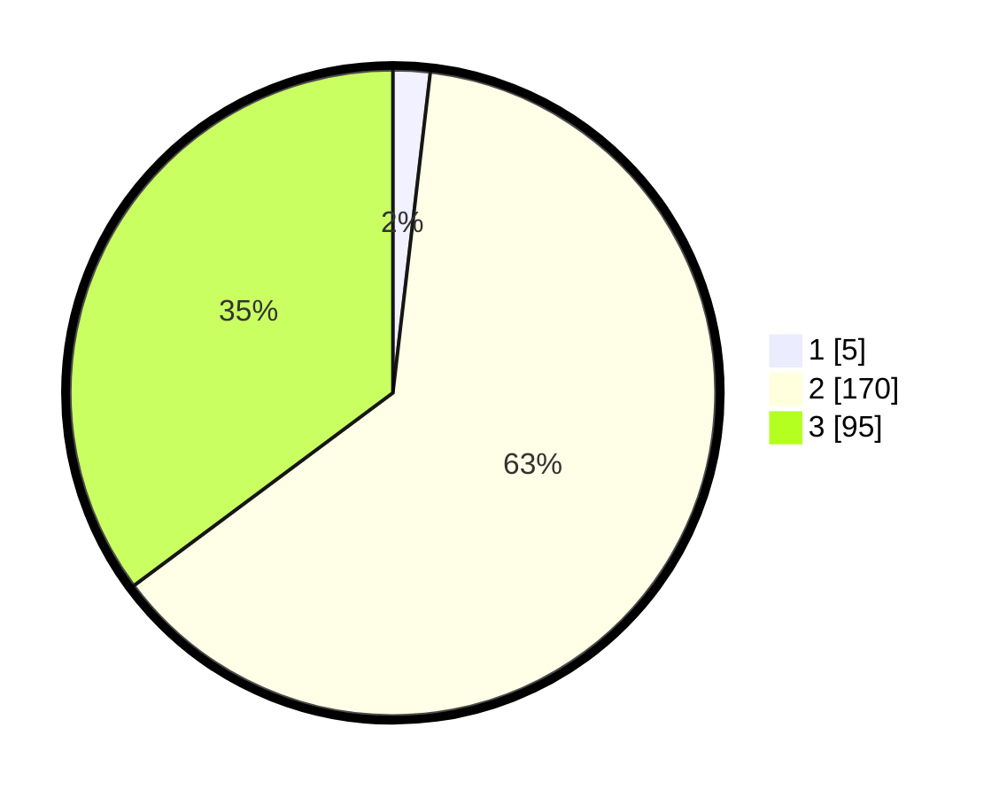

# Hasil

## Grafik

## Tabel

| No. | Nama Paslon    | Suara | Suara (raw) | Persentase |
|:--- |:-------------- | -----:| -----------:| ----------:|
| 1   | ANIES MUHAIMIN | 5     | [5][p-1]    | 1,85       |
| 2   | PRABOWO GIBRAN | 170   | [170][p-2]  | 62,96      |
| 3   | GANJAR MAHFUD  | 95    | [95][p-3]   | 35,19      |

[p-1]: https://github.com/gigit-pemilu/pemilu-2024-51-bali/blob/main/pilpres/hitung-suara/sub/51-bali/sub/08-buleleng/sub/08-kubutambahan/sub/2011-kubutambahan/sub/004-tps/sub/paslon-1.txt
[p-2]: https://github.com/gigit-pemilu/pemilu-2024-51-bali/blob/main/pilpres/hitung-suara/sub/51-bali/sub/08-buleleng/sub/08-kubutambahan/sub/2011-kubutambahan/sub/004-tps/sub/paslon-2.txt
[p-3]: https://github.com/gigit-pemilu/pemilu-2024-51-bali/blob/main/pilpres/hitung-suara/sub/51-bali/sub/08-buleleng/sub/08-kubutambahan/sub/2011-kubutambahan/sub/004-tps/sub/paslon-3.txt

## Foto C Plano

https://sirekap-obj-formc.kpu.go.id/79d6/pemilu/ppwp/51/08/08/20/11/5108082011004-20240214-212259--cf26f0d1-64ca-466a-ab8b-079100e17aa6.jpg

https://sirekap-obj-formc.kpu.go.id/79d6/pemilu/ppwp/51/08/08/20/11/5108082011004-20240214-212355--6f2330eb-9cc4-47e2-8ebf-6cf3d2b3c864.jpg

https://sirekap-obj-formc.kpu.go.id/79d6/pemilu/ppwp/51/08/08/20/11/5108082011004-20240214-212438--567a68ab-ecc6-4241-9e79-6f3f85ef5e3b.jpg

## Metadata

| Key        | Value               |
| ---------- | ------------------- |
| Time Stamp | 2024-02-24 22:31:28 |

